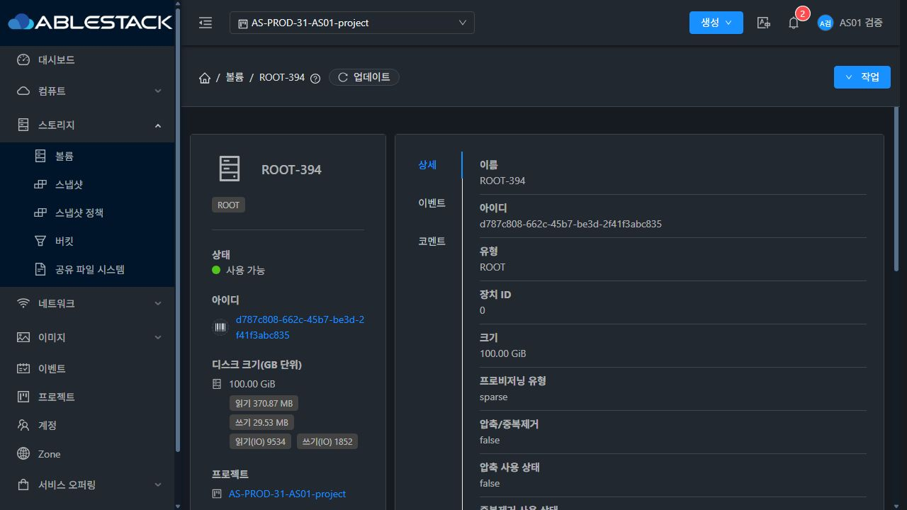
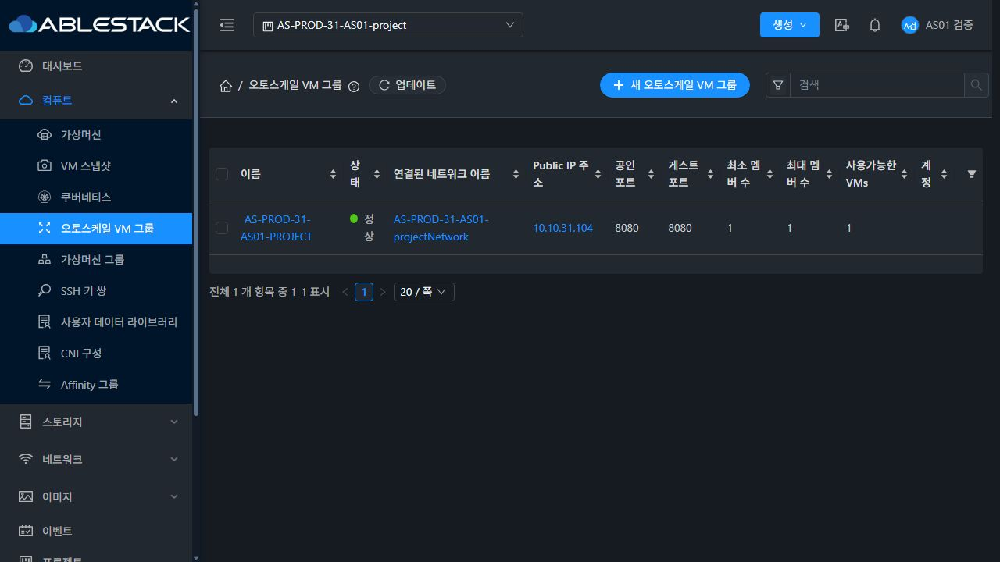
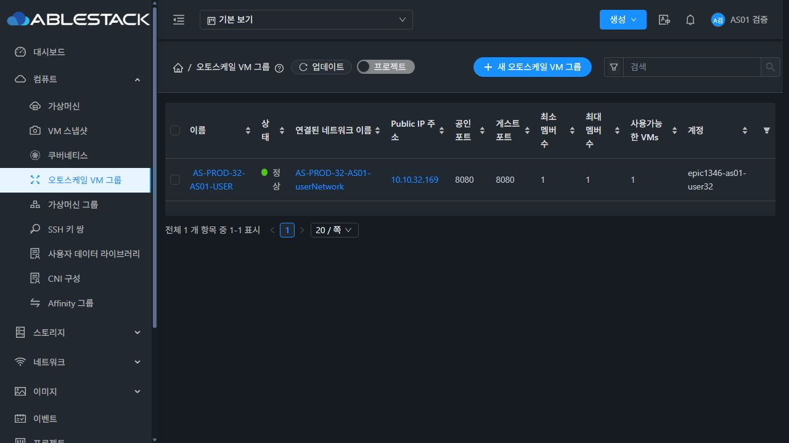
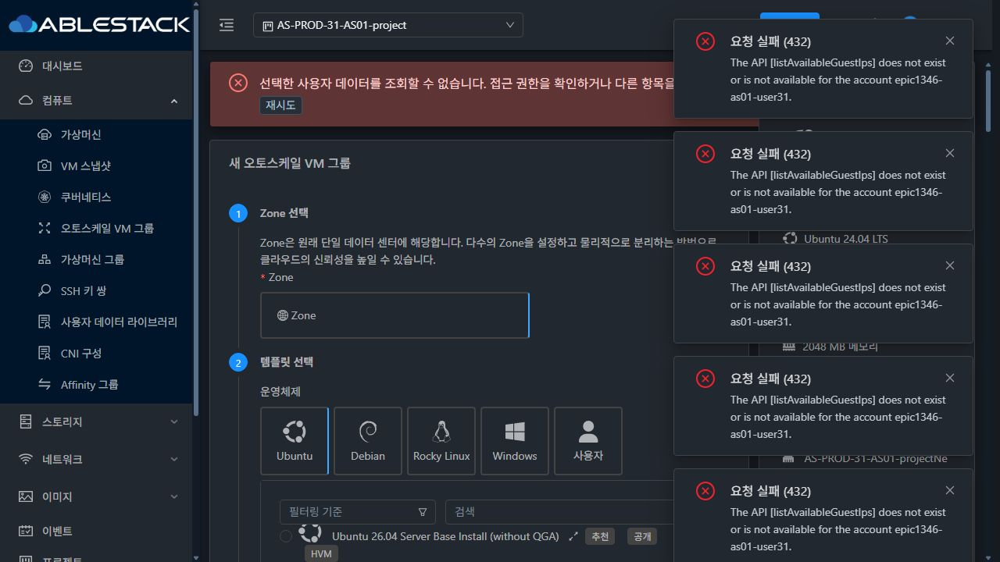
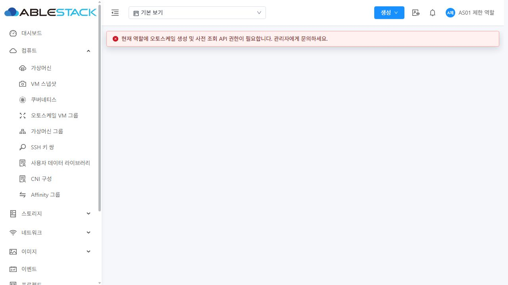
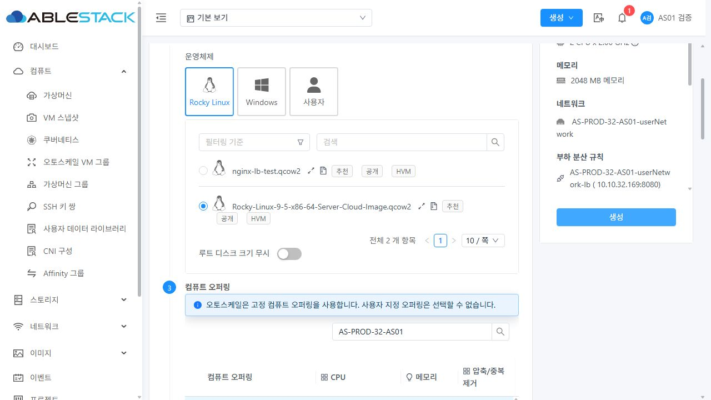
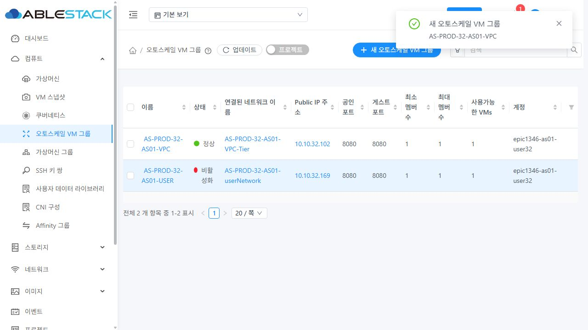
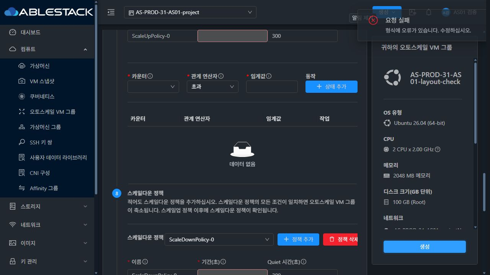
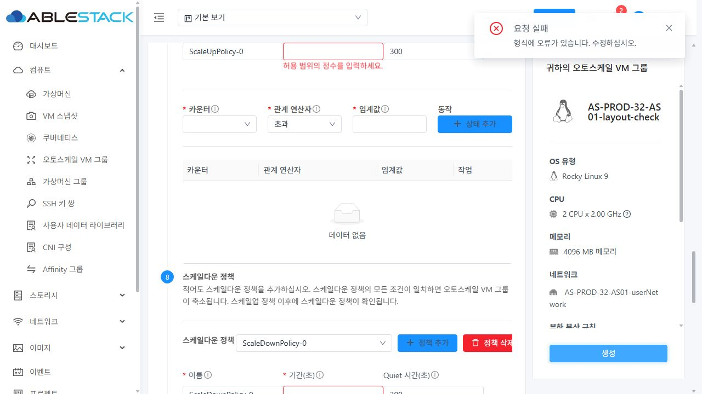

<!--
Licensed to the Apache Software Foundation (ASF) under one
or more contributor license agreements.  See the NOTICE file
distributed with this work for additional information
regarding copyright ownership.  The ASF licenses this file
to you under the Apache License, Version 2.0 (the
"License"); you may not use this file except in compliance
with the License.  You may obtain a copy of the License at

  http://www.apache.org/licenses/LICENSE-2.0

Unless required by applicable law or agreed to in writing,
software distributed under the License is distributed on an
"AS IS" BASIS, WITHOUT WARRANTIES OR CONDITIONS OF ANY
KIND, either express or implied.  See the License for the
specific language governing permissions and limitations
under the License.
-->

# AS-01 (#1347) 구현 및 배포 검증 기록

Epic #1346의 첫 하위 이슈이며 누적 Draft PR은 #1356이다. 생성 중 비동기 실패/보상(#1348), 실제 스케일 조건/시간(#1349), 동시성(#1350), 메뉴 전체 UI 통합(#1355), 최종 통합 및 장시간 확인(#1354)은 별도 순차 범위다.

## 구현 및 빌드

- `server` 변경 Maven 모듈 빌드 및 `AutoScaleManagerImplTest` **128건 통과**, checkstyle 오류 0.
- UI 집중/일반 VM 선택 회귀 **66건, 3 suites 통과**, 변경 파일 lint와 production build 통과. WSL ext4 소스만 사용했다.
- 생성 API 메타데이터가 없으면 한국어 안내와 함께 폼을 차단한다. UserData 누락/빈 변수/조회 실패/삭제/늦은 응답을 처리하고 제출 직전 변수 정의까지 다시 확인한다.
- 고정 오퍼링만 기본 선택하며 일반 VM 선택 동작은 유지한다. 임계값 0을 허용하고 음수/소수/안전 정수 범위 초과를 거부한다. 멤버 수는 `1 <= min <= max`, 유예 시간은 0 이상이다.
- 템플릿 Ready/실행 권한, 고정 오퍼링, 프로젝트/계정 범위, 기본망 VmAutoScaling/LB provider, LB 연결 VM/기존 그룹, 카운터/조건을 생성 POST 전에 조회한다.
- 서버는 신규 프로필의 활성 고정 오퍼링·템플릿 유형/Ready/사용 권한, 그룹 프로필/LB Zone 일치를 검사한다. 기존 프로필 업데이트 경로를 유지했다.
- 실제 UI에서 정책 필드의 선택 모델과 그룹 폼 모델 불일치, 설치된 AntDesignVue에서 미지원 Alert action 슬롯, 일반 사용자의 선택적 IP 조회 권한 오류를 발견해 보정했다.
- 긴 생성 요약으로 1280x720 화면의 버튼이 가려지던 문제는 기존 Mold InfoCard의 내용만 스크롤하고 CSS sticky를 실제 내부 스크롤 컨테이너에 적용해 footer를 유지하는 방식으로 보정했다. 최종 배포본의 두 테마에서 상세 입력까지 내려간 뒤 생성 버튼 위치가 y=630.14~662.14(높이 720)로 유지됐으며 실제 클릭 후 한국어 입력 오류로 제출이 차단됐다.

## 실제 UI 결과

| 경로 | 소유/환경 | UI 결과 | 실제 스토리지 및 서비스 |
|---|---|---|---|
| 프로젝트 격리망 | 일반 사용자, 31 GFS2 | `AS-PROD-31-AS01-PROJECT`, min/max 1, VM 실행 중 | 독립 QCOW2 SPARSE, LB `10.10.31.104:8080` HTTP 200 |
| 계정 격리망 | 일반 사용자, 32 krbd | `AS-PROD-32-AS01-USER`, min/max 1, VM 실행 중 | ROOT RBD 이미지가 `/dev/rbd10`으로 실제 매핑, LB `10.10.32.169:8080` HTTP 200 |
| VPC 계층 | 일반 사용자, 32 krbd | `AS-PROD-32-AS01-VPC`, min/max 1, VM 실행 중 | VpcVirtualRouter, ROOT `/dev/rbd6`, LB `10.10.32.102:8080` HTTP 200 |

31번 Ubuntu 기본 설치 템플릿은 cloud-init이 marker 파일로 비활성화돼 있었다. Cloud가 전달한 UserData는 라우터에서 확인했으나 첫 부팅 때 게스트가 실행하지 않았다. 사용자가 제공한 게스트 계정으로 전용 VM에 CloudStack datasource를 설정하고 cloud-init을 활성화한 후 **UI 재시작**으로 UserData 서비스 자동 실행과 HTTP 200을 확인했다. 이는 템플릿 준비 조건의 보정 결과이며, 최초 부팅부터 앱 설정까지 무조건 성공했다고 주장하지 않는다. 게스트 cloud-init에 DHCP lease 조회 관련 recoverable warning은 남았지만 errors는 없고 HTTP 서비스는 정상 실행됐다.

### 생성 사전 검증 범위

| 테스트 | 증거와 판정 |
|---|---|
| CRE-01 | 실제 UI 생성 → 그룹/프로필/조건/정책 → 최소 VM 실행 → LB 응답. 두 스토리지에서 확인 |
| CRE-02 | 변수 없는 UserData 정상 선택, 선택 후 전용 UserData 삭제 시 양 클러스터 제출 차단·한국어 안내·재시도·선택 복구. 빈 응답/권한/늦은 응답은 집중 테스트로 확인 |
| CRE-03 | 실제 UI 동적 오퍼링 disabled 및 고정 기본 선택. 실제 API 동적/ISO/시스템 템플릿/사설 템플릿 권한 거부. 미준비/제거된 자원은 서버·UI 계약 테스트로 확인 |
| CRE-04 | 실제 UI 음수/소수 차단 및 0 조건 추가, 실제 API 음수/소수/상한 거부, 빈 값/정밀도 경계 집중 테스트 |
| CRE-05 | 실제 UI min/max 0 및 min>max 거부, 실제 API 멤버 경계 거부, 정수 상한 집중 테스트 |
| CRE-06 | 31 실제 L2 선택에서 사용 가능한 LB 없음, 정상 기본망 재선택. 32에서 기본망을 VPC로 바꾼 뒤 기존 VirtualRouter 카운터 조건이 VpcVirtualRouter의 다른 카운터 ID와 맞지 않아 생성 전 차단되는 것을 실제 브라우저 API 요청/응답으로 확인했으며 VPC 카운터를 다시 선택했다. 두 클러스터는 Advanced Zone이며 Basic 및 외부 LB provider 실환경은 없음 |
| CRE-07 | 사용 중 LB는 제출 직전 VM/그룹 조회로 차단. 동시 동일 LB 생성 검증은 #1350 범위로 유지 |
| CRE-08 | 실제 계정/프로젝트 소유 범위와 API 외부 프로필/정책/LB/사설 템플릿 접근 및 변경 차단 확인 |
| CRE-09 | 실제 일반 사용자 계정/프로젝트 UI 생성과 제한 역할의 직접 URL 차단, 필수 API 안내. 선택적 IP 조회 권한 없는 일반 사용자에게 432 알림이 생기지 않음 |
| CRE-10 | 31 일반 사용자 프로젝트 생성, 32 일반 사용자 VPC 계층 생성·VM 기본 NIC/소유자/LB·HTTP 200 확인 |
| UI-07 | 새 안내/정수 검증/재시도/권한 안내를 한국어로 표시하고 밝은·다크 모드에서 읽기 확인 |

잘못된 UI 제출 및 삭제된 UserData 검증 전후 프로필/조건/정책/그룹 개수는 같았다. 생성 비동기 보상, 실제 정책에 따른 스케일업/다운, 삭제/복구 수명주기, 동시성, 장시간 운영 통과를 이 기록으로 대체하지 않는다.

## GFS2 Sparse 원칙 및 실제 연결

31번에서 새로 만든 사용자 VM과 가상 라우터의 ROOT는 모두 **SPARSE**다. Thin으로 최초 준비된 테스트 오퍼링은 VM 생성에 사용하지 않았으며 API 검사 전용 프로필도 Sparse로 변경했다. 기존 공용 네트워크 오퍼링을 수정하지 않고 전용 테스트망에 Sparse 라우터 오퍼링의 복제 네트워크 오퍼링을 적용했다.

- 사용자 ROOT `d787c808-662c-45b7-be3d-2f41f3abc835`: VM `i-35-394-VM`, API/DB provisioning `sparse`, `/mnt/glue-gfs/`의 GFS2 파일, QCOW2, 100GiB, backing file 없음. 논리 파일 107390828544 bytes, 실제 할당 3512270848 bytes.
- 라우터 ROOT `270171ac-ed33-44a4-9145-4fe128c49145`: `r-395-VM`, DB `sparse`, 동일 GFS2, QCOW2, 5242880000 bytes, backing file 없음.
- `LibvirtStorageAdaptor.createDiskFromTemplate`의 QCOW2 Sparse 경로는 독립 이미지 convert 및 metadata preallocation을 사용한다. 실제 생성 로그의 SharedMountPoint 경로와 이미지 정보를 함께 확인했다.
- 생성 호스트 31.2에서 이미 100GiB인 이미지에 같은 크기 metadata resize를 요청해 `Preallocation can only be used for growing images` 경고가 있었으나 볼륨 Ready/VM Running/게스트 HTTP는 정상이다. 명령 로그가 없는 convert 실행을 로그로 포착했다고 주장하지 않는다.
- 32 VPC ROOT `0509cc46-bd45-457d-8eae-05392888b03a`: VM `i-6-71-VM`의 block/raw → RBD UUID → `/dev/rbd6`. 기본 NIC `172.30.32.220`은 전용 VPC 계층, 그룹/VM/망/LB 소유자 모두 검증 일반 계정이다.
- 32 ROOT `b7172d8e-f635-4524-89b4-9c4c1db4088b`: libvirt block/raw → `/dev/rbd/rbd/<UUID>` → `/dev/rbd10`, 실제 RBD 매핑의 image UUID 일치.

이 이슈에서 적용한 것은 신규 검증 VM/라우터의 Sparse 생성 원칙이다. 전체 Cloud의 모든 GFS2 Thin 오퍼링을 전역 차단하도록 변경한 것은 아니다.

## 배포 및 기존 자원

- server 모듈 JAR SHA256: `99b32c49d930236cffdde96716e71039de40ce1ac2d0bbf7405e9bc35e1b44e0`.
- 31 활성 관리 JAR SHA256: `061c640f43ddf482f16ec4c075ef88dd963df5be671bf0844bae81c8067904d4`.
- 32 활성 관리 JAR SHA256: `d51b1872b720f68b71c635efa8212135ad2680a874d958bab9e1529255e6c790`.
- 기존 fat JAR에 변경된 AutoScale 클래스 9개만 반영했다. UI는 활성 `cloudstack-management/webapp`의 static assets만 갱신하고 WEB-INF/META-INF 및 현장 config를 보존했다.
- 최종 UI 코드 커밋: `383a5546f7b3092819b4a45cbacb6b6a42740a9e`. UI tgz SHA256: `906eb9bddb1f02a719df77825180ebfe65909cac62693bdf048b4332be2f72af`, 840 파일 해시 검증.
- 최종 UI 백업: 31 `/root/epic1346-as01-ui-20261011-014517`, 32 `/root/epic1346-as01-ui-20261011-014529`. 관리 서비스 active, 기존 PID 유지, `/client/` HTTP 200.
- 기존 사용자 VM 149대(31:104, 32:45)의 상태 차이 0, 컴퓨트 호스트 6대 Up.
- 생성 완료 그룹 3개는 UI에서 모두 비활성화(DISABLED)했고 각 VM 1대는 Running이다. VM/LB 및 전용 검증 자원은 다음 이슈를 위해 보존한다. 밝은 모드 검증 후 32번 브라우저를 원래 다크 모드로 복원했다.

## 제한 및 후속 범위

전체 Cloud/RPM 빌드와 GitHub Actions 전체 CI는 실행하지 않았다. 변경 파일 ASF 라이선스는 인식되지만 전체 RAT는 변경되지 않은 기존 문서 7항목으로 실패했다. 해당 파일 목록은 AS-01 검증 산출물의 `rat-source/target/rat.txt`에 보존했다.

기존 메뉴의 Quiet/상태 추가/영문 카운터, VM 연결 목록의 `label.autoscalevmgroupid` 번역 키 노출, VM 목록의 빈 백업 오퍼링 링크 및 provider 변경 시 조건 재선택 안내 및 성공 알림이 헤더 작업 버튼을 잠시 가리는 현상은 #1355의 메뉴 전체 UI 표준 검토 대상으로 기록한다. 새 이슈를 만들지 않는다. 다음 착수 대상은 #1348이며 사용자 지시를 기다린다.

## UI 증거

