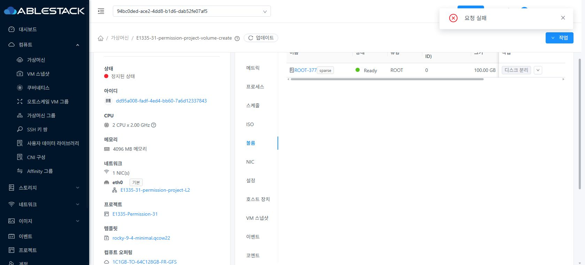
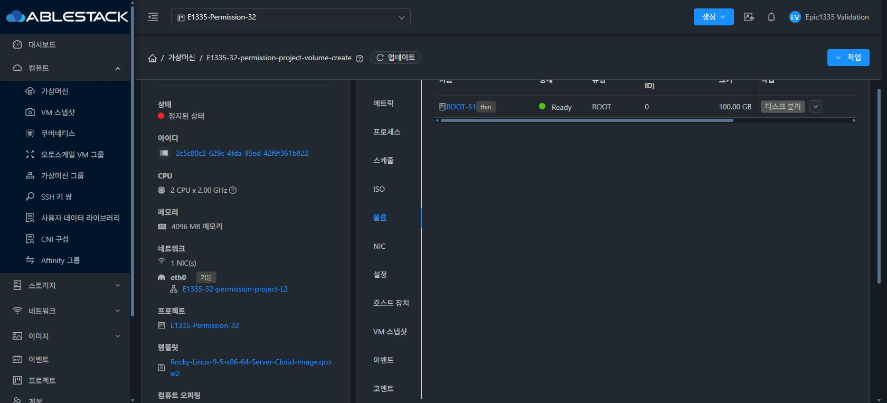
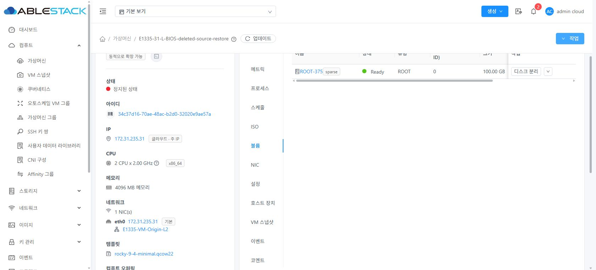
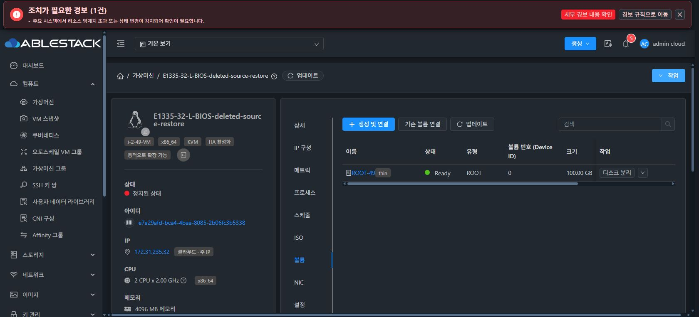
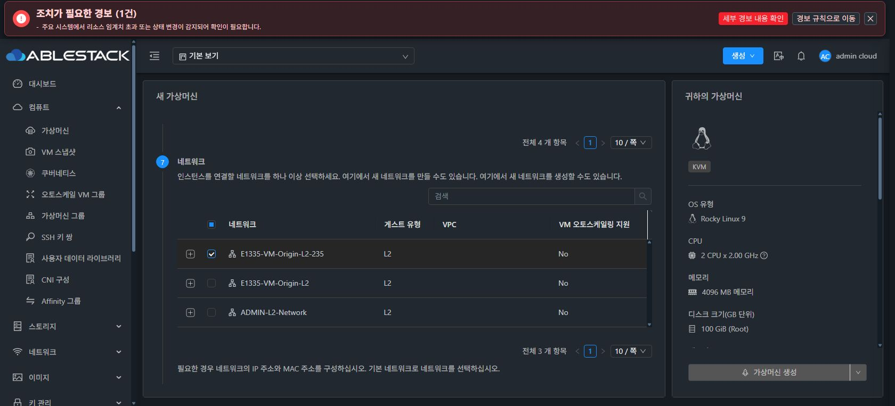
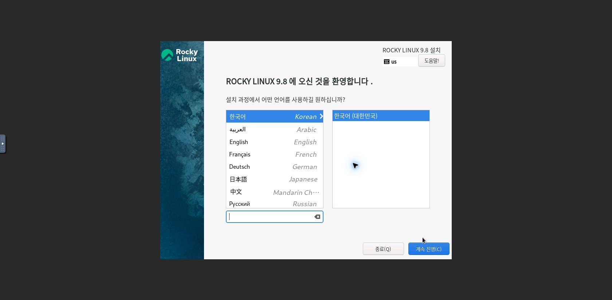

<!--
Licensed to the Apache Software Foundation (ASF) under one
or more contributor license agreements.  See the NOTICE file
distributed with this work for additional information
regarding copyright ownership.  The ASF licenses this file
to you under the Apache License, Version 2.0 (the
"License"); you may not use this file except in compliance
with the License.  You may obtain a copy of the License at

  http://www.apache.org/licenses/LICENSE-2.0

Unless required by applicable law or agreed to in writing,
software distributed under the License is distributed on an
"AS IS" BASIS, WITHOUT WARRANTIES OR CONDITIONS OF ANY
KIND, either express or implied.  See the License for the
specific language governing permissions and limitations
under the License.
 -->

# Epic #1335 추가 UI 경계 검증 — 2026-10-10

이 문서는 추가 경계 검증 당시 기록이다. 대표 Linux BIOS·Windows UEFI 16개 경로는 UI 생성·게스트 한글 파일 SHA256·정상 정지를 통과했다. 당시 남아 있던 장애·회귀·최종 배포의 현재 결과는 [최종 장애·회귀·배포 보고](resilience-ui-validation.ko.md)를 따른다. 아래 최초 실패와 당시 버전 기록은 보존한다.

## 일반 사용자·프로젝트와 사용량

사용자 승인으로 각 환경에 전용 일반 사용자와 프로젝트를 만들었다. 전용 ROOT와 BackedUp 스냅샷은 관리자 API로 준비·보존 분리하고 최종 생성은 일반 사용자 UI로 수행했다.

| 환경 | 사용자 스냅샷 | 프로젝트 스냅샷 | 사용자 볼륨 | 프로젝트 볼륨 |
|---|---|---|---|---|
| 31 GFS2 | PASS | PASS | PASS | PASS |
| 32 Ceph krbd | PASS | PASS | PASS | PASS |

8건 모두 최초 Stopped, 올바른 계정/프로젝트, ROOT/device0 100GiB를 확인했다. 볼륨은 동일 UUID, 스냅샷은 새 ROOT UUID다. 이 추가 8건은 생성·소유권 검증이며 게스트 부팅은 수행하지 않았다. 대표 16건의 게스트 검증과 구분한다. 일반 사용자에게 admin 스냅샷 URL을 입력해도 후보·요약이 비고 생성은 비활성화되었다.

첫 사용자 볼륨 편입은 기존 100GiB를 다시 예약해 200GiB 한도를 초과하는 결함으로 거절되었다. 921f970f97c는 기존 ROOT 편입의 중복 볼륨/저장소 예약을 생략하고 신규 스냅샷 ROOT·DATA 예약은 유지한다. 한도를 올리지 않고 200GiB·볼륨 2개가 꽉 찬 상태에서 사용자·프로젝트 볼륨 편입 4건을 다시 UI로 제출해 성공했다. 성공 뒤에도 네 소유자 모두 200GiB/200GiB, 볼륨 2/2였다. 최초 실패는 실패 증거로 보존했다.

두 프로젝트의 추가 스냅샷 요청은 볼륨 한도 2/2에 새 ROOT 1개가 필요하므로 사전 거절되었다. UI 한글 실패 안내·기술 상세·자동 재제출 없음·새 VM 0개를 확인했다.

## 원본 영구 삭제 후 복구

승인된 전용 VM 2대와 ROOT만 UI로 영구 삭제했다. 두 백업 스냅샷은 유지했다. 이후 UI 생성·시작, 새 ROOT/device0 100GiB, Linux 게스트의 백업 시점 한글 파일 SHA256 일치, UI 정상 정지를 확인했다. 최종 VM은 Stopped, 스냅샷은 BackedUp이다.

31 VM은 34c37d16-70ae-48ac-b2d0-32020e9ae57a, ROOT는 2f44e12e-bf27-448e-9128-ce2e72b55e5c다. 32 VM은 e7a29afd-bca4-4baa-8085-2b06fc3b5338, ROOT는 1b60822d-98e3-42ce-82a0-8feb5dcccc4f다. 기존 전용 SSH 키와 호스트 경유로 게스트를 확인하고 임시 테스트 브리지 주소를 제거했다.

원본 삭제 직후 volumeid 필터가 삭제된 Volume을 참조하며 NPE를 내는 별도 결함을 발견했다. 47191c5b447은 사라지거나 미배치된 원본에도 필터를 유지하고 기존 공유 별칭만 확장한다. ACL 조건은 유지했다. 관련 테스트 4개, 배포 후 API 및 실제 UI의 원본 volumeid 목록에서 올바른 BackedUp 스냅샷 1개 표시를 통과했다.

## 자동 스토리지·ConfigDrive·ISO

7bbefd84f0b는 자동 배치도 적격 풀 조회가 성공해야 유효하게 처리한다. 조회 중·실패·후보 없음·용량 부족 때 생성 버튼을 비활성화하고 한글 사유를 표시한다. 두 환경에서 ROOT100GiB+DATA10000GiB×2 자동 배치를 차단했고 DATA를 10GiB로 복구하면 활성화되었다. 수동 동일 풀의 합산 검증과 자동 ROOT/DATA별 검증은 구분한다.

31 CLVM 태그/GFS2 풀 불일치, 32 전용 epic1335-no-pool 오퍼링 불일치는 UI에서 후보 0개·한글 안내·생성 비활성화를 통과했다. 정상 GFS/rbd 오퍼링으로 복구하면 후보와 생성 활성화가 돌아왔다. 태그 검증을 IOPS·스토리지 장애로 확대하지 않는다.

6e802176178은 ConfigDrive와 부팅 ISO+추가 ISO의 슬롯 충돌을 VM 할당 전 차단한다. 양쪽 UI 경고·생성 차단과 백엔드 사전 거절·VM 목록 불변을 확인했다. 추가 ISO 제거 또는 ConfigDrive 없는 네트워크로 바꾸면 활성화되었다. 31 라이트·다크, 32 다크에서 확인했다.

32 Rocky Linux 9.8/드라이버 ISO를 승인된 기존 내부 저장소에서 UI로 등록했다. 두 ISO와 ConfigDrive 없는 네트워크로 최초 Stopped 생성→UI 시작→한국어 설치 화면→UI 정상 정지를 통과했다. ROOT20GiB Ready/device0와 SATA CD-ROM 2개를 확인했다. OS 설치는 하지 않았다. 31 같은 회귀도 앞선 보고서에서 통과했다.

## 최신 빌드·배포·보존

변경 모듈만 WSL ext4에서 빌드했다. Server 집중 테스트 16개(UserVmManager 12+SnapshotVolumeFilter 4), Checkstyle 0건, Server RAT 통과다. UI 집중 6개 suite/66개 테스트, 변경 파일 ESLint·생산 빌드 통과다. 겹치는 과거 테스트 수는 합산하지 않는다. 전체 Cloud 빌드는 수동 실행하지 않았다.

관리 JAR 소스는 921f970f97c다. 31 SHA256 a221e3ac835ca0e4d7300d2af370d98ec0fab112475e621f85f825a7eed7200a, 32 e2483942a9ff90fb53168ab4798490521b71f89cf70f6800a43458b4f87cf289. UI 소스 7bbefd84f0b의 archive SHA256은 6d1bef9077588523e0fa7ea27ad8a4b97edf5a93568b2e7d9c02fa53cb75c2b9다. 양쪽 정적 파일 840개 해시, WEB-INF/META-INF/config.json 보존, mold active, /client/ 200을 확인했다.

32의 같은 IP에 남은 Down Diplo 등록과 Up Europa 등록을 백업·재확인하고 공식 removeManagementServer API로 해당 Down Diplo 등록만 제거했다. 이후 두 차례 관리 JAR 배포 재시작에서 Agent 3대가 별도 Agent 재시작 없이 Up으로 돌아왔다. 진행 중 VM 생성 장애 검증과 구분한다.

최신 확인에서 기존 31 VM 74개·32 VM 13개 UUID/상태/호스트가 변경되지 않고 호스트 6대 모두 Up이었다. 전용 테스트 VM은 기본 범위 31 19개·32 21개, 전용 프로젝트 각 3개다. 진단 실패 VM도 보존한다.

## 남은 완료 조건

진행 중 Agent/management 재시작, 생성 응답 유실·중복 재제출 방지·재진입, IOPS·스토리지 불가, 안전한 재시도와 더 넓은 template 회귀를 계속한다. 완료 조건과 최종 PR 체크를 확인하기 전 Epic 완료·전체 CI 성공으로 보고하지 않는다. PR은 Draft이며 기존 9개 이슈는 Open이다.

