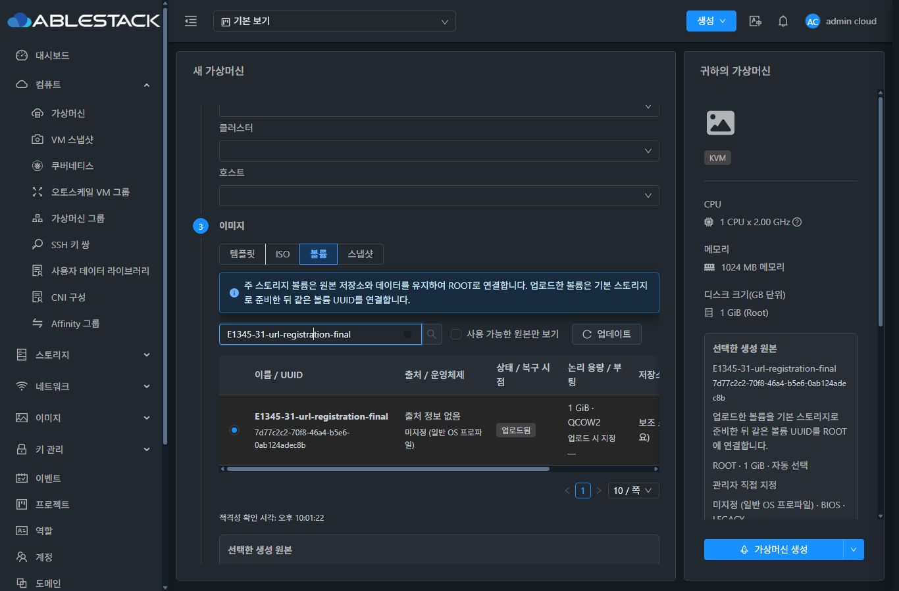
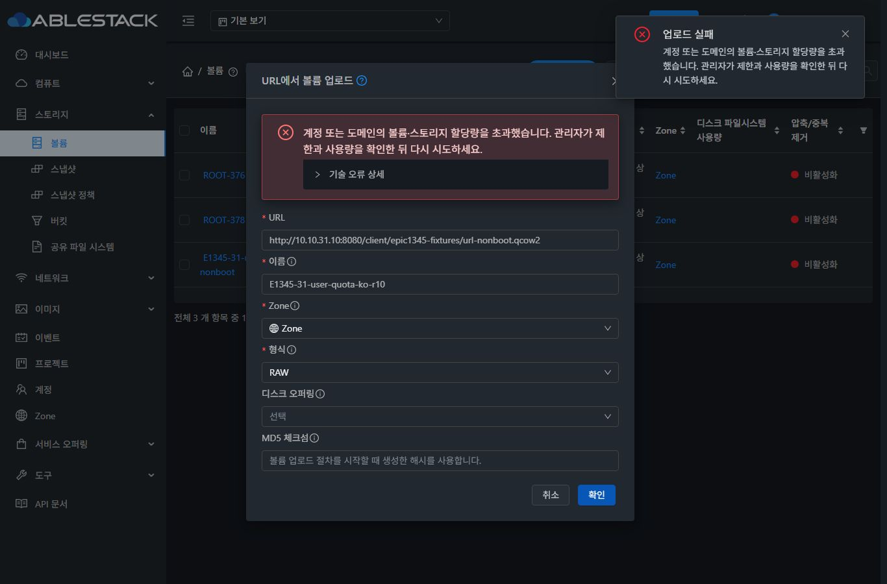
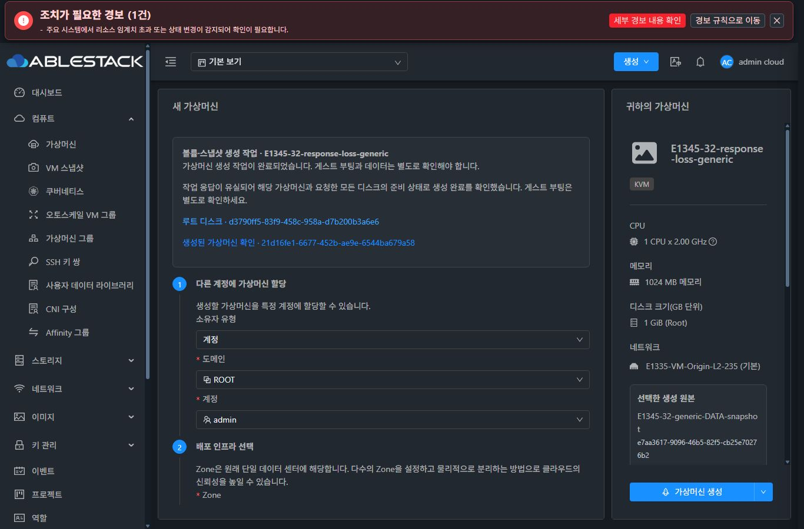
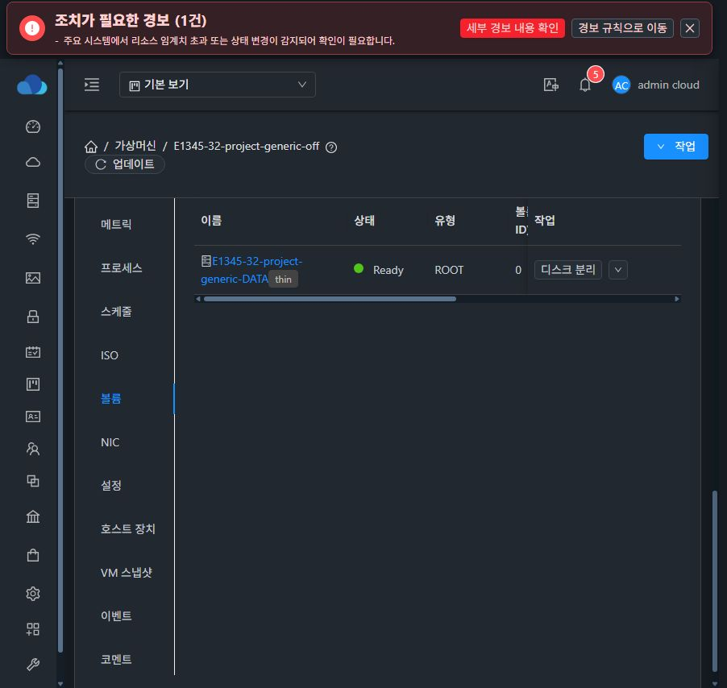

<!--
Licensed to the Apache Software Foundation (ASF) under one
or more contributor license agreements.  See the NOTICE file
distributed with this work for additional information
regarding copyright ownership.  The ASF licenses this file
to you under the Apache License, Version 2.0 (the
"License"); you may not use this file except in compliance
with the License.  You may obtain a copy of the License at

  http://www.apache.org/licenses/LICENSE-2.0

Unless required by applicable law or agreed to in writing,
software distributed under the License is distributed on an
"AS IS" BASIS, WITHOUT WARRANTIES OR CONDITIONS OF ANY
KIND, either express or implied.  See the License for the
specific language governing permissions and limitations
under the License.
 -->

# #1345 일반 업로드·파일 등록 볼륨의 VM 생성 구현 및 실환경 검증

Epic #1335 / 기존 PR #1344에 일반 DATADISK·Uploaded 볼륨·일반 DATA 스냅샷 생성 경로를 추가했다. 별도 목업 화면을 제품으로 배포하지 않았다. 기존 Mold의 **가상머신 생성 마법사**, **스토리지 브라우저**, **VM 정보 카드·상세·볼륨 탭**을 수정했다. 이 보고서는 이전 ROOT 출처 검증 16개와 구분되는 추가 범위의 증거다.

## 최종 동작

- 원본 VM·템플릿·OS 기록이 없는 볼륨도 선택 가능하다. OS는 실제 GuestOS 카탈로그에서 직접 지정하거나 `미지정 (일반 OS 프로파일)`을 사용한다. BIOS/UEFI 및 ROOT 디스크 버스를 선택한다. 내부 blank 실행 프로파일은 원본 템플릿으로 노출하지 않고 별도 빈 ROOT도 생성하지 않는다.
- 주 스토리지의 미연결 Ready 볼륨은 **같은 UUID·pool·경로**로 ROOT/device0에 편입한다. Uploaded 볼륨은 기존 전송 서비스를 통해 선택/자동 배치한 주 스토리지에 준비한 뒤 같은 논리 UUID를 ROOT로 연결한다. GFS2는 QCOW2, krbd는 driver가 준비한 RAW 객체를 실제 형식으로 응답한다.
- 일반 DATADISK 스냅샷도 OS/ROOT 출처를 강제하지 않고 새 ROOT로 복구할 수 있다. 원본 스냅샷은 보존한다.
- Cloud 성공은 디스크 준비·연결과 요청된 VM 프로세스 시작이다. **게스트 OS 부팅은 관리자 책임**이라는 한글 안내를 실행 설정·결과에 표시한다. 게스트 내부 OS 탐지나 QGA 응답을 생성 조건으로 사용하지 않는다.
- OS 이름은 Cloud의 원본/GuestOS 기록 또는 관리자 선택값이다. 화면에서 내부 기본 프로파일을 실제 OS처럼 표시하지 않는다. 형식 출처는 업로드 선언·스토리지 조회·Cloud 등록 기록으로 구분하며 자동 OS 탐지 결과처럼 표시하지 않는다.
- 사용 중·동시 편입·ACL/프로젝트/Zone·업로드 미완료·실제 형식/아키텍처 불일치·provider·태그·공간/IOPS·quota 검사는 유지한다. 외부 출처라는 사실만으로 차단하지 않는다.

## 실제 UI 검증

아래 생성·등록·확인·시작/재시도는 배포된 Mold에서 수행했다. API/DB/host XML·이미지 비교는 보조 증거다. 이름은 모두 전용 E1345 자원이다.

| 환경·원본 | VM / 상태 | ROOT UUID | 확인 |
|---|---|---|---|
| 31 로컬 업로드 / 자동 배치·시작 해제 | `4f39826d-de7c-4316-ab2e-4d28ed5e2907` / Stopped | `876a602e-0128-4c4b-aaf0-80d0688b2c84` | 같은 UUID, Primary QCOW2 Ready/device0 |
| 31 URL 업로드 / 풀 지정·시작 | `a795afba-36dc-4a37-b1e4-e4942d72d613` / Running | `144f28ad-682e-48c7-b8d2-cb509c069873` | 유효 QCOW2 비부팅 디스크, 콘솔 No bootable device |
| 32 로컬 업로드 / 자동 배치·시작 해제 | `7fe75646-6ba9-4bca-9f8c-f9399746173d` / Stopped | `dfe19a9a-f925-45d4-9423-8207895e9c99` | 같은 UUID, Primary RAW Ready/device0 |
| 32 URL 업로드 / 풀 지정·시작 | `be04ea93-c0ce-4d98-a256-36bfb1e6ea5c` / Running | `e7ecfae2-9c31-44ea-a67f-acb71e53a7cd` | 실제 krbd RAW, BIOS/iPXE 콘솔이며 게스트 부팅 PASS로 기록하지 않음 |
| 31 기존 QCOW2 파일 / 시작 | `a40721ed-8267-49d0-8861-820a919851c5` / Running | `16dc8a47-d8ec-4f63-ab0a-a457b3ddec82` | UI 파일 등록, 같은 UUID·pool·파일, 비부팅 콘솔 |
| 31 정상 QCOW2 파일 / BIOS | `be399161-fde8-49f0-af32-0e24daa6a80d` / Running | `30bd3283-f84f-47ce-b181-b52d7e8d639d` | Rocky Linux 9.4 로그인 콘솔, 별도 관리자 부팅 확인 |
| 32 정상 RBD 파일 / UEFI LEGACY | `38ba8098-562a-4596-aa8c-557f8bc7b20e` / Running | `7aba5eb3-16a5-4a8c-9388-9059fb5c3748` | Windows Server 2022 잠금 화면, 별도 관리자 부팅 확인 |
| 31 일반 DATA 스냅샷 / 시작 해제 | `01b08f41-e8d2-48d2-82a3-18e68ea6f666` / Stopped | `b9e03fcc-c04e-4c1d-942d-47712a8a05f6` | DATA 백업에서 새 ROOT, OS 미지정 |
| 32 일반 DATA 스냅샷 / 시작 해제 | `42fa5f69-a98b-4c3a-ac68-e2eac582ab66` / Stopped | `9351043e-3d8b-423c-9435-a6b260bf783d` | DATA 백업에서 새 ROOT, OS 미지정 |
| 31 일반 사용자 업로드 / 시작 해제 | `661829fb-df0f-4da4-8ffb-fe39860a2be9` / Stopped | `76a05d7c-b9d4-4be0-a586-30ce235ec341` | 사용자 소유 유지, Uploaded→Primary ROOT |
| 31 프로젝트 일반 DATA / 시작 해제 | `be5a4012-27e0-4484-b9df-108607ee3114` / Stopped | `1c7c2247-c0fc-485b-af33-ef7fa5741181` | 프로젝트 소유 유지, 기본 보기 ROOT 표시 |
| 32 프로젝트 일반 DATA / 시작 해제 | `7e2a62e6-5c83-4876-8c8f-b1376c83e0c5` / Stopped | `ef79a090-75d6-420f-8e15-3be5663cb306` | 프로젝트 소유 유지, 기본 보기 ROOT 표시 |
| 31 두 UI 동시 편입 / B만 성공 | `bc35e1a5-5433-441d-b038-6bdc64d514ed` / Stopped | `a8ea590a-ae15-4582-a873-5908fd7f7141` | A 거절, B 한 대, 같은 파일 SHA256 |
| 32 시작 실패 후 UI 재시도 | `692145c3-07fb-40c0-aff5-2bde2776b7a2` / Running | `f5dc33f5-a83f-4fee-9f22-9259e1526d1e` | 실패 시 Stopped+Ready ROOT 보존, 네트워크 수정 후 같은 VM·ROOT 시작 |
| 32 일반 DATA 스냅샷 응답 유실 | `21d16fe1-6677-452b-ae9e-6544ba679a58` / Stopped | `d3790ff5-83f9-458c-958a-d7b200b3a6e6` | 재제출 차단→결과 재조회→완료, 새로고침 후 기록 유지, deploy 1회 |

31/32 URL 업로드의 실제 대상 이미지를 원본 QCOW2와 `qemu-img compare -U`로 비교해 모두 `Images are identical`을 확인했다. krbd 대상은 `/dev/rbd/rbd/...` RAW이며 GFS2 대상은 QCOW2 파일이다. 전송 후 동일 논리 UUID의 ROOT Ready/device0와 보조 스토리지 volume_store_ref 정리도 대조했다. 31 동시 편입 전후 파일 SHA256은 `3b107e52f63fab104395d42dbb0d08b9ef9cb3f10b1e32fe083674dba258e7f8`로 동일하다.

일반 DATA 백업은 31 `b73d1aee-a32b-4ccd-a351-907e2578984c`, 32 `e7aa3617-9096-46b5-82f5-cb25e70276b2`이며 실제 UI `백업 됨`을 확인한 후 생성했다. 원본 DATA는 후속 전용 동시성/시작 재시도 테스트에서 ROOT로 편입했지만 두 백업은 보존했다.

## 실패·권한·복구 증거

- 31 일반 사용자 UI에서는 관리자 원본 검색 결과가 없고 제출이 비활성화된다. primary_storage 200GiB가 이미 사용된 상태의 Uploaded ROOT 생성은 quota 오류로 거절되어 원본 Uploaded DATADISK가 유지되고 VM은 추가되지 않았다. 일시 201GiB 허용 후 위 사용자 VM이 생성됐다.
- 두 UI가 같은 Ready DATA를 선택한 뒤 확인 버튼을 동시에 눌렀다. A는 SOURCE_ATTACHED/SOURCE_CHANGED로 거절되고 B만 성공했다. 동일 원본에 VM/ROOT가 중복되지 않았다.
- 32 VLAN 3235의 호스트 인터페이스 길이 제한을 이용한 실제 하이퍼바이저 시작 실패에서 VM은 Stopped, 원본 ROOT는 Ready/device0로 보존됐다. UI NIC를 정상 VLAN235로 변경한 후 기존 생성 작업의 시작 재시도로 같은 VM/ROOT가 Running이 됐다.
- 32 응답 유실은 실제 배포 UI를 통과시키는 전용 localhost 릴레이에서 단 한 번의 deploy 응답 본문을 끊어 재현했다. 서버 job은 정상 완료됐다. UI는 unknown 안내와 재제출 차단, `작업 상태 다시 확인`으로 실제 VM·모든 디스크 준비 상태 확인, 새로고침 후 완료 기록과 ROOT 링크를 유지했다. 릴레이를 종료했고 추가 deploy 요청은 없었다.
- 처음 31 업로드 시도 두 건은 내부 blank 템플릿/NIC 준비 및 Uploaded ROOT 배치 결함으로 Error였다. 원본 Uploaded 볼륨은 보존됐고 수정 후 같은 원본으로 위 성공 VM을 생성했다. 처음 32 파일 시작 시도는 기존 cleanup이 원본의 DB 상태를 Destroy로 변경하는 결함이었다. 물리 RBD 백업을 보존하고 시작 실패 보존 경로를 수정했다. 이 초기 실패들을 PASS로 합산하지 않는다.
- 마지막 URL 업로드 quota 검증에서 비동기 작업 접수 직후 성공 알림을 표시하던 결함을 추가 발견했다. 이제 uploadVolume job을 조회해 등록 성공 후에만 성공을 표시하고, 실패는 한글 요약과 펼쳐보는 기술 상세로 제공한다. 원래 영어 오류는 진단용 상세 안에 유지한다.

일반 사용자와 두 프로젝트의 quota는 테스트 후 원래 volume=2, primary_storage=200GiB로 복원했다. 증거용 새 VM/ROOT를 보존했으므로 각 해당 소유자의 사용량은 현재 3개/201GiB다. 복원된 제한 이내라고 주장하지 않는다. 새 테스트 자원은 영구 삭제하지 않았다.

## 현재 Mold UI와 가독성

새 실행 설정은 기존 이미지 단계 아래에 배치했고 목록·오른쪽 요약·기존 최종 확인 대화상자에 같은 원본/설정/형식 출처를 사용한다. Uploaded만 ROOT 대상 스토리지 선택을 활성화하며 Ready 원본은 기존 pool을 유지한다. 스토리지 브라우저의 `파일을 볼륨으로 등록`은 기존 Import API를 사용한다. 책임 안내에 별도 강제 동의 절차를 추가하지 않았다.

실제 클러스터 UI에서 한국어 상태·미지정·관리자 지정·실패 문구·선택 placeholder, 기존 정보 카드의 Rocky Linux 9/Windows Server 2022와 미지정 표시를 확인했다. 390/1366/1680px × light/dark의 원본 표 및 모바일 실행 설정을 확인했고 키보드 Tab과 표 내부 가로 스크롤도 확인했다. 비활성 `Cloud 기록 사용` 문구는 어두운 테마의 보조 텍스트 토큰으로 보정했다. 이 검증은 수치 기반 전체 WCAG 감사가 아니다.

프로젝트 VM의 기본 보기에서 볼륨 탭/작업 ROOT 링크가 비어 보이는 오류를 발견해 VM·작업에 저장된 projectid를 조회에 반영했다. 두 클러스터 최종 UI에서 Ready ROOT/device0가 다시 표시되는 것을 확인했다.

실제 화면은 [evidence/issue1345](evidence/issue1345)에 저장했다. 초기 잘못된 빈 ROOT 화면이나 테마 전환 직후 밝은 화면을 다크 PASS 증거로 사용하지 않았다.

## 빌드·배포 및 범위

- WSL ext4의 dhslove 작업 트리에서 변경 api/server/engine-orchestration 모듈만 Maven 빌드했다. 고유 집중 Java 테스트 **126개**: API 3, server 58, UserVmResponse 11, orchestration 54. 최종 세 모듈 package PASS, Checkstyle 0건, 모듈 RAT PASS.
- UI 집중 테스트는 기존 111개/9 suites와 URL 등록 결과 3개를 포함해 **114개**다. 변경 UI ESLint 및 production 빌드를 확인했다. 이는 전체 UI 테스트/전체 Cloud CI가 아니다.
- 관리 서버의 기존 배포 JAR에 변경 모듈에서 빌드한 45개 클래스의 해시를 대조해 적용했다. 31/32 서로 다른 배포 패키지의 나머지 클래스는 보존했다. 최종 모듈 package와 배포 클래스 해시 불일치 0건을 확인했다.
- 실제 webapp의 정적 파일만 갱신했으며 WEB-INF/META-INF와 기존 config.json을 보존했다. 두 서버 mold active 및 `/client/` HTTP200, 정적 파일 840개 해시 일치를 확인했다. 하위 이슈에서 agent 변경/전체 RPM 교체는 하지 않았다.
- 기존 VM **31번 99개, 32번 41개**의 상태·host가 기준선과 동일했고, 라우팅 호스트 여섯 대는 Up이었다. 프로젝트 VM은 개별 UUID로도 조회해 기본 목록 누락을 오판하지 않았다.

전체 Cloud GitHub Actions 빌드나 전체 RPM 검증을 이번 요청의 변경 모듈 빌드로 대체해 PASS라고 표시하지 않는다. 새 Uploaded 전송 중간의 물리 네트워크 단절은 이번 실환경에서 별도 재현하지 않았다. 초기 준비 실패의 원본 보존, copy rollback 집중 테스트, 시작 실패 및 응답 유실 UI 증거와 구분한다. ACL/Zone/실제 형식·아키텍처·태그·용량/IOPS·provider 거절의 모든 조합을 이번 추가 UI 경로에서 다시 실행한 것은 아니며, 공통 validator/allocator 집중 테스트 및 기존 Epic 회귀 증거와 함께 평가한다. Windows 정상 파일의 게스트 콘솔은 확인했지만 QGA는 연결되지 않아 QGA/게스트 파일 해시 PASS로 확대하지 않는다.

PR #1344 업데이트 이후 코드 리뷰·병합은 별도 단계다. 현재 구현·변경 모듈 빌드·테스트 환경 배포와 위 실제 UI 검증 결과를 보고하며, 원본 ROOT/스냅샷의 이전 검증은 [기존 최종 보고](resilience-ui-validation.ko.md)에 보존한다.

## 최종 배포 재검증 (22:00 KST 이후)

최종 UI 코드 `558024bd897c501798477402561cc8749befc8d7` production 빌드와 양쪽 정적 배포를 완료했다. 아카이브 SHA256은 `29d7b4a8451c235ca12e4b6771dce38a5ad98215025edbca7ba5ab3bd61740b5`다. 이후 PR에 추가한 문서·증거 커밋은 실행 소스를 변경하지 않는다. 최신 upstream Europa `2871963cd43aeb592f619c1b67d8a5974846409d`가 현재 브랜치의 조상임을 다시 확인했다.

새 번들을 reload한 31 일반 사용자 URL 등록은 quota job 실패가 한글 오류 요약으로 표시되고 기술 상세를 펼쳐볼 수 있었다. 새 볼륨은 0개다. 관리자 URL 등록은 `7d77c2c2-70f8-46a4-b5e6-0ab124adec8b` Uploaded DATADISK 1GiB가 됐고, 최종 VM 생성 UI에서 업로드 시 지정 QCOW2·출처 없음·OS 미지정·생성 가능·직접 지정 및 대상 스토리지 준비 경로를 확인했다. 이 마지막 자원은 업로드 UI 수정의 검증용이며 위 VM 15개에 합산하지 않는다. 32 실행 설정의 비활성 `Cloud 기록 사용` 글자도 다크 모드에서 읽을 수 있음을 확인했다.

