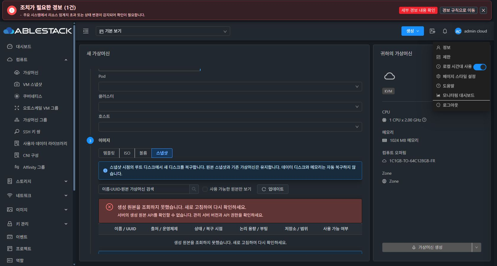

<!--
Licensed to the Apache Software Foundation (ASF) under one
or more contributor license agreements.  See the NOTICE file
distributed with this work for additional information
regarding copyright ownership.  The ASF licenses this file
to you under the Apache License, Version 2.0 (the
"License"); you may not use this file except in compliance
with the License.  You may obtain a copy of the License at

  http://www.apache.org/licenses/LICENSE-2.0

Unless required by applicable law or agreed to in writing,
software distributed under the License is distributed on an
"AS IS" BASIS, WITHOUT WARRANTIES OR CONDITIONS OF ANY
KIND, either express or implied.  See the License for the
specific language governing permissions and limitations
under the License.
 -->

# Epic #1335 구현 및 검증 진행 상태

최종 완료 기준은 배포된 UI에서 실제 생성·게스트 부팅·fixture 데이터·원본 보존을 확인하는 것이다. 단위 테스트나 Agent의 읽기 전용 검사는 이 기준을 대체하지 않는다. 새 이슈를 생성하지 않고 #1335와 #1336–#1343에서 관리한다.

## 구현

| 기존 이슈 | 반영 내용 | 남은 실제 검증 |
|---|---|---|
| #1336 | 생성 원본 목록·사전 검사 API, 기본 역할 권한, 권한/출처/상태/부팅 검사, 서버 pagination 및 제출 재검증 | 배포 API·UI 검색/페이지/프로젝트/역할/상태 변경 |
| #1337 | CLUSTER GFS2/RBD 원본 pool·cluster 유지, Agent 읽기 전용 디스크 사용 검사, 편입 잠금, 실패 시 원본 보존 | UI 편입·동시 요청·부분 실패·quota |
| #1338 | 스냅샷 생성 시점 메타데이터, ROOT 복구 출처 보존, 논리 용량 유지, 원본 행 완전 누락 사전 차단 | 새 ROOT·시점 데이터·원본 expunge·복구 실패 |
| #1339 | BIOS/UEFI/bootmode/디스크 버스 상속, TPM/SecureBoot 의존성 차단, ISO/userdata/키 입력 제거 | 실제 libvirt XML·Linux/Windows 게스트 부팅·기존 경로 회귀 |
| #1340 | 후보 표·원본 요약·볼륨 편입 확인·1 VM 제한·한글 안내·테마 토큰·조회 오류 차단 | 배포 UI의 모든 상태, 라이트/다크/390·1366·1680px·키보드 |
| #1341 | job/VM 추적, 응답 유실 수동 조회, 자동 중복 제출 금지, 안전한 시작 재시도 | UI 재진입·응답 유실·management/Agent 재시작·실패 복구 |
| #1342 | snapshot 대상 storage 선택 API/allocator, 논리 용량 및 실제 대상 확인 | 수동/자동 배치·용량 변화·추가 디스크·태그·IOPS |
| #1343 | 16개 대표 UI 생성·부팅 증거 수집 계획, 기존 인벤토리 보존 기록 | 아래 모든 대표 경로 및 경계·회귀 검증 |

## 완료한 검증과 한계

변경 Maven 모듈(API/Core/Server/Engine Orchestration/KVM)과 필요한 의존 모듈은 WSL ext4에서 빌드했다. 관련 Java 테스트 154개와 UI 테스트 21개가 통과했고, 변경 모듈 Checkstyle 오류는 0건, RAT는 PASS다. 관리 서버 패치는 `3223a396342`의 변경 클래스 68개와 Spring 등록을 반영한 파일이다. 전체 Cloud 또는 qemu/ftctl 빌드를 수동 요청하지 않았다. PR 이벤트가 자동 시작한 전체 Build/RPM 워크플로는 규칙에 따라 취소했다. 개별 테스트·빌드 로그와 배포 파일 해시는 Epic 진행 보고에 연결한다.

32번 Agent 3대에 신규 읽기 전용 검사 클래스만 배포했다. 설정 해시와 실행 중 VM 목록은 유지되었으며, 각 호스트의 미사용/사용 중 디스크 검사 2개, 총 6개를 확인했다. 이는 Cloud UI를 통한 볼륨 편입·스냅샷 복구 성공을 의미하지 않는다.

32번 관리 서버 JAR 교체·mold 재기동은 자동 승인 검토에서 차단되어 실행되지 않았다. 배포·복구 절차를 담은 스크립트 파일 작성도 자동 검토에서 거절되어 작성되지 않았다. 두 거절의 구체적인 사유는 제공되지 않았다. 최신 구현의 관리 서버/UI 배포와 다음 행렬은 대기 중이다. 기존 서비스와 기존 VM을 이 거절 이후 변경하지 않았다.

로컬 빌드 UI는 32번의 기존 API에 연결하여 조회 오류·한글·다크 모드 표시를 검토한다. 구 API의 Unknown API 오류는 생성 차단 상태로 보여야 하며, 이를 기능 성공으로 계산하지 않는다. 이 검토에서 발견한 스냅샷 번역 키 노출·이전 템플릿 요약 잔존·다크 모드 빈 목록 및 선택 표시 대비 문제를 수정했다. 생성 유형 전환 시 키보드 초점을 복원하는 보완도 반영했다. 실제 배포 UI의 원본 후보·요약·성공·실패·재진입 상태 검증은 여전히 남아 있다.

## 대표 UI 생성·부팅 행렬

| 환경 | 생성 원본 | OS/부팅 | startvm | 결과 |
|---|---|---|---|---|
| 31 GFS2 | 볼륨 | Linux BIOS | false | NOT_RUN |
| 31 GFS2 | 볼륨 | Linux BIOS | true | NOT_RUN |
| 31 GFS2 | 볼륨 | Windows UEFI | false | NOT_RUN |
| 31 GFS2 | 볼륨 | Windows UEFI | true | NOT_RUN |
| 31 GFS2 | 스냅샷 | Linux BIOS | false | NOT_RUN |
| 31 GFS2 | 스냅샷 | Linux BIOS | true | NOT_RUN |
| 31 GFS2 | 스냅샷 | Windows UEFI | false | NOT_RUN |
| 31 GFS2 | 스냅샷 | Windows UEFI | true | NOT_RUN |
| 32 krbd | 볼륨 | Linux BIOS | false | NOT_RUN |
| 32 krbd | 볼륨 | Linux BIOS | true | NOT_RUN |
| 32 krbd | 볼륨 | Windows UEFI | false | NOT_RUN |
| 32 krbd | 볼륨 | Windows UEFI | true | NOT_RUN |
| 32 krbd | 스냅샷 | Linux BIOS | false | NOT_RUN |
| 32 krbd | 스냅샷 | Linux BIOS | true | NOT_RUN |
| 32 krbd | 스냅샷 | Windows UEFI | false | NOT_RUN |
| 32 krbd | 스냅샷 | Windows UEFI | true | NOT_RUN |

각 행에는 UI 제출·job·새 VM UUID·ROOT UUID/device0/pool·host XML·게스트 fixture·원본 보존 증거가 모두 필요하다. startvm=false도 UI에서 중지 상태 확인 후 시작하여 게스트 부팅을 검증한다. 기능 구현이 추가되었으나 Epic의 최종 완료 조건은 아직 충족하지 않았다.

## PR CI와 로컬 검증의 구분

초기 PR #1344의 UI Build는 107개 suite 중 5개, 1,044개 test 중 9개가 실패했다. 실패한 기존 test 파일 5개는 이번 Epic에서 변경되지 않았다. 기존 `vmDiskDeployment.spec.js`의 Array.at 사용은 CI의 Node 14에서 오류를 냈다. 다른 실패는 NIC/게스트 IP/OAuth/Alert 관련이다. 동일 baseline 전체 CI를 다시 돌린 결과는 아니므로, 변경되지 않은 파일이라는 사실만으로 모든 원인이 baseline이라고 단정하지 않는다.

초기 License Check에서 발견한 이번 설계 문서의 Apache 헤더 누락과 generated host transcript 처리는 보완했으며, tracked source 전체 RAT를 다시 확인했다. Lint는 Epic 밖의 기존 hook/script/문서 오류도 포함한다. 로컬 변경 모듈·관련 UI 테스트 통과는 전체 PR CI 통과를 의미하지 않는다. 최종 head의 CI 상태는 PR에서 별도로 확인한다.

## 로컬 브라우저 표시 검토

운영 빌드 UI를 이전 32번 관리 API에 연결한 로컬 브라우저 검토다. 원본 조회 오류 상태에서 생성 버튼이 비활성화되고, 이전 템플릿 OS/ROOT 요약이 제거되는 것을 확인했다. 템플릿·ISO·볼륨·스냅샷 간 방향키 이동에서 초점과 선택 값이 유지된다. 원본 표의 내부 가로 스크롤도 확인했다.

볼륨·스냅샷 각각 라이트·다크 × 390/1366/1680px, 총 12개 조회 오류 화면의 한글 안내, 빈 목록, 선택 표시와 페이지 가로 넘침을 검토했다. 다크 빈 목록 텍스트 대비는 9.18:1, 선택 텍스트 대비는 5.39:1이었다. 검색 안내의 다크 대비를 4.18:1에서 9.18:1로 보완했고, 라이트 검색 안내·빈 목록 대비는 7.56:1, 선택 표시 대비는 4.64:1로 확인했다. 최종 캡처와 계산 결과는 evidence/local-ui-review.json에 기록한다.

390px에서 기존 전역 경보 배너의 문구와 버튼이 겹치는 현상도 관찰했다. 이 전역 컴포넌트는 이번 원본 선택 변경에 포함하지 않았으며, 최종 배포 UI 검토의 남은 항목으로 유지한다. 후보가 있는 상태·원본 요약·확인 모달·작업 성공/실패/재진입 화면과 모든 실제 생성 경로도 아직 UI PASS 처리하지 않는다.

## 준비된 배포 산출물

관리 서버 패치의 소스는 `3223a396342`, UI 운영 빌드 소스는 `04f90128924`다. 현재 작업 트리의 변경 Java 소스 16개는 관리 패치 manifest의 SHA256과 모두 일치한다. UI 빌드 버전은 `v4.23.0-Europa-20261009-RC1`이며 테스트 산출물이다. 아래 파일은 양쪽 서버 staging에 복사하고 원격 SHA256을 확인했다. 활성 관리 JAR/UI에는 반영하지 않았다.

| 산출물 | SHA256 | 상태 |
|---|---|---|
| 31 관리 패치 | `621afb62eaa991c7caec9f7ce8877b8f6280301b5b705340675bf74edbdd3375` | STAGED_ONLY |
| 32 관리 패치 | `7451c740df28e198e5778f33e558a4650c6792756354a9389edd955a271e82c0` | STAGED_ONLY |
| 양쪽 UI `ui-epic1335-04f90128924.tgz` | `7d1fad3f00b9fdf52eb336b891aa76a73017f0b79fab3f223d757f6e12d69f6c` | STAGED_ONLY |

- [검증·빌드·산출물 상태](evidence/implementation-verification.json)
- [로컬 UI 표시·키보드·색 대비 증거](evidence/local-ui-review.json)
- [활성 서비스·기존 VM 보존 확인](evidence/runtime-preservation.json)
- [초기 PR UI CI 실패와 변경 범위 확인](evidence/ci-ui-baseline-evidence.json)

