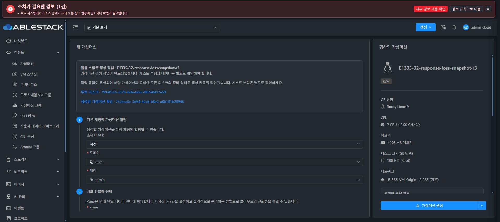
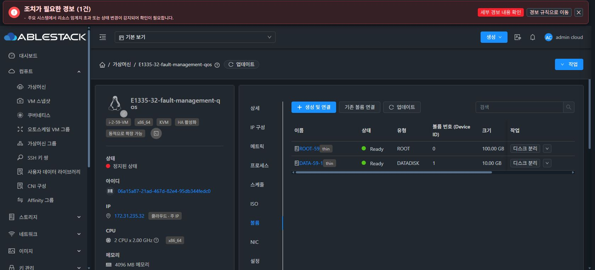
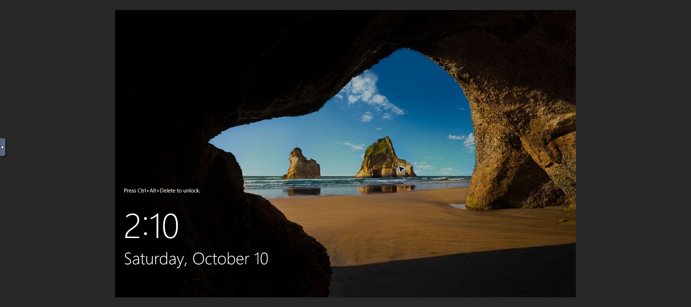
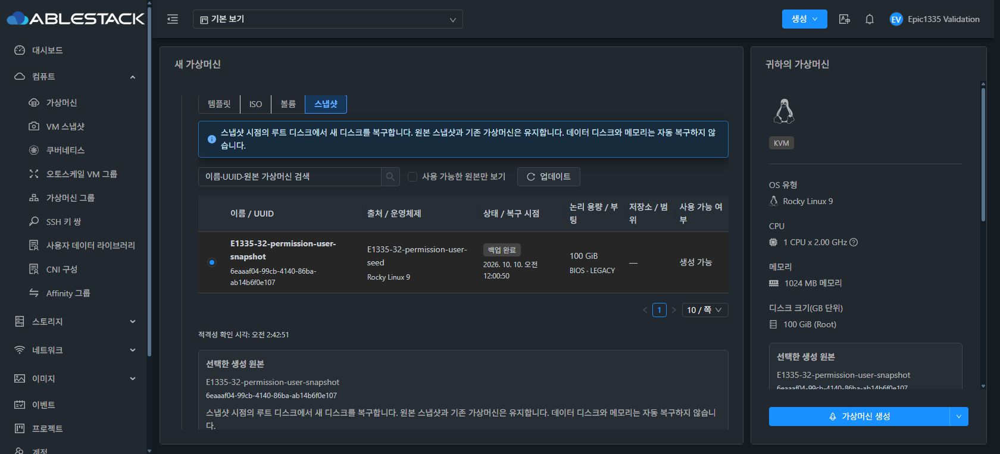
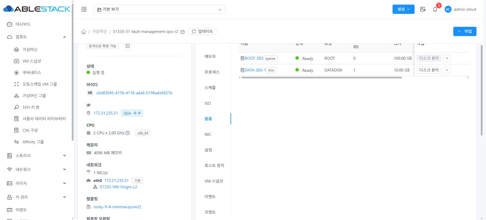
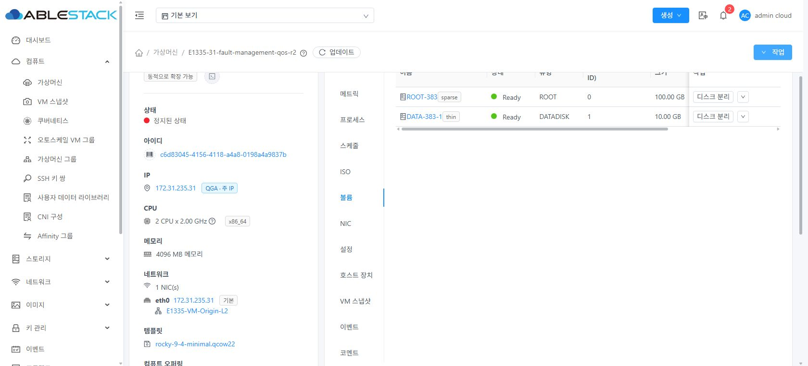

<!--
Licensed to the Apache Software Foundation (ASF) under one
or more contributor license agreements. See the NOTICE file
distributed with this work for additional information
regarding copyright ownership. The ASF licenses this file
to you under the Apache License, Version 2.0 (the
"License"); you may not use this file except in compliance
with the License. You may obtain a copy of the License at

  http://www.apache.org/licenses/LICENSE-2.0

Unless required by applicable law or agreed to in writing,
software distributed under the License is distributed on an
"AS IS" BASIS, WITHOUT WARRANTIES OR CONDITIONS OF ANY
KIND, either express or implied. See the License for the
specific language governing permissions and limitations
under the License.
-->

# Epic #1335 응답 유실·재시작·부분 실패 복구 검증 — 2026-10-10

이 문서는 [대표 16개 UI·게스트 경로](implementation-status.ko.md), [Windows 검증](windows-ui-validation.ko.md), [권한·원본 삭제·용량 검증](edge-ui-validation.ko.md)에 이어 수행한 장애 및 회귀 검증이다. 기존 #1335와 #1336–#1343, PR #1344 안에서 구현했다. 새 이슈를 만들지 않았다.

**구현·변경 모듈 빌드·31/32 배포·지정 UI 검증을 완료했다. PR #1344는 코드 검토·병합 단계다.** 아래 완료 기록과 최초 실패 기록을 구분한다. 관리 서비스나 수동 보정 이후 성공을 최초 장애 실행의 무보정 전체 체인 성공으로 합산하지 않는다.

## 발견한 결함과 수정

- 생성 POST 응답 유실이 공통 요청 처리에서 로그아웃을 유발했다. 이 생성/재시도 요청만 전송 실패 시 인증을 유지하도록 했으며 실제 HTTP 401의 세션 만료 처리는 유지한다.
- 완료 작업은 listAsyncJobs의 진행 중 목록에서 사라진다. 응답을 잃은 작업은 이름·원본 UUID/종류·생성 시각이 일치하는 단일 VM, 요청한 DATA 개수, 모든 Ready 디스크, 요청한 최종 VM 상태를 확인해 완료 여부를 대조한다. 모르는 job ID를 만들지 않는다.
- 실패한 VM의 ROOT가 Ready이고 DATA가 Allocated인 부분 실패를 시작 재시도 대상에 포함했다. 소유권·실제 실패 job을 다시 조회하고 startVirtualMachine만 제출한다. 원본 복구 또는 새 VM 생성을 재제출하지 않는다. 재시도 응답까지 유실되면 기존 실패 job과 새 시작 요청을 섞지 않고 확인 필요 상태로 유지한다.
- krbd에서 DATA 생성 직후 Agent 응답이 끊기면 Ceph에는 이미지가 있으나 Cloud에는 Allocated로 남는다. 동일 DATA UUID·풀 UUID·물리 경로·RAW 형식·정확한 논리 용량을 확인해 그 이미지를 재사용한다. ROOT, 암호화, migration, qemu 관리 data pool, 다른 풀/경로/크기/형식은 이 복구에 포함하지 않는다. 기존 디스크를 삭제·초기화·리사이즈하지 않는다.
- 한글 안내와 기술 오류 원문을 구분했고, 같은 상태 안내를 중복 표시하지 않는다. 시작 재시도의 진행 문구는 준비된 ROOT 유지와 DATA 준비/연결을 설명한다.
- 일반 사용자에게 비공개 저장소 이름/형식이 없는 셀은 단일 ‘—’로 표시한다.

## 생성 응답 유실: 32번 실제 UI

로컬 전용 중계기가 관리 서버의 정상 HTTP 200 생성 응답만 유실시켰다. 서버 오류나 실제 네트워크 전체 단절로 확대해 해석하지 않는다.

| 항목 | 결과 |
|---|---|
| 이름 | E1335-32-response-loss-snapshot-r3 |
| 생성 요청 횟수 | 1 |
| VM | 752ece3c-3d54-42c6-b8e2-a06181b20946 |
| 새 ROOT | 791af122-3379-4afa-b8cc-ff07e8417e59 |
| 실제 최종 상태 | Stopped / ROOT Ready |
| UI | 로그인 유지 → 확인 필요·재제출 차단 → 작업 재조회 → VM와 모든 디스크 대조로 완료 |
| 재진입 | 새로고침 후 같은 완료 기록 유지 |
| 원본 | BackedUp 유지 |

r1의 로그아웃과 r2의 완료 작업 미검출은 실패 기록이다. r3 성공과 합산하지 않는다. 같은 통신 유실 주입을 31번에도 수행했다고 주장하지 않는다.

## 관리 서버·Agent 재시작과 부분 실패

각 관리 서버에서 UI 생성 작업이 jobstatus=0임을 확인한 뒤 mold를 재시작했다. 두 관리 서버 PID 변경, WEB-INF 유지, /client/ HTTP 200, 원본 BackedUp 유지, 다른 VM 상태/호스트 보존을 확인했다. 실제 401 이후 정상 재로그인하면 같은 job·VM 기록이 복원된다.

| 환경 | VM / ROOT / DATA | 장애 이후 |
|---|---|---|
| 31 GFS2 | c6d83045-4156-4118-a4a8-0198a4a9837b / 835fab91-488e-408c-b88a-69f3d92a46d1 / 94e7feaa-176a-48e5-ac10-bad5ea6767d5 | 생성 job 실패, ROOT 보존; 이후 호스트 실행 결과와 Cloud Running·모든 Ready가 동기화됨 |
| 32 krbd | 06a15a87-21ad-467d-82e4-95db344fedc0 / d7d646bd-bbb3-4cf7-a8cd-ae716ef8e548 / caf4e79d-b529-44ea-9c4f-1a3f71135a6f | 생성 job 실패, ROOT Ready·DATA Allocated; UI 시작 재시도로 복구 |

두 환경에서 UI 시작 작업이 진행 중이고 호스트가 배정된 시점에 해당 Agent만 재시작했다. 다른 실행 도메인 UUID는 유지했다.

32번은 DATA 생성 응답 유실과 이미 존재하는 이미지 오류를 재현했다. 수정 후 별도 복구 실행의 UI 시작 job **89461b22-74db-4680-845a-8789fc1c6d3a**가 성공했고 동일 VM·ROOT·DATA가 Running/Ready가 됐다. Ceph DATA 이미지 ID **4a91bf129d196e**, 생성 시각과 크기는 그대로였다. 서버 로그에서도 기존 DATA 복구 분기를 확인했다. 정상 UI 정지 후 기존 VM의 정상 UI 시작도 성공했다.

31번 Agent 장애 실행은 600초 관측 동안 시작 job이 0, Cloud Starting인 반면 게스트는 실제 Running이었다. UI는 작업을 성공으로 속이거나 재제출하지 않았다. 이 경우 관리 서비스 재시작으로 기존 job을 실패 확정하고 Agent 재연결로 실제 Running 상태를 동기화했다. 이 복구 절차는 운영 개입이 필요하며 무보정 자동 복구 성공으로 표시하지 않는다. 별도 실행 **E1335-R31-post-repair-start**에서 UI 작업 재조회 → 기존 VM 시작 재시도 → job **e01538ff-cc46-4527-9c05-dc8ff5cbb00c** 성공 → 동일 VM/ROOT/DATA Running/Ready를 확인했다. 이 시작 이후 게스트 한글·20GiB 파일 해시를 다시 확인했으며 정상 UI 정지까지 완료했다.

생성 요청의 재제출에는 원본 revision 검사가 적용된다. 이미 준비된 VM의 시작 재시도는 원본을 다시 복구하지 않으므로 VM의 원본 식별자, 연결된 ROOT/DATA 소유권·상태, 실제 실패 job을 확인한다. 기존 볼륨은 ROOT 편입 자체로 원본 연결 상태와 revision이 달라진다. 원본을 자동 분리하거나 삭제해 옛 revision으로 되돌리지 않는다.

## 게스트 데이터와 회귀

두 장애 복구 VM에서 실제 게스트 SSH로 100GiB ROOT·10GiB DATA, 한글 UTF-8 파일 및 20GiB 검증 파일을 읽었다. 두 파일 해시는 각각 백업 이전과 일치했다. 임시 검증 브리지 주소는 finally에서 제거했다. QGA의 비활성 guest-exec/file 명령을 활성화하지 않았다. cloud-init에 따른 SSH 호스트 키 재생성은 신뢰 가능한 해당 ROOT의 읽기 전용 공개 키 검사로 확인하고 StrictHostKeyChecking을 유지했다.

| 환경 | 한글 파일 SHA256 | 20GiB 파일 SHA256 |
|---|---|---|
| 31 | bfe00c222e9fcf100f5892036fd69b88394a5b3f4499a2133b0f4af1873bd873 | db9f210eeaabed04c7cc4fde4f256f5d3fc5e0c3b5a6efcd9fa0d672bffec7a6 |
| 32 | 7f74af1c640673344c8a64b9dc219a7681553951e11f966051257d8a5da1c98f | 2b525e9a8c7899823f64abe3c61101aa91b7e607d373e624932496f896debb07 |

31번 사전 선택 템플릿 VM **5dbc658d-f6a3-46d4-9afd-3dd9768a3880**도 UI 시작 → 실제 Windows 잠금 화면 → 정상 UI 정지를 통과했다. 기존 보고서의 최초 Stopped 생성 검증과 구분해 부팅 회귀를 보완했다. 두 환경의 추가 ISO 2개 한국어 설치 화면 및 ConfigDrive 충돌 차단은 경계 보고서에 있다.

## 스토리지 불가와 IOPS의 정확한 검증 범위

각 전용 풀에 공식 updateStoragePool(enabled=false)을 적용해 신규 할당만 비활성화했다. 양쪽 실제 UI의 자동 배치 후보가 0개, 한글 차단 사유, 생성 비활성화를 확인하고 즉시 enabled=true로 복원했다. 전후 다른 VM UUID·상태·호스트는 유지됐다. GFS2/Ceph 전체를 중단하는 물리 장애나 storage maintenance를 수행한 것으로 주장하지 않는다.

두 DATA 오퍼링의 최소/최대 IOPS 500/1000, 10GiB가 UI 선택 및 실제 Ready DATA 속성에 유지되는 것을 확인했다. 두 풀의 capacityIops는 미설정이다. 따라서 집계 IOPS 소진을 실제 환경에서 통과/차단했다고 주장하지 않는다. 최소/최대 IOPS 예약 값과 KVM read/write throttle은 다른 속성이다. iotune이 비어 있으므로 이 검증을 런타임 IOPS 제한 보장으로 확대하지 않는다.

## 최종 원본 행과 화면 검증

31번 실제 후보 19개에서 첫 페이지 10개·둘째 페이지 9개, 중복 없음, 첫 페이지 복귀와 UUID 검색 1개 결과를 확인했다. 25/30개 및 페이지 크기 변경은 집중 테스트 증거와 구분한다. 누락 boot metadata는 ‘—’와 한글 차단 사유를 표시하고 생성 버튼을 막는다.

32번 일반 사용자 소유 원본은 비공개 저장소 셀을 단일 ‘—’로 표시한다. 최신 다크 UI에서 보조 문구 표본 대비는 9.18:1 이상, 문서 가로 overflow는 없었다. 390/1366/1680px·light/dark·키보드·표 내부 스크롤은 기존 경계 보고서의 실제 배포 UI 검증과 연결한다. 전체 접근성 감사 완료로 해석하지 않는다.

## 빌드·배포·보존·CI

WSL ext4의 dhslove 작업 브랜치에서 변경 Maven 모듈만 빌드했다. 원래 Windows 작업 트리의 수정은 유지했다.

- 관리 JAR: 921f970f97c. 관련 Server 테스트 16개·패키징·Checkstyle/RAT 통과.
- KVM 모듈: 7c1da47b579. 신규 복구 보호 테스트 10개 + 기존 KVMStorageProcessor 48개 = 58개, 변경 모듈 package·Checkstyle 위반 0·RAT 통과.
- UI: 03e16ae2a68. 집중 92개·ESLint·생산 빌드 통과. 아카이브 SHA256 **993453ebadd1b4e83573ad5505f4d9aecdcd5862e043b9f03b00d82ffadd912f**, 활성 index.html SHA256 **11524ac3936e5c9ecdad9c746a6a738fe0f02bc5c6f050e4d737fef80d21952b**.
- 정적 UI 배포는 WEB-INF/META-INF/config.json을 보존하고 840개 정적 파일 해시·mold active·/client/ HTTP 200을 대조한다.
- KVMStorageProcessor 클래스 SHA256: 6cdbc40d9fc5b6c243c6676e2edaf342704fcd1058f29aaaddbb0712f32b8e45. 양쪽 호스트 6대 배포를 확인했다.
- 최초 31-1 배포 후 즉시 실행 도메인 비교가 실패했다. 이 기록을 숨기지 않았다. 별도 진단에서 클래스 일치·agent active·원래 agent.properties 속성 불변과 기존 VM 74개 상태/호스트 불변을 확인했고 나머지 호스트에는 전후 목록을 파일로 보존했다. 최종 별도 검사에서 관리 클래스·UI index/840개 파일 해시·WEB-INF/META-INF/config 보존·서비스·HTTP 200, 6대 Agent 클래스/서비스, 기존 31번74개·32번13개 VM UUID·상태·호스트를 확인했다. 최초 31-1 비교 전 실행 목록을 파일로 남기지 않아 그 비교 실패의 원인을 확정할 수 없다. 최초 배포 비교를 PASS로 바꾸지 않는다.
- 전체 Cloud/RPM/GitHub Actions 빌드는 명시적으로 요청되지 않았다. 집중 테스트와 전체 CI를 구분한다. 최종 PR 체크 상태는 완료 보고 시 다시 조회한다.

[검증 JSON](evidence/resilience-validation.json)
