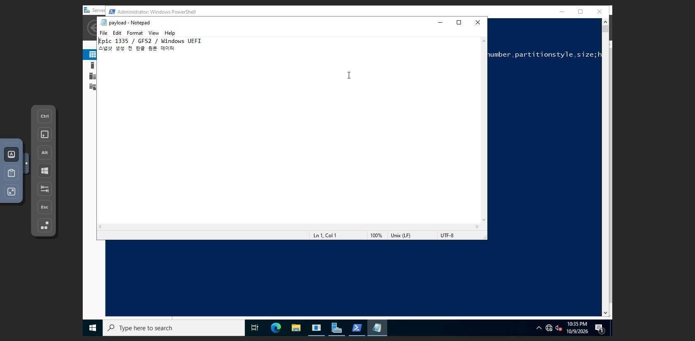
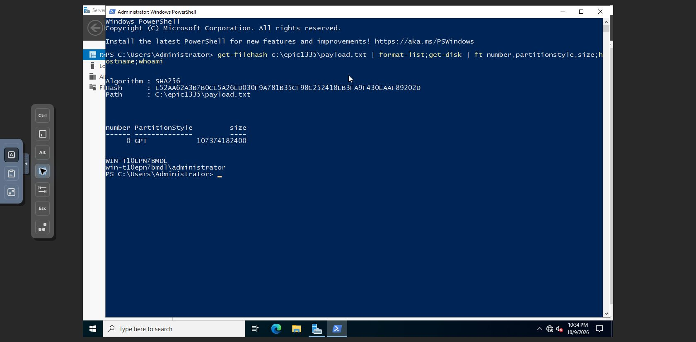

<!--
Licensed to the Apache Software Foundation (ASF) under one
or more contributor license agreements.  See the NOTICE file
distributed with this work for additional information
regarding copyright ownership.  The ASF licenses this file
to you under the Apache License, Version 2.0 (the
"License"); you may not use this file except in compliance
with the License.  You may obtain a copy of the License at

  http://www.apache.org/licenses/LICENSE-2.0

Unless required by applicable law or agreed to in writing,
software distributed under the License is distributed on an
"AS IS" BASIS, WITHOUT WARRANTIES OR CONDITIONS OF ANY
KIND, either express or implied.  See the License for the
specific language governing permissions and limitations
under the License.
 -->

# Windows UEFI 실제 UI 검증

관리/Agent 코드 `1c3c9c41341`, UI `24e4d7b0074`가 배포된 31 GFS2와 32 Ceph krbd에서 Windows Server 2022 UEFI LEGACY 대표 경로 8개를 통과했다. Linux 8개와 합쳐 대표 16개 모두 PASS다. Epic 전체 경계·장애 조건 완료와 구분한다.

UI에서 원본 선택·CPU/메모리·격리된 L2 네트워크·시작 옵션·확인·제출·VM 결과를 검증했다. false는 최초 Stopped 후 UI 시작, true는 자동 Running을 확인했다. 게스트 기존 Administrator 로그인 후 파일 SHA256, GPT/100GiB, 호스트명/계정과 Notepad 한글 표시를 검증하고 UI 정상 정지했다. 정상 정지 대화상자의 강제 옵션은 사용하지 않았다.

| 환경 | 원본 | startvm | VM | ROOT UUID | 결과 |
|---|---|---|---|---|---|
| 31 | volume | false | `i-2-370-VM` / `4d472e96-a267-48ea-9ff4-96b129b2e669` | `15c2f8f7-54bf-4287-89fe-4717838e2d40` | PASS |
| 31 | volume | true | `i-2-371-VM` / `c6e11c06-0db9-4423-8429-790379edba48` | `15c2f8f7-54bf-4287-89fe-4717838e2d40` | PASS |
| 31 | snapshot | false | `i-2-372-VM` / `5769363e-cc47-4d60-8806-5a5959b207c9` | `c698c464-38d8-4d3e-9e87-f5c97f6c637c` | PASS |
| 31 | snapshot | true | `i-2-373-VM` / `bac37bfb-d130-4262-b092-58465ce662ff` | `9a3fca7a-17b6-42a9-a237-8eb608dad3d7` | PASS |
| 32 | volume | false | `i-2-43-VM` / `2031e251-fd4b-4f7b-8bc6-7a8c4fab3a36` | `d945a565-eb11-4240-9c64-20b9fd4e0a40` | PASS |
| 32 | volume | true | `i-2-44-VM` / `63008885-b08f-4d89-a162-c11c72df7bd3` | `d945a565-eb11-4240-9c64-20b9fd4e0a40` | PASS |
| 32 | snapshot | false | `i-2-45-VM` / `72f699ad-51ad-4de6-acf9-1a8d94888c3a` | `56dedced-bb39-4f66-88d7-359d719e8b6f` | PASS |
| 32 | snapshot | true | `i-2-46-VM` / `5870f38f-a68e-44b4-9016-30b604acc0ea` | `46896a3a-df13-4ee6-a7de-fce471738a73` | PASS |

원본 seed에서 UTF-8/BOM 없음/LF 파일 `C:\epic1335\payload.txt`를 작성한 뒤 정상 정지하고 볼륨 스냅샷 BackedUp을 확인했다. 다시 seed를 시작해 파일을 변경하고 해시/한글을 확인한 뒤 정상 정지 및 ROOT 보존 분리했다. 볼륨 사례는 변경 후 해시, 스냅샷 사례는 변경 전 해시와 일치한다. 각 파일의 정확한 내용은 `evidence/windows31-fixture-before.txt`, `-after.txt`와 32번 파일에 있다.

| 환경 | 스냅샷 시점 SHA256 | 변경 후 SHA256 |
|---|---|---|
| 31 GFS2 | `aa38be6978f34713512a562d532832a1230355a08d6dca6dbca962c9a5188501` | `afb257eff40b86553d4258b5c65ad61567ff5c687c23b40b2d16ac6ea54c4c30` |
| 32 krbd | `e52aa62a3b7b0ce5a26ed030f9a781b35cf98c252418eb3fa9f430eaaf89202d` | `d30ebb9db0356c8011a3d1c7f992ddde1850c1e642dde9feb5a7815c7cbc7a1a` |

볼륨 사례는 같은 원본 UUID가 ROOT/device0으로 편입되었다. 스냅샷 사례는 원본과 다른 ROOT UUID를 만들었다. Running host XML에서 VM UUID별 NVRAM 경로, q35/UEFI secure=no, SCSI ROOT를 확인했다. 31번은 `/mnt/glue-gfs/` qcow2 파일, 32번은 `/dev/rbd/rbd/` raw 블록 장치다. 게스트의 기존 호스트명/Administrator 계정은 유지됐다. 한 번에 환경별 테스트 VM 한 대만 실행하여 중복 게스트 식별자 충돌을 피했다. SID 재생성이나 네트워크 재초기화 검증으로 확대 해석하지 않는다.

콘솔 키 입력 및 웹 대화상자의 전환이 지연되는 경우 화면이 안정된 뒤 입력·제출했다. 로그인을 위한 비밀번호 변경이나 게스트 원격 접근 권한 변경은 하지 않았다. PowerShell 기본 폰트의 한글 글리프 제한은 Notepad UTF-8 화면으로 분리해서 확인했다.

각 `evidence/windows{31,32}-{volume,snapshot}-{off,on}-result.json`에는 UI job/VM/ROOT, 실제 게스트 해시 판독, 생성/실행/종료 상태와 민감 정보를 제외한 host XML이 있다. 증거 사진 54개는 `evidence/windows-ui/`에 있다. 로그인 비밀번호·세션 키·콘솔 URL은 포함하지 않는다.

검증 후 Windows seed와 생성 VM 모두 Stopped다. volume-off는 원본 보존 분리, volume-on은 원본 Ready/ROOT/device0을 그대로 보존했다. 스냅샷 두 개는 BackedUp이다. 기존 VM 31번 74개/32번 13개 UUID·상태·호스트 불변, 호스트 6대 Up과 전용 테스트 VM 15/16개를 최신 preservation JSON으로 대조했다.

남은 일반 사용자/프로젝트, 삭제 원본 복구, 태그/IOPS/스토리지 불가, 진행 중 agent/management 재시작·응답 유실·재시도·다중 부하, 32번 ISO 및 ConfigDrive+ISO2개 사전 검사는 [진행 보고서](implementation-status.ko.md)에 남겼다. 기존 Epic #1335 및 #1336–#1343, Draft PR #1344에서 계속 진행한다.
