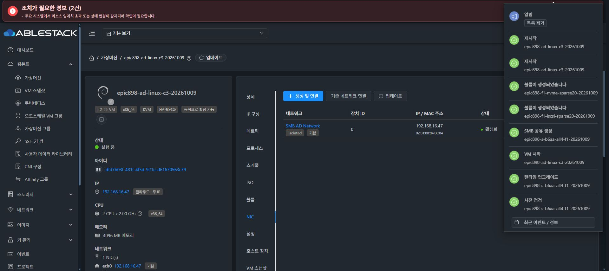
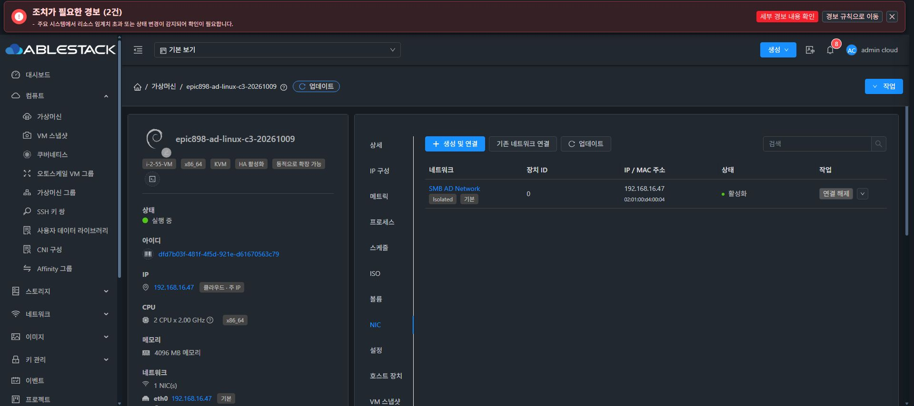
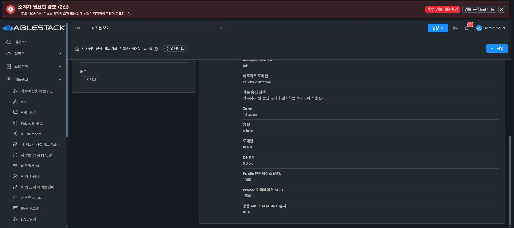

# 독립 Linux AD 클라이언트 C3의 실제 준비 검증

정상 UI로 생성한 C3 `dfd7b03f-481f-4f5d-921e-d61670563c79`/`i-2-55-VM` 한 대에서 hostname·DNS·NIC 부팅 설정과 정상 UI 재시작을 검증했다. 준비 단계에서 패키지 추가·AD 가입·계정/권한 생성·F1/DC/Windows/전역 네트워크·공통 Storage 코드 변경은0이다.

| 항목 | 최종 실제 값 |
| --- | --- |
| hostname/FQDN | epic898-ad-c3 / epic898-ad-c3.ablestack.local |
| NIC/MAC/IP/GW | eth0 / 02:01:00:d4:00:04 / 192.168.16.47/24 / 192.168.16.1 |
| 게스트 기본 DNS | DC192.168.16.2 |
| 전역 Cloud 네트워크 | VLAN201 / DNS8.8.8.8 / cs2cloud.internal 보존 |
| ROOT/DATA | cbb72f38… / QCOW2 SPARSE5GiB / no backing / DATA0 |
| machineId SHA | 246748e0fc960ffb639941a7571748ef2c929db79ede11c1dc28dc129a08b3bb, 생성 시 값 유지 |
| 두 번째 재시작 boot | c80a8a32-d4f7-49ed-b2c0-7b2201b18fb8 |
| DC NTP 관측 | offset -1.881초 / stratum1, 읽기만 |

C3 전용 cloud-init preserve_hostname과 UUID/MAC에 묶인 dhclient DNS override를 구성했다. 첫 정상 UI 재시작에서 hostname/DNS 파일은 유지됐지만 NIC가 DOWN/주소·route·dhclient 없음으로 실패했다. 원래 interfaces가 loopback만 자동 시작했음을 확인하고 첫 실패 증거를 보존했다.

C3에만 `auto eth0`/DHCP boot-start stanza를 추가해 정상 ifup으로 같은 예약 IP/GW를 복원했다. 두 번째 정상 UI 재시작에서 새 boot와 Running/단일 NIC를 확인하고, QGA의 eth0 UP/IP/GW/MAC·hostname·기본 resolver·ROOT·machineId 보존을 대조했다. 강제 재시작은0, 정상 재시작은2회이다.

기본 resolver의 LDAP/Kerberos SRV·getent DC 주소·realm discover ABLESTACK.LOCAL/configured:no를 확인했다. realm list는 비어 있다. NTP 관측값은 Kerberos 인증 성공이나 DC 정책 검증으로 확대하지 않는다. 현재 AD JOIN·TGT·kvno·SMB AD I/O는0이다. 다음 Kerberos 시험은 operator 암호·ticket을 디스크에 저장하지 않는 RAM cache 방식을 별도로 검증한다.

필요한 krb5-user/realmd/adcli/SSSD/NSS/PAM/smbclient/ntpsec은 기존 이미지에 설치돼 있었다. 공개 OS 설정만 C3에 백업했으며 private DB/keytab을 읽거나 복사하지 않았다. 기존 Storage network JSON·공통 boot helper와 전역 네트워크 DNS를 변경하지 않았다. UI의 VM 이름과 실제 guest hostname은 별도이며 guest 값은 QGA로 확인했다.

최종 공개 proof SHA-256 `48014e5bcb5b894d023bf4a136e0dfc2216172e9c6def30b04b26a52b537ae0a`, 두 번째 cold QGA proof SHA-256 `45dbad248ea6036f57dd0b900ea2ac35a21ee0799241ee2f17f5016cb7739525`이다. preparation의 전후·첫 실패·교정·두 번째 재시작 JSON을 각각 보존했다.

Windows47 OOBE 사용자 입력과 SharedFS 실제 AD 서버 가입·DNS/SPN/인증·복원 인수는 별도 게이트이다. 최종 UI 표준 #1275는 미착수이며 시작 직전에 전체 작업을 중단해 보고하고 추가 지시를 기다린다.
