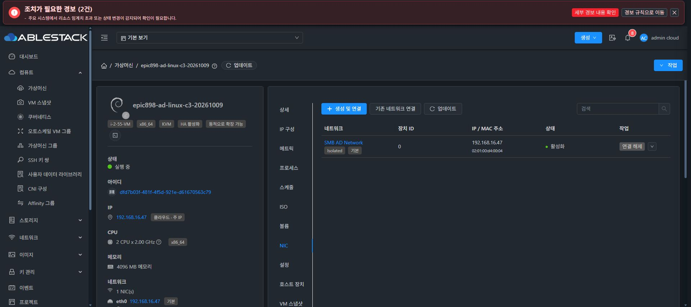

# C3의 기존 도메인 계정 Kerberos 실제 인증

C3 `dfd7b03f-481f-4f5d-921e-d61670563c79`에서 기존 제공 Administrator@ABLESTACK.LOCAL의 정상 kinit1회로 TGT를 확인했다. 같은 부모·자식 KEYRING session에서 DC의 `cifs/adsvr.ablestack.local@ABLESTACK.LOCAL` service ticket을 kvno1회/값3으로 확인했다. 이 검증은 기존 사용자 로그인과 DC 서비스 티켓 범위이며 AD 가입·새 계정/권한·SharedFS SMB AD I/O를 수행하지 않았다.

정확한 C3 UUID/MAC/hostname/machineId/ROOT/DNS를 먼저 확인했다. 새 anonymous session의 UID0·양수 ID·기존 session과 다름·초기 empty와 자식 동일 session을 검증했다. 공개 realm config는 sealed memfd로만 전달했다. 암호는 libvirt_qemu API의 메모리 input-data와 kinit stdin으로 사용했다. argv·환경·파일·로그에 암호를 넣지 않았고 FILE/DIR/user/persistent credential cache로 fallback하지 않았다.

kinit exit0/expected principal·realm/TGT, kvno exit0/서비스 principal/kvno3를 typed metadata로 남겼다. 실제 ticket·key·비밀 hash·klist 원문을 저장하거나 출력하지 않았다. 잘못된 암호 시험·로그인 재시도는0이다. Python immutable 복사본의 완전 zeroize를 주장하지 않으며 정상 프로세스 종료와 버퍼/참조 폐기로 정리했다.

finally의 자기 cache kdestroy exit0·exact owned session clear/revoke·memfd close와 guest/host helper 정상 종료를 확인했다. 독립 관측에서 해당 session은 ENOKEY126으로 접근되지 않았고 디스크 credential cache0/keytab 없음/realm list 빈값을 확인했다. 다른 session/global keyring은 변경하지 않았다. 자체 SSH control도 정상 종료했다.

boot c80a8a32…/machineId246748…/eth0 MAC·IP192.168.16.47/24·GW16.1/hostname epic898-ad-c3/SPARSE ROOT5GiB/no backing/DATA0를 보존했다. 실제 UI에서도 Running/단일 NIC를 확인했다. 추가 재시작·패키지 설치·DC/F1/Windows·공통 코드/Git 변경은0이다.

실제 typed proof SHA-256 `b950829ee0446cc4fa25577f9720ac0c83e56c8ac349da804c7f4f9f0c0ee769`, 독립 cleanup SHA-256 `ef0c840f9a8cf44e57441d947cb3219fb7d03fe3c0fa911161bd834983c71843`, 최종 public proof SHA-256 `e9cf1c55d4ddfa4ad559645117e7ceb28a2e8164e8f298af25eb01dcc56eb2d2`이다.

SharedFS F3 생성·서버 AD 가입·별칭 DNS/SPN·AD 권한과 SMB I/O·ROOT/백업 identity 복원 및 Windows47 OOBE는 별도 미완료 게이트이다. 최종 UI 표준 #1275는 시작하지 않았으며 착수 직전에 전체 작업을 중단해 보고하고 추가 지시를 기다린다.
