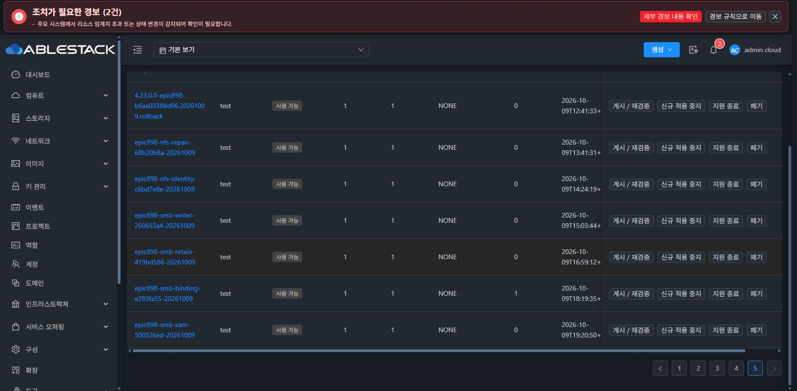

# CURRENT 복구의 원문 SAM 저장 이름 검증

Samba 4.17.12의 [machine_sid.c](https://github.com/samba-team/samba/blob/samba-4.17.12/source3/passdb/machine_sid.c)는 구성된 lp_netbios_name 원문으로 SID 저장 키를 조회한다. wire NetBIOS 이름의 길이 조건을 그대로 저장 키에 적용하면 기존 로컬 신원을 관측하지 못할 수 있다.

## 실제 읽기 비교

F1의 알려진 세 키만 기존 NOFOLLOW·descriptor·libtdb O_RDONLY·메타데이터 보호를 유지해 조회했다. 키 열거, SID 생성, net 유틸 실행, SID 또는 private 내용 출력은 없다.

| 알려진 키 | 관측 |
| --- | --- |
| 실제 구성 원문 | 52자, 커널 hostname과 일치, 기존 SID 키·68바이트 구조 유효 |
| instance에서 도출한 STOR 이름 | 14자, 기존 SID 키·구조 유효, 원문 키와 서로 다른 SID |
| 15자 접두어 비교 | 해당 키 부재. 복구의 fallback 또는 신원 소유자로 사용하지 않음 |

passdb/secrets와 구성의 메타데이터는 검사 전후 동일했다. 두 SID 중 하나를 선택하거나 축약·합치지 않으며 loadedDaemonSidVerified=false를 유지한다.

## 소스와 모듈 검증

- Java dd461bae9e99: CURRENT 내부 증빙을 exact2 samNamespace/machineSid로 구분, 원문 ASCII 이름과 SID uint32·중복·scope·BOOT·hash 검증. focused37 및 정상865/124·Checkstyle PASS. 이전864 대비 production 변경은 Proof.class 한 개이다.
- native500526ed58e9: CURRENT 전용 raw reader와 기존 글로벌15자 reader를 분리. 기존 글로벌 helper 바이트·AD/ROOT/SERVICE 동작 유지. focused43 및 정상48 selectors/428 tests PASS, native141개 파일 검증 전후 동일.
- 두 namespace와 서로 다른 SID·opaque TDB 바이트를 실제 libtdb와 암호화 wrapper에서 보존했다. 실제 signed updater 기록 조회·생산자→immutable Java 소비자 5긍정/9부정 검증 PASS. 이 격리 검증의 ROOT/DMI/endpoint 제공자는 대체 구현이며 Cloud 복구 완료로 표시하지 않는다.
- 별도 unsigned 후보의 정의만 RAM에서 실제 게스트의 읽기 제공자로 평가했다. SOURCE·ROOT·runtime·namespace·unit·package·facts PASS, master2/database2/namespace2, SMB 세션·열린 파일0을 확인했다. 후보를 서명·설치 완료로 표시하지 않았으며 정지·캡처·retain은 호출하지 않았다. 공개 요청은 /run의 고유 디렉터리에만 임시 저장했다.

## 실제 반영 상태

관리 서버는 ABI68 참조 검증 후 Proof.class 한 개만 반영했다. JAR SHA25ad79d8d859f8cb7e9e2faf56156f81ab52e8fa06ff2581d073a72fbe753e39/PID1291168. 다른 JAR 항목·운영 UI 설정을 보존했고 8서비스 Running·3호스트 Up·원래 cfe RECOVERY_REQUIRED/revision4를 확인했다.

테스트 서명 번들2bf5f73e-bb75-401a-9714-a99dd4528c76은 정상 UI에서 등록·검증·게시했다. 실제 CODE 적용 및 새 공개 검토·유지보수 승인·CURRENT 복구 결과는 후속 인수로 기록한다. unsigned 후보의 검토 hash는 실제 승인에 사용하지 않는다.

기존 이미지 b6aa의 소스·체크섬을 유지하며 CODE 변경을 전체 이미지 재빌드로 재표시하지 않는다. 원본 SOURCE의 신원 부재와 CURRENT의 두 신원 기록을 구분한다. 기존 두 SPARSE20GiB DATA와 실패 이력을 보존한다. 최종 UI 표준 #1275는 미착수이다.
