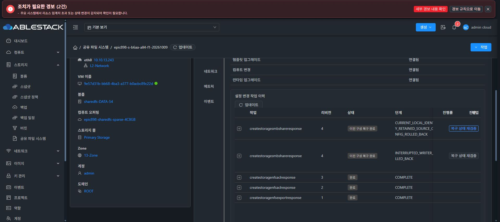
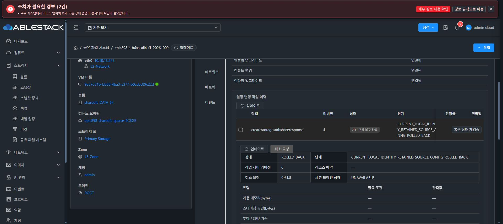
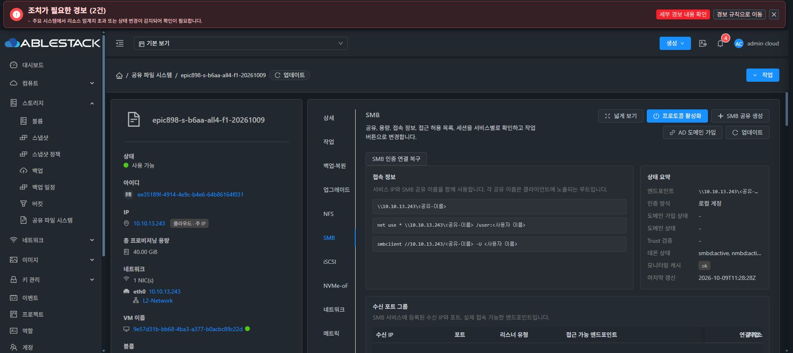

# CURRENT 신원 복구와 SMB 공유의 실제 인수

## 검증 범위

13번 F1 인스턴스 `3480bb2c-99ee-42f2-91cf-715ded5dd35f`에서 정상 Mold UI로 현재 신원 보존 복구와 기존 DATA를 재사용한 SMB 공유 생성을 수행했다. 이후 로컬 계정 ACL 추가는 보호 스냅샷 단계에서 차단되어 외부 SMB 인증·I/O는 아직 수행하지 않았다. 최종 UI 표준화 #1275는 미착수이다.

실제 관리 서버는 소스 dd461bae9e99의 정상 Maven 865 tests/124 classes·Checkstyle 검증 후 Proof.class 한 개만 반영한 JAR SHA-256 `25ad79d8d859f8cb7e9e2faf56156f81ab52e8fa06ff2581d073a72fbe753e39`이다. 실제 서명 CODE500 적용 `915401bb-47a2-43f0-9ecd-d68ed9ae0d8f`는 COMPLETE/100이며 native 정상428 tests/48 selectors와 CLI `4fdd436071dcbe9b8220faacca8b4d266ebbcc6a23661c641559590368c74300`를 대조했다.

기능 UI 소스3df730e74a06의 정상334 tests/18 suites·lint·production850 검증 후 산출물6개만 반영했다. 실제 API의 중첩 `storageserviceruntime` 응답을 풀어 승인·결과를 표시한다. index SHA-256 `4595c74ee9cacf57aa625e8906023451a76d39aec4bc9358603da3164bb7cdc1`, 운영 config·WEB-INF·theme·다른 자산·관리 JAR/PID는 보존했다. 기존 guard·template·style은 유지했다.

## 정상 UI CURRENT 복구

원래 실패 작업 `cfe87d14-7b32-4b9c-999d-fcdae29dbb3d`, revision4에 대해 fresh signed 공개 검토와 명시적 유지보수 승인 후 정상 UI로 복구했다. 결과는 ROLLED_BACK/100, `CURRENT_LOCAL_IDENTITY_RETAINED_SOURCE_CONFIG_ROLLED_BACK`이다.

- `currentIdentityRetained=true`, `originalIdentityRestored=false`, `originalConfigurationSourceRestored=true`이다. 최초 원본 신원 부재를 현재 신원 복원 성공으로 바꾸어 표시하지 않는다.
- 원문52자와 STOR14자 namespace의 서로 다른 SID2개 및 AFTERSTOP private DB 바이트를 native 읽기 전용 검증으로 확인했다. private 내용·SID 값·비밀을 출력하거나 문서에 포함하지 않았다.
- CURRENT reference SHA-256 `87f2050c8a16496642f3400ce0b62c350b9cc10422cd5dc8a374ab756d6a607d`와 원본 SOURCE capsule SHA-256 `95780b3e6d6f10fb762451768acc43f454f1313ab6a2dd70a667a8b16651fb3c`를 구분해 보존했다.
- source generation3/SHA-256 `3f20d0533dab73092aa11b9005a7c15501c2056a2b026c5dd572eb16b3cb87bd`로 구성만 원복했다. pending 없음, CLI·boot·동일 VM·ROOT·DATA 두 개의 serial/size/XFS UUID/mount를 대조했다. formatter 호출0이다.

## 기존 DATA 재사용 SMB 생성

정상 UI의 `EXISTING_VOLUME` 경로로 SPARSE20GiB `ceaee4ff-0dc6-4c4f-ac5d-e28e658906a7`을 재사용했다. 작업 `219b09d5-fe32-40b0-befa-d919c6c964fe`는 COMPLETE, 공유 `eac9dd0c-ccfc-47ec-b49c-c25aca5e3eb5`/`f1-smb`는 Ready/READY이다. 서비스 소유 TCP445 listener를 확인했다.

`/dev/sdc`의 정확 매핑·XFS UUID `6ff9399c-fc78-4ef3-a598-85ad87586ccf`·동일 boot를 유지했다. `formatInvoked=false`, formatter 없음, guest access=false, create mask0660/directory mask0770이다. SMB 공유 생성 성공을 사용자 인증·외부 I/O 성공으로 확대하지 않는다.

## 다음 실제 blocker

정상 `createStorageSmbAcl`의 LOCAL_USER 작업은 job `c4405c22-6f7c-497b-9aca-bacef5efc94e`, jobstatus2/error530, revision5 BLOCKED 및 `Protected local identity snapshot is unavailable`로 종료됐다. 새 시험 암호는 RAM에서만 사용하고 폐기했으며 브라우저 새 자격 증명 입력·credential 파일 저장·외부 SMB 연결·DATA 쓰기는0이다.

설치된 native의 실제 `live_identity_database_holders` 읽기 보호 함수로 smbd가 passdb/secrets 두 FD를 보유함을 확인했다. generic identity capsule 수집이 `SMB_IDENTITY_SOURCE_QUIESCE_REQUIRED`로 거절하는 조건이다. 관리 서버의 일반 LOCAL SMB checkpoint가 native begin/정지보다 먼저 실행되는 호출 순서를 소스에서 확인했다. 보호 검사를 완화하거나 수동으로 데몬을 중지하지 않고 정상 작업 경로의 순서를 개선한다.

차단 뒤 current generation4/SHA-256 `dafecb8bd68c29c0abd2b6e5ff31422361bb325768a54c77de7e305f24db544a`, pending 없음, 두 private DB 메타데이터, DATA UUID/mount, NFS4096바이트 sentinel UID/GID65534 및 SHA-256 `9ba0b0280276cad982cfa3df6e6821f2b4b8ea04761b905cc1d089cbd72c4c8a`를 보존했다.

## 증거와 잔여 게이트

공개 proof는 preparation의 `actual-current-recovery-500/current500-actual-terminal-proof.json`, `smb-current-ceaee-actual-ready-proof.json`, `after-smb-acl-blocked-public.json`이다. 캡처·실행은 한 에이전트가 F1을 단독 소유하여 수행했다. 기존 실패 이력을 변경하지 않았다.

LOCAL SMB 인증·긍정/부정·재접속 I/O, mixed POSIX·CIDR·추가 endpoint·cold, RAW iSCSI/NVMe 및 all4, 백업/다중 NEW 복원, ROOT·AD·작업 제어 인수가 남는다. Linux AD 클라이언트 C3는 정상 UI로 SPARSE ROOT5GiB·고유 신원을 확인했으나 AD 가입은 아직 하지 않았다. Windows47 OOBE 및 정확한 신규 SPARSE10TiB 용량 선택은 기존 사용자 대기 사항이다. 모든 선행 기능 이후 #1275 시작 직전에 전체 작업을 중단해 보고하고 추가 지시를 기다린다.
