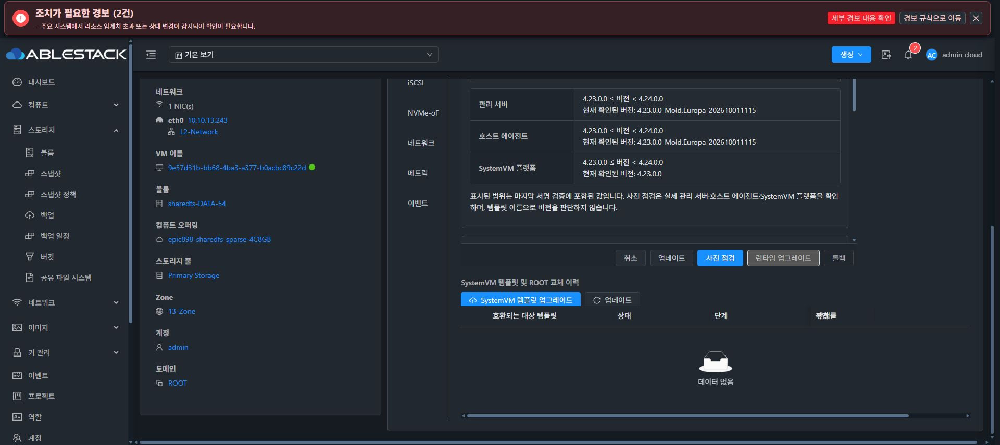
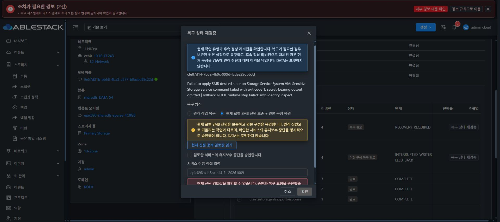

# 현재 SMB 신원 보존 복구의 배포와 읽기 검토

원본 구성에는 SAM 데이터베이스가 없지만 실패한 SMB 설정 중 현재 로컬 신원이 생성된 경우를 구분한다. 원본 SOURCE 캡슐을 그대로 보존하면서 현재 신원을 별도 암호화 자료로 캡처한 뒤 구성을 원복하는 승인 경로이다. 원래 신원을 복원했다는 의미로 표시하지 않는다.

## 배포된 구성요소

| 구성요소 | 검증과 실제 반영 |
| --- | --- |
| 관리 서버507ecfb557f | 정상862 tests/124 classes·Checkstyle. 실제 ABI2671 참조 대조 후17클래스만 반영. JAR SHA3dc96f09fd687ca81f1df43a66a44799b45d199968c591a8abbe67f8680d7e93/PID1276478, API 등록·8서비스 Running·3호스트 Up 확인 |
| native419bd5864b8 | 정상423 tests/48 selectors. 정상 UI에서 테스트 서명 카탈로그a79eff3b-1f85-434e-ac53-12a45bc12a31 등록·검증·게시. F1 CODE 적용9b3d3e8e-8d4e-48c3-9afa-46fb7a619fe8 COMPLETE100. 실제 CLI SHA38525765b32c36fcc6651608fd353e73f953e02ceb96b7806b10b5b3d4690feb 일치 |
| 기능 UIe6669e50ecb | 293 tests/18 suites·lint·production850. 산출물8파일만 반영, index SHA6b32faf8060e123df13405af1b6f9565d6e505bd34ea3d5dd14c8f3a5b89e5b5. 운영 config symlink·SHA d3e28531… 및 WEB-INF·기존 자산 보존 |
| 이미지 | 기존 b6aa 이미지의 소스·체크섬을 유지. CODE 변경을 새 이미지 전체 빌드로 재표시하지 않음 |

CURRENT 생산·소비 검증의 libtdb·FD9·서로 다른 RSA/AAD는 실제 구현을 사용했으나 endpoint/ROOT/runtime 제공자는 격리 대체 구현이다. 이 결과를 실제 Cloud 복구 성공으로 확대하지 않는다.

## 실제 읽기 검토에서 발견한 오류

F1의 cfe87d14-7b32-4b9c-999d-fcdae29dbb3d는 PREPARED/revision4/RECOVERY_REQUIRED이다. 원본 구성은 generation3/SHA3f20d053…이며 canonical SMB 파일은 null이다. 현재 protected SAM 자료가 존재하므로 UNCONFIGURED의 부재 조건으로 처리하지 않는다.

정상 UI에서 CURRENT 방식을 선택하고 공개 검토값 읽기를 실행했다. Java currentSmbRecoveryContext가 정규 키 desired-state/smb-share-apply.json 대신 basename만 조회해 NullPointerException이 발생했다. UI 확인 버튼이 비활성화됐고 취소했다. 이 시점의 실제 서비스 정지·CURRENT 캡처·복구 실행은 0이다.

e935b0b3ef863c37e0f808db180806e4fd7399b1은 production1줄을 기존 PROTOCOL_PATHS[SMB]로 수정했다. 실제 context 메서드의 exact7/null SMB 수용·불완전 또는 이미 구성된 SMB 거절을 검증했다. focused35 및 정상863 tests/124 classes·Checkstyle 통과. 이전862 대비 production 차이는 Manager.class 한 개이며 API/native/UI/DDL 변경은 0이다. ABI2479 참조 검증 후 해당 클래스만 실제 반영했다. JAR SHA d8519b50facb292c25787d44e73eeeba851ce58fbc8174ee736af5aa9f30fcba/PID1280338, 운영 UI와 다른 JAR 항목 보존, 8서비스 Running·3호스트 Up을 확인했다.

정상 UI 재검토에서 NPE는 해소됐으나 다음 native 조건이 거절됐다. 실제 설치 CLI385의 정의를 메모리에서 그대로 사용한 읽기 검사는 request 통과 뒤 root_binding에서 거절됐음을 확인했다. ROOT 조회의 PATH 열만 지정하면 lsblk JSON이 평면 목록이므로 엄격한 부모 추적이 ROOT를 찾지 못했다. 동일한 검증에 --tree를 명시하면 /dev/sdb와 예상20자리 ROOT serial을 하나만 정확히 찾았다.

기존 runtime updater의 실제 인자는 readback --request /dev/stdin이다. 올바른 형식으로 동일한 pin을 비교했을 때 조합한 smb-current-cfe87… ID는 TRANSACTION_NOT_FOUND, 실제 완료된 runtime-6cb6d6ff-002c-4d26-b002-058d75481344는 서명·설치 파일·실행 경로 검증과 모든 SHA가 일치했다. 검사 전후 passdb/secrets의 inode·크기·권한·mtime·ctime은 동일했다. 새 업그레이드 작업이나 SAM을 생성하지 않았다.

후속 Java420bbc861b87은 이미 READBACK 검증된 완료 작업의 transactionId를 CURRENT runtimePin의 다섯 번째 필드로 전달한다. focused36에서 실제 context 메서드의 ROOT/runtime 경로와 투영을 실행했고 ID 부재·숫자·상대 및 절대 경로·허용하지 않는 문자·길이 초과를 거절했다. native의 ROOT tree·명령 인자·실제 ID 전달 수정은 별도로 검증 중이며, 아직 이 후속 변경의 실제 정지·캡처·복구는 실행하지 않았다.

기존 두 DATA의 XFS UUID와 원본 캡슐·실패 이력을 보존한다. 실제 성공 이후에도 원본 신원 복원과 현재 신원 보존을 별도로 기록한다. 최종 UI 표준 #1275는 미착수이며 시작 전 사용자 보고·추가 지시 대기를 유지한다.
