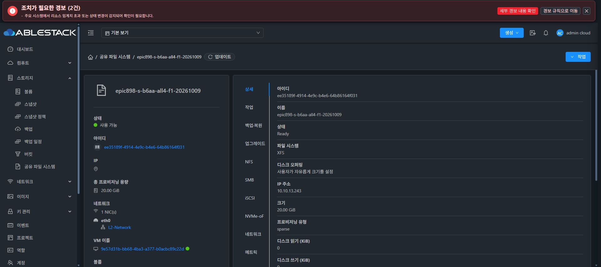
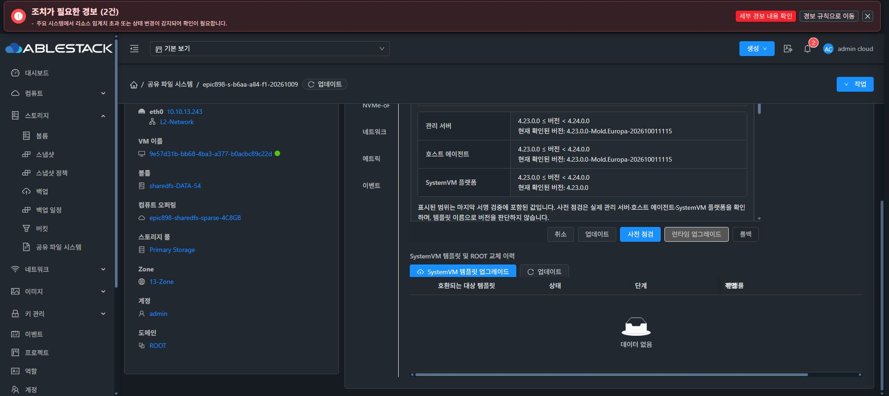

# 신규 F1 실제 생성·런타임 UI 완료와 첫 NFS 실패

Java 아키텍처 비교 수정da24467a08a(normal839/124/Checkstyle)후관리class1개를제한반영해JAR54b1ec5b/PID1248181으로정상기동했다. 기존7Running/3Up를보존했다. 이미지/runtime/UI의sourceb6aa를재표시하지않았으며producer/UI전체hash가같다.

normalprotectedprivateUSERfoundation의첫431할당전거절은보존했고, 수정후같은scope재요청은jobace873a6-37dd-4444-aadb-86598c57108e COMPLETE1이다. FS ee35189f-4914-4e9c-b4e6-64b86164f031·instance3480bb2c-99ee-42f2-91cf-715ded5dd35f·VM9e57d31b-bb68-4ba3-a377-b0acbc89c22d/i54@13.2·ROOTf24d1253(SPARSE4.883G)·DATAabfa15d5(SPARSE20G)를실제확인했다. MAC0d/STATIC13.243/dns8s/kernel6.12/native3SHA/GNS5.5.3가정상이다. 이생성은API-only foundation이며일반UI생성제출로표시하지않는다. Chrome 실제상세조회Ready/XFS20GiB/SPARSE·로딩종료를확인했다.

Chrome에서새서비스의동일sourceBASEa750런타임을선택해preflight→apply를직접제출했다. upgradeac3b07c1-52ec-49b3-91f3-426883b5a2b9 COMPLETE100/오류0, 현재버전4.23.0.0-epic898-b6aa0338bd96.20261009·이전bootstrap-a5bcff1744c815b3을확인했다. actualmanager/agent/template호환과pin4/서명·installedreadback을검증했다. profileall4승인·프로토콜I/O완료와구분한다.

첫NFS내보내기f1-nfs/path/export/f1-nfs는실제UI CURRENT초기DATA로제출했다. initialDATA만mkfs.xfs-f-K1회exit0, FSb54f3304-3ab3-4be7-a63a-a324bee2255b·receipt26486a32-d008-4965-bcf5-4d6cd2492a5f·leafinode33685632/65534:65534/0775를확인했다. guestROOT는/dev/sdb6이고DATA는/dev/sda여서명칭을가정하지않았다. mountedDATA는보존한다. preparationAPI는historicalCOMPLETE면서freshidentityUNAVAILABLE/filesystemCompletionProvenfalse를반환해성공표시로확대하지않는다.

NFS서비스시작은실패하여operationef23a3f4-90ff-4ab2-959f-a7f3be2753a0가RECOVERY_REQUIRED다. actualmanagedunitjournal에render-boot-gate가'Automatic protocol exposure is held by a pending native configuration writer'로거절/ExecConditionSkipped를기록했다. TCP2049refused·rollbackfailed와일치한다. 옛build4.3global로그를새endpoint결과로쓰지않는다. private5.5.3선택/파일부족이나포맷실패로단정하지않는다.

기존scopedbootwriter계약을source/log근거로확인해자기writer의unit시작/rollback만해결할예정이다. 전역보호해제/pending직접삭제/재포맷/강제재시작0이다. 기존7/partial10TiB/DC45/Windows47은보존하고#1275최종UI작업을시작하지않았다.

proof: final-s-f1-foundation-create-after-archfix.json, final-s-f1-host-qga-readonly.json, final-s-f1-runtime-upgrade-ui-proof.json, final-s-f1-first-nfs-operation-readonly.json, final-s-f1-first-format-ui-summary.json, final-s-f1-ganesha-endpoint-failure-guest-readonly.json.
