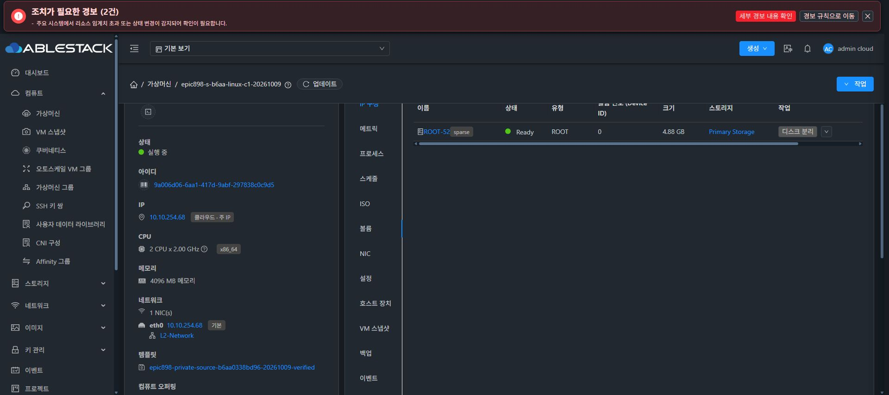

# 동일 소스 신규 SPARSE Linux 검증 클라이언트

최종 b6aa0338bd96 privateUSER템플릿0dc1de90-1273-4e40-8847-c0292c634c63이DownloadComplete/Ready가된뒤normaldeployVirtualMachine으로C1·C2를각각배치했다.둘다기존SPARSE2C4G SO를사용했으며DATA추가0이다.

| 자원 | C1 | C2 |
| --- | --- | --- |
| VM UUID | 9a006d06-6aa1-417d-9abf-297838c0c9d5 | 39facd8c-d967-4907-a377-819cb5e83979 |
| job | 616ecfcf-9e25-4ad6-b317-cede58a0998d | 7445ca29-7316-40b3-a563-20bb4e7d8838 |
| host/domain | 13.2/i-2-52-VM | 13.2/i-2-53-VM |
| ROOT UUID | d5b9fe9d-d988-402f-a7d5-a26baf714ddf | b1753ea0-5429-43c4-8f37-c0e63713b3b4 |
| exactNIC MAC | 02:01:00:cc:00:0b | 02:01:00:cc:00:0c |
| 자기guest STATIC | 10.10.13.247/16 | 10.10.13.248/16 |

두jobstatus1/ROOTReadySPARSE5,242,880,000B·actualqcow2header·backing없음을확인했다.템플릿cache도metadata방식인동일virtualsize/backingnone다.QGA연결·kernel6.12.95·3개runtimeentrySHA가S와같다.일반USER부팅이며sharedfsvm role/cmdline사칭0이다.

정적주소는CloudNIC목록및hostbridge/guestARP중복0후exactMAC/currentaddressguard로자기guestNIC만정상ifdownDHCPRELEASE→staticifup했다.양쪽관리서버ping2회0loss와host에서양쪽ping0loss를확인했다.처음C1은뒤늦은DHCP배정으로noaddress사전guard92가변경전차단했고실패를보존했다.두guest에DHCP가같은10.10.254.68을배정한현상은있으나machine-idSHA와bootID/MAC는고유하다.정확DHCPclientidentifier/server원인은미관찰이며SAM/AD신원복제를주장하지않는다.

Chrome의C1VM상세Running·같은S템플릿·ROOT-52 sparseReady4.88G를확인했다.일반VMIP구성스냅샷은NOT_COLLECTED이며직접QGA정적주소와CloudDB기존DHCP관찰값을구분한다.이화면이SharedFS의UI프로토콜성공을대신하지않는다.

기존7SharedFS/DC45/Windows47/partial51은변경하지않았다.정확10TiB와OOBE사람인계는그대로남는다.다음은승인된새F1foundation·RuntimeCOMPLETE·exactprofile후all4/UI권한·외부I/O검증이다.#1275최종UI는미착수다.

proof: final-s-linux-c1-deployment-b6aa.json·c2, final-s-c1-host-qga-readonly.json·c2, final-s-c1-network-static-apply-proof.json·c2, final-s-template-cache-db-readonly.txt·host-readonly.txt, final-s-c1-c2-identity-readonly-summary.json.
