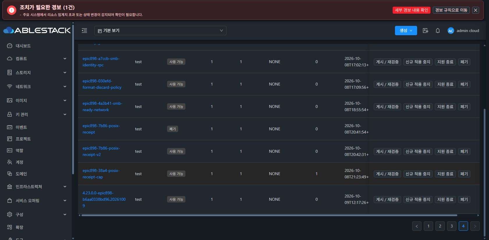

# 동일 소스 이미지·관리 서버 배포와 실제 UI 카탈로그

고정기능소스 b6aa0338bd961496c4b61c207eb5ab75c142b306에서 Java837/UI244와 실제Packer/runtime빌드를 완료했다.15395추적파일변경0, sealed RAM시험서명키의base/update/rollback3개 manifest·서명·tar3entrySHA·공개trust를검증했다. 시험키를정식CI서명으로표시하지않는다.

SPARSEmetadata qcow2 이미지5,243,928,576B SHA5a40f3ec225355a377e69ceddbbd5908485b3358e6a33df202ff2b9adebc0525 및 bz2 712,326,836B SHA30b98674b2e3b9ebf1919168a75930604b4d842c29bf690adc225f82e9365e4a를확인했다.압축왕복byte동일·validator를통과했다. readonly추출에서source310/native51/entry3exact, kernel6.12.95/NVMeAUTH, Ganesha5.5.3/private6files/service2bindings/ACL검사, seed9부재·uniqueSID아직미주장을확인했다.이미지byte/metadata전후동일·NBD7연결/자기해제1회후idle이다.

관리837최소220entry/211classes/9792memberrefs 누락0후기존JAR의다른entry를보존하여13번에실제반영했다. backup /root/epic898-final-s-backup-20261009-120219, afterJAR023518f1865a510b132fe2ff3e3cb32c5bd1ca73f79be1478ec47f47b08e94b4, PID1242582, 활성화12:14:36KST다. strictRuntime3와시험publictrust를포함한다. Spring기동·HTTP200/API로그인·7Running/3UpEnabled·기존recovery10보존을확인했다. 신규DDL0이며all4/AD/ROOT인수완료는별도다.

Chrome에서같은S카탈로그a750408b-75e6-4573-8b6e-5c2de45cf442를직접등록→VERIFIED→AVAILABLE게시했다. APIreadonly audit의source/3entry/signature검증과UI상태가같다. 기존카탈로그/서비스/신원/DATA는유지했다.

동일이미지는기존8080/client의독립artifact폴더에만publicartifact를복사했다.16파일checksum전부일치·새listenport0이다. 처음8791 transient는PrivateTmp가/var/tmp를숨겨CHDIR실패해프로세스가시작되지않았고,보호설정을낮추지않고기존HTTP경로로옮겼다.

privateUSER최초등록0e5e824a는unprefixedchecksum의MD5기본및detailmap형식을잘못사용해checksum실패했다.실패를보존하고API정의의SHA-256prefix/직접indexedmap18details로0dc1de90-1273-4e40-8847-c0292c634c63을새등록했다.현재다운로드/설치중이며아직Ready/생성완료가아니다.고정소스수정이나checksum검증우회0이다.일반SYSTEM전역선택변경0이다.

남은새SPARSE/FAT fixture의all4/권한/backup/ROOT/작업제어및조건부AD를API와실제UI로계속검증한다.사람OOBE/정확10TiBcapacity의기존요청은유지하며#1275최종UI는미착수·시작전에전체중단한다.

proof: final-s-b6aa0338bd96/build-result.json·artifact-manifest.json, final-s-image-readonly-b6aa/source-proof.json·guest-readback-proof.json, management-final-s-b6aa-review/activation.json·postdeploy-api-proof.json, final-s-runtime-catalog-ui-b6aa.json, final-s-private-template-verified-registration-b6aa.json.
