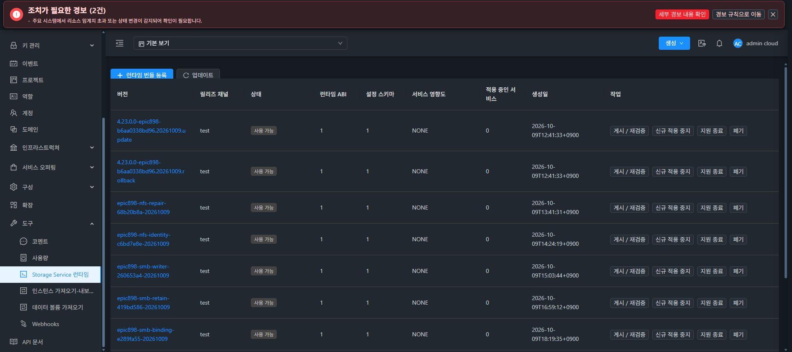
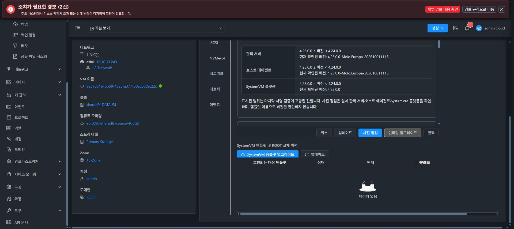

# LOCAL SMB 체크포인트와 원본 블록 인증 복원 검증

정상 LOCAL ACL 작업이 실행 중인 SMB DB의 스냅샷 수집 단계에서 BLOCKED되는 실제 순서 문제를 수정했다. 원래 generic collector의 live-holder 보호를 유지하고, 작업이 소유한 SMB만 정지해 불투명 원본 신원을 암호화·보존한 뒤 정상 재개한다. 별도 LOCAL_SOURCE 목적·scope·원본 generation/hash/boot와 실제 FD9 권한을 사용하며 ROOT/SERVICE/CURRENT 신원을 재라벨하지 않는다.

## 구현

- 관리 서버는 효과 전에 같은 RSA 키의 at-rest 보호 자료·의도를 영속화한다. native begin→owned STOP→암호화 체크포인트→정상 재개 확인→참조 영속화 후 변경한다. 응답 유실에는 같은 키·cipher·참조를 재사용한다.
- native는 빈 세션·정확한 PID/시작 시점·패키지/단위 정의·DB descriptor·원본 SOURCE7·boot·FD9를 검증한다. 비활성 단위를 임의로 시작하지 않고, 부분 SIGSTOP·응답 유실·외부 inode 교체를 구분한다. 정지가 불확실하면 복구 상태와 자료를 보존한다.
- 롤백은 원본 SOURCE7를 먼저 복원하고 원본 LOCAL cipher로 SMB 신원을 복원한다. 같은 증빙으로 원래 CHAP/DH-HMAC 자료를 필요한 block 도메인에만 replay한다. 일반 요청은 원래 도메인 배열을 유지하고, renderer의 부분 활성화는 검증된 ROLLING_BACK manifest/pin/source pointer가 확인한 실제 변경 subset만 허용한다.
- NFS만 변경하는 기존 경로는 SMB를 정지하지 않는다. generic collector·글로벌 wire SID15 helper·기존 CURRENT 보존 모듈은 바이트를 유지한다. 실제 원문52자/STOR14자 SID와 private DB는 불투명 자료로 보존한다.
- 새 runtime 기능의 literal capability를 효과 전 검사한다. 이전 runtime에서 미지원·잘못된 타입이면 native begin/정지 전에 차단한다. 기존 POSIX receipt 수집을 재사용하고 신원/권한을 임의로 초기화하지 않는다.

## 고정 소스와 검증

커밋 `b9c91b829ba1863b476b3a412afd69cc3c240a17`의 Java3/native6 경로를 고정했다. Java 집중54(새17), native 관련80(새22 포함), 최종 committed native **451 tests/49 selectors**, 정상 Maven **882 tests/124 selectors/Checkstyle**을 통과했다. 실패·오류·생략0이다.

native 관측 집합136개는 NUL 경로/바이트 SHA-256 `f97bf94f509c7aceada6df34984f263bd422115f0e48f2988b9e3b9af93f349d`로 전후 동일하다. 과거141 집합과 선택 기준이 달라 같은 숫자로 표시하지 않는다. Java9896개 NUL digest는 `bb9ced8fbc2003fd61874b15e7b6b3c0e0c5dbfd2953e4a7210699b1dc95487f`, runtime producer47개·소유 소스도 전후 동일하다. 5모듈 출력6293파일을 고정했다.

실제 RSA/AEAD·libtdb·FD9·원본 CHAP/DH-HMAC 파일 및 POSIX receipt를 사용하는 producer→고정 Java 소비자6양성/9거절을 확인했다. systemd/endpoint/ROOT 제공자는 격리 대체 제공자이며 실제 Cloud 인수로 확대하지 않는다. 공개 issuer SHA-256 `69f05780157f837fcd8899f4bcb4aef017a8d55ed99ca562cab4cfac0069bcef`, 정상 Java proof `d1574fa2e524c79797bdabf8cc308f38355e3061166633ddb96ed84605396c48`이다.

## 실제 관리 서버 배포

865의 고정 출력과 비교해 새 Proof.class1개+Manager 계열13개만 변경됐다. 다른5232 production/API/schema/KVM/StorageVM 출력은 동일하다. 실제 라이브러리/class chain의 signature·member2683 참조 검토를 통과했고, 실제 기존 JAR 및 각 변경 entry hash가 일치하는 경우에만14개를 반영했다.

- 기존 JAR: SHA-25625ad79d8…/PID1291168.
- 적용 JAR: `52cc153e3a7f509d4bcb43894977594cd2c9f8c9abc63fc4cca299702ef97136`/PID1310175.
- 백업: `/root/epic898-local-source-882-backup-20261009-225316`.
- 적용 시각: 2026-10-09 22:54:14 KST.
- 운영 UI index4595c74e…/configd3e28531…/symlink/locales와 다른 JAR 항목 보존. DDL0, 기존 `storage_service_operation.previous_snapshot_json` 사용.
- 실제 HTTP200·API 로그인·8서비스 Running·3호스트 Up, F1 cfe ROLLED_BACK/219b COMPLETE/f85 BLOCKED 상태 보존 확인.

## 테스트 서명 CODE와 실제 인수 경계

같은 고정 커밋에서 sealed RAM Ed25519 키로 테스트 번들을 만들고 정상 서명 검증을 확인했다. 정식 CI 키나 새 전체 이미지로 표시하지 않는다. 원래 이미지 b6aa의 체크섬·출처를 유지한다.

version `epic898-smb-source-b9c91b-20261009`, key ID `epic898-test-smb-source-b9c91b`, CLI SHA-256 `d505e629644f8be0263eb7d2e50de6d725341a1b62d23d4b97a228b641569ff9`이다. archive384568B/SHA883b5e86…·manifest1435B/SHA801d7ffb…·sig64B·public113B를 확인하고 `/client/epic898-runtime-smb-source-b9c91b/`에 공개5파일을 게시했다. 기존 trust 키는 보존했다. private key 파일은0이다.

## 실제 정상 UI 카탈로그와 CODE 적용

카탈로그 `9d82d0d5-51ca-4307-abd4-b45d7c6b655b`를 정상 UI에서 등록·검증·AVAILABLE로 게시했다. F1 CODE 작업 `8f688f2f-5d22-4d4d-a3f6-b7d6929e9b22`는 COMPLETE/100, 정상 transaction `runtime-6401a37f-b66d-4396-a52a-e69060546f29`이다. 2026-10-09 23:06:58→23:07:23 KST, healthSuccess/consumerCompatible=true를 확인했다.

실제 CLI는 d505e629…로 전환됐다. 적용 전후 공개 관측 JSON은 CLI SHA 한 필드만 달라졌으며, boot dc4b·generation4/SHA dafecb…·pending 없음·private DB 메타데이터/holder·두 XFS/장치/mount·NFS4096바이트 sentinel·VM/ROOT는 동일했다. image b6aa를 새 전체 이미지로 표시하지 않았다.

LOCAL ACL·외부 SMB I/O 인수는 이 CODE 적용 후 별도로 진행한다. 단일 actor만 F1을 변경하고 기존 SOURCE/CURRENT 참조·DATA와 실패 이력을 보존한다. 준비된 RAW2/all4·백업/ROOT/AD/작업 제어 인수는 별도이며 최종 UI #1275는 미착수이다.
