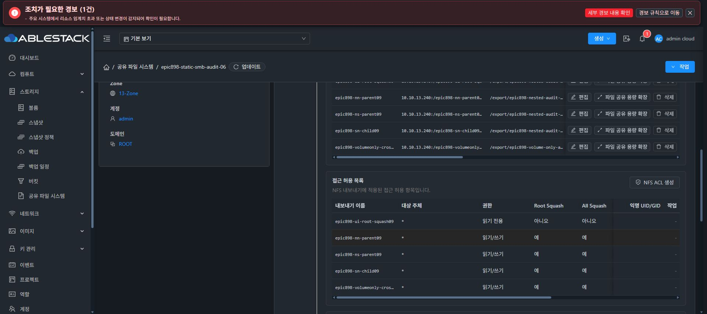

# NEW20 NFS child 삭제 및 parent 열린 I/O 보존 시험 계획

이 문서는 먼저 작성한 실행 전 계획과 이후 승인된 실제 시험 기록을 함께 보존합니다. 최신 결과는 아래 NEW20 NFS child 삭제 실증 절에 있습니다.

## 범위와 고정 식별자

| 항목 | 식별자 |
| --- | --- |
| SharedFS | `1ff60dc2-d276-499e-a7ac-3317d299a472` |
| 서비스 instance / VM | `b54a3c04-fe88-4bde-9ae3-1c67e0998030` / `i-2-50-VM` |
| 신규 SPARSE DATA | `7b4fae44-e926-41c9-bdd5-c0eca7ccd634`, 20 GiB |
| 실제 파일시스템 | `5b11b028-0234-428d-99ef-0edd336ad955`, XFS, 현재 `/dev/sdc` |
| NFS parent | `6b6dd32b-df24-40d7-aea7-9a636199991d`, `epic898-volumeonly-cross-parent10` |
| 삭제할 NFS child | `ca41e478-ab1c-4339-a05e-574aa4d3d0dc`, `epic898-volumeonly-nn-child10` |
| parent / child relative | `epic898-volume-only-audit-10/cross-parent` / 위 경로 아래 `child` |
| 현재 정책 | RW, RootSquash 및 AllSquash, anon UID/GID `1002:1002`, mode `0770`, recursive false, NFS NUMERIC |
| 외부 클라이언트 | 승인된 host `10.10.13.1`, task 전용 `/run/epic898-new20-nn-delete-client` |
| 실제 NFSv4 pseudo | `10.10.13.240:/epic898-volumeonly-cross-parent10` / `10.10.13.240:/epic898-volumeonly-nn-child10` |

기존 파일 `child/new20-nn-cross-rw-20261008.txt`는 inode `133`, UID/GID `1002:1002`, mode `0640`, SHA-256 `d8108a34ebd7213b7652d3ed7d8b3310d508db524c8c6961a8969251d3e07b26`입니다. parent 디렉터리 inode `33685632`와 child 디렉터리 inode `132`를 fresh 관측으로 다시 고정합니다.

## 현재 구현의 삭제 범위 근거

실제 management에 반영된 namespace pin `1dad2501b5cf3ee4528389ef73a7b61181cf6678`의 `StorageServiceManagerImpl.java:3674`는 다음 순서입니다.

1. `requireNfsExport`와 `requireInstance`로 정확한 대상 및 instance를 조회합니다.
2. `validateNoChildShares`로 하위 공유를 먼저 검사합니다.
3. 해당 공유의 access-rule 행과 file-share 행을 제거합니다.
4. `applyNfsDesiredState`로 남은 export 구성을 적용합니다.

이 메서드는 volume 삭제, detach, filesystem format, backing 디렉터리 unlink/rmdir 또는 재귀 데이터 삭제를 호출하지 않습니다. 그러므로 확인 대상은 공유 메타데이터와 export 등록 제거이며, 물리 데이터 보존을 실제 inode/내용 증거로 별도 확인합니다. 적용 실패 시 managed operation의 복구 상태를 그대로 기록하며 삭제 성공으로 승격하지 않습니다.

실제 guest에 설치된 `38a4` candidate의 `start_ganesha_endpoints`는 각 Ganesha endpoint를 `systemctl restart`합니다. 따라서 메타데이터만 삭제해도 NFS 서비스 적용은 영향을 줄 수 있습니다. 열린 I/O의 중단 없음 또는 FD 연속성은 아직 보장된 결과가 아니며, 기존 PID 유지 기준으로 PASS를 만들지 않습니다. native는 남은 export의 alias를 관리하지만 제거된 export의 물리 backing 디렉터리를 지우는 경로는 이 시험에 포함하지 않습니다.

## 읽기 전용 live 준비 관측

2026-10-08 15:48:58 UTC에 실제 CLI SHA \`99c1cbdd2929c5b7517229c41452c81234f2b216a580bb9dbde56d8bc5ffb0a5\` 및 boot ID \`c53e1cbb-5dfd-4d39-b9ce-b61c5171e6a4\`를 확인했습니다. parent Export_Id는 \`46750\`, child는 \`8868\`이며 parent Filesystem_Id는 \`14045721289127484551.9992890067150287163\`입니다. 실제 daemon은 \`ablestack-storage-ganesha@0.0.0.0_2049.service\`, PID \`98665\`, startTicks \`583781\`, active/running입니다.

\`38a4\`의 \`assign_ganesha_export_ids\`는 UUID의 CRC32 기반 값을 사용하고 충돌 시 빈 ID로 전진합니다. 순서와 충돌 변화에 따른 ID 변경 가능성을 고려하여 parent Export_Id 및 Filesystem_Id는 실제 전후 값으로 비교합니다. endpoint daemon은 재시작되므로 PID/startTicks 유지가 확인된 것으로 주장하지 않습니다.

제거된 child의 alias는 \`umount\`하고 해당 alias fstab marker를 제거합니다. 이 경로는 물리 backing 디렉터리 삭제와 구분합니다. parent held-FD에서 삭제 전후 같은 descriptor로 write/fsync/read를 지속 관찰하며, 오류 또는 정체 시 자동 재시도 없이 원래 파일과 디렉터리를 보존하고 bounded 종료/cleanupPending 증거를 기록합니다.

준비 증빙은 \`acceptance-audit/910-new20-nfs-delete-plan-readonly-baseline.json\`입니다. 이 관측에서 실제 삭제, mount 또는 파일 쓰기는 수행하지 않았습니다.

## 단계별 실행 계약

1. GO 이후 API의 parent/child 전체 공개 설정, volume UUID/owner/pool/20 GiB/SPARSE/attachment, FS UUID/serial, format journal 및 receipt, parent/child/file inode·UID·GID·mode·ACL·SHA를 fresh baseline으로 고정합니다. 원래 DATA sentinel, local SID, boot ID, primary `240` 및 alias `241`, SMB endpoint도 함께 보존 기준으로 수집합니다.
2. client flag `nfs4_disable_idmapping`의 현재 `Y`를 읽고 변경하지 않습니다. task 전용 mountpoint 2 개로 parent/child의 정확한 pseudo를 정상 mount합니다. global mount/cache/network 설정은 변경하지 않습니다.
3. 기존 보존 파일은 읽기만 합니다. parent 경로로 새 자기 시험 파일 1 개를 `O_EXCL` 생성하여 write/fsync하고, 그 FD를 유지한 채 bounded I/O를 수행합니다. 반복 쓰기 횟수, 완료 시각, 최대 지연, 오류 종류 및 errno를 기록합니다. 자기 시험 파일은 기존 파일과 다른 이름을 씁니다.
4. parent가 실제 UI에서 child UUID와 이름을 확인하여 정상 삭제 1 회를 수행합니다. 우리 쪽에서 삭제나 retry를 추가하지 않습니다. 해당 job/operation UUID를 받은 뒤 I/O와 fresh API 상태를 대조합니다.
5. child metadata 및 child pseudo가 제거되었는지 확인합니다. 직접 child pseudo의 fresh mount 실패는 bounded 결과와 실제 errno를 기록하고, parent pseudo로 동일 child 디렉터리 및 기존 파일이 읽히는지 확인합니다. 제거된 pseudo가 성공하면 별도 negative 실패로 기록합니다.
6. 기존 파일 inode/해시/권한/ACL, child 디렉터리, parent 디렉터리 및 format receipt가 unchanged인지 guest에서 대조합니다. 열린 자기 파일은 마지막 fsync/read 결과를 기록한 뒤 닫습니다. 서비스 restart 중 오류나 stale handle은 숨기지 않습니다.
7. 자기 client mount만 정상 umount하고 process 종료 및 mount 0 을 증명합니다. timeout 또는 D-state child가 남으면 bounded PID 상태를 보존하고 cleanupPending으로 남깁니다. VM/service 재시작이나 강제 cleanup을 수행하지 않습니다.

## 제한과 남는 인수 게이트

원래 `a0b` DATA와 `021b` partial 10 TiB, 초기 ROOT, Client 47 OOBE 및 다른 공유를 변경하지 않습니다. 새 디스크, format, password reset, chmod/chown, recursive apply, volume 삭제, auto-cleanup은 모두 0 회입니다.

시험은 NEW20 기본 owner 정책의 NN child 삭제 범위를 검증합니다. mixed named ACL, symlink/bind 경계, 10 TiB SPARSE 정상 완료, fullFour 원자 적용, AD, ROOT swap 및 최종 UI `#1275` 완료를 대신하지 않습니다.

## NEW20 NFS child 삭제 실증 — 2026-10-09 00:52–00:55 KST

부모의 명시적 GO 이후 NEW20의 NFS child `ca41e478-ab1c-4339-a05e-574aa4d3d0dc` 하나만 정상 API로 삭제했다. Job `42a90bcb-100d-44ec-857f-512e2f517916`는 00:52:44 생성, 00:52:57 완료, status 1 / success true였다. Managed operation `6f046dee-6f36-4c91-88cd-71012a03e6d7`도 COMPLETE / revision 48 / progress 100이며 native GEN 47 → 48, SHA `7b5d9c896e1363a6aae8823c07c5adb7d1b2c4397d034ad619c6eba24fb54755`, IN_SYNC / pending NULL을 확인했다.

parent pseudo를 mount하여 새 자기 파일 `child/new20-nn-childdelete-held-20261009.txt`를 만들고 같은 열린 FD로 120 초간 write/fsync/read를 관측했다. inode `135`, UID/GID `1002:1002`, mode `0640`이며 총 596 회, 오류 0, 최대 측정 지연 16.0 ms였다. 정상 FD close / worker exit 0 / umount / worker 없음 / 자기 mount 0을 확인했다. 전체 event stream을 파일에 저장한 것으로 주장하지 않으며, 구조화된 초기·중간 관측과 최종 count/cleanup 결과를 남겼다.

| 항목 | 실제 전후 결과 |
| --- | --- |
| parent Export_Id / Filesystem_Id | `46750` / `14045721289127484551.9992890067150287163` 그대로 |
| Ganesha daemon | PID `98665` / startTicks `583781` → PID `255722` / startTicks `1354270`; 실제 restart |
| child 직접 pseudo | fresh mount exit `32`, 서버 `No such file or directory`, mounted false |
| parent fresh 접근 | 같은 child 디렉터리와 기존 file `133` 읽기 정상 |
| 기존 file | inode `133`, UID/GID `1002:1002`, mode `0640`, SHA `d8108a34...` 그대로 |
| parent / child 디렉터리 | inode `33685632` / `132`, device `2080`, owner/mode 그대로 |
| binding / fstab | parent bind 및 marker 보존, child alias bind/marker만 제거 |
| 남은 fstab 기록 | child의 backing marker 행은 잔존; 완료된 정리라고 확대하지 않음 |
| DATA / format | FS `5b11` / serial `7b4` / 20 GiB 그대로, format journal SHA/mtime 및 PID `89199` 동일 |
| 원본 회귀 | sentinel inode/hash/UID/mode, old FS `a433`, SID/boot/network/SMB PID 보존 |
| canonical 7 files | NFS desired 파일만 변경, 다른 6 개 해시 그대로 |
| 종료 | client flag `Y` 그대로, flag 쓰기 0, cleanupPending false |

현재 daemon이 재시작됐음에도 이 특정 parent 열린 FD의 관측에서는 오류 없이 I/O가 보존됐다. 모든 NFS 세션의 무중단이나 Ganesha PID 보존을 증명한 것으로 확대하지 않는다. 새 파일 외 기존 파일 쓰기, 추가 export 삭제, format, volume 삭제, password reset, 원본/partial 변경은 0 회다.

증빙은 `910-new20-nfs-child-delete-api-proof.json`, `910-new20-nfs-delete-managed-operation-readonly.json`, `910-new20-nfs-delete-held-client-proof.json`, `910-new20-nfs-delete-direct-pseudo-proof.json`, `910-new20-nfs-child-delete-preservation-comparison.json` 및 native baseline 전후 파일이다. 실제 UI의 child absent / parent Ready 확인은 부모가 별도 수집한다. Named ACL mixed, symlink/bind 경계, 전체 cold recovery 및 다른 Epic 기능은 미완료이며 `#910`은 OPEN이다.

## 부모 실제 UI 확인

정규 API 삭제 완료 뒤 기능 UI64be의 NFS 탭에 진입했다.
삭제된 epic898-volumeonly-nn-child10의 정확 cell은0개이고,
epic898-volumeonly-cross-parent10의 내보내기·implicit ACL·새7b4 backing volume
행이 남아 있다. 부모 내보내기는 Ready / NFSv4 / UID:GID1002 /0770,
새 SPARSE20GiB backing volume도 xfs/dev-sdc/정확/Ready이다.
UI에서 추가 삭제나 변경은 수행하지 않았다.

이 UI 관찰은 실제 parent held-FD596회/오류0/최대16ms, child fresh mount
ENOENT/exit32 및 native 보존 비교16개와 연결한다. daemon PID/startTicks는
실제 바뀌었으므로 무재시작으로 표시하지 않는다. child backing fstab 잔존도
후속 검토 대상으로 남긴다. source NFS/SMB mixed named ACL 및 symlink/bind
경계·완전한 #910 인수, 최종 UI #1275는 아직 완료하지 않았다.
