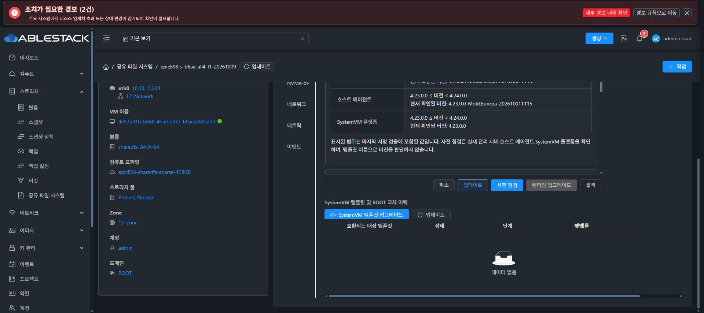
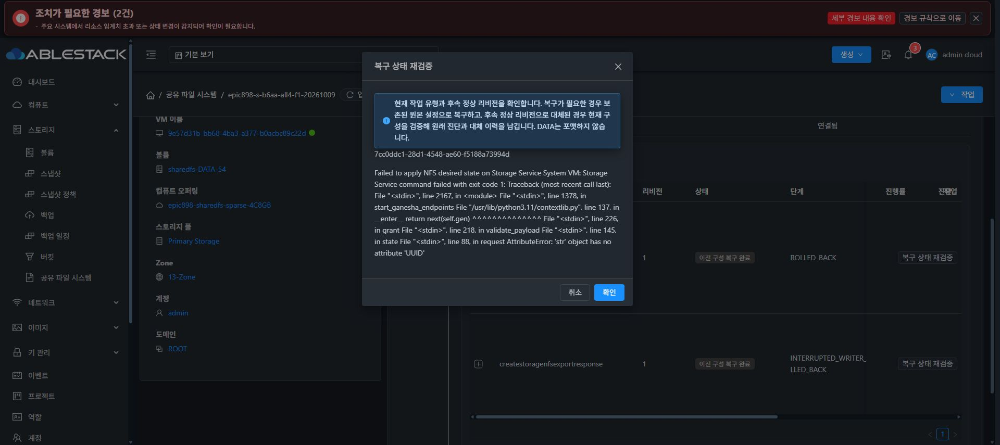
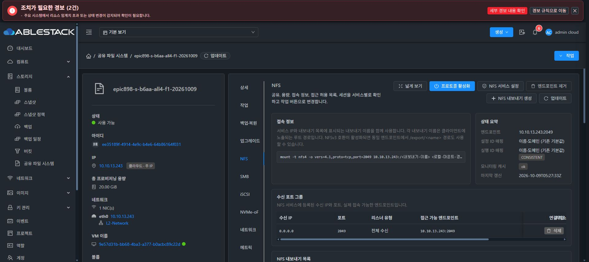
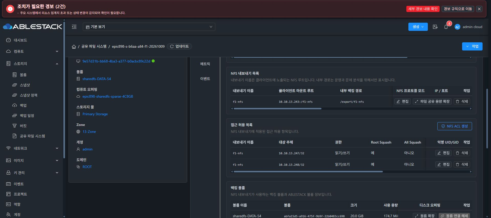

# 2026-10-09 NFS 복구·CODE 적용·외부 클라이언트 실제 검증

이 기록은 Epic #898의 기능 인수 중간 결과다. 전체 하위 이슈 완료나 최종 UI 표준 정리 #1275 완료를 의미하지 않는다.

## 적용 소스와 실제 UI 결과

- 관리 서버: Java 845 tests / 124 classes, 소스 09146d7a53f. ABI 검토 후 Manager 외부 클래스와 $5 두 클래스만 배포했다. 실제 JAR SHA-256 b8cac847284af4eeea3d14680e1dda0e6aeb3a007e5e908a87ac178e40fcfc57.
- 새 CODE: c6bd7e8e7d85411f50ff565be9925888124bbfa6, 네이티브 394 tests / 47 selectors. NFS 단위의 정상 writer 허용과 최초 원본 복원, UUID 변수 충돌, ROM _parentDisk=None 읽기 처리 수정이 포함된다.
- 실제 UI에서 카탈로그 84a03c6f-4fc2-40e3-ae62-5c75d50d930e를 등록·서명 검증·사용 가능으로 게시했다. 테스트 전용 공개키 epic898-test-nfs-identity-c6bd7e8e이며, 정식 배포 키가 아니다. 개인키는 RAM에서만 사용하고 폐기했다.
- F1 실제 UI 사전 점검·적용 작업 5f774ec7-eae8-430f-b56a-c9dd1994fedf는 COMPLETE / 100%. 설치된 CLI SHA-256은 72f9be20abe74b9d1fd7829636852f7ac7881c28b07641ce4b4fab33b428003b와 일치한다.
- 이미지 소스 b6aa0338bd96는 별도로 유지한다. 새 CODE를 이미지 전체의 새 소스로 표시하지 않는다.
- 복구 안내는 한국어·영어 locale 두 파일만 배포했다. 254 tests / 18 suites·lint·production build 통과. 원본 작업 복원과 후속 리비전 재검증을 구분한다. 버튼·레이아웃·컴포넌트·JS/CSS 변경 없이 실제 UI 새 문구를 확인하고 취소했다.

## 원본 보존과 NFS 생성

F1은 ee35189f-4914-4e9c-b4e6-64b86164f031 / instance 3480bb2c-99ee-42f2-91cf-715ded5dd35f다. ROOT는 f24d1253-cbe3-46d7-8b77-055bd17ed1bc / /dev/sdb6이고 DATA는 abfa15d5-a916-475f-9b9f-22b0483cc698 / /dev/sda / SPARSE 20GiB다.

첫 실패 ef23a3f4-90ff-4ab2-959f-a7f3be2753a0는 정상 UI 복구 상태 재검증으로 ROLLED_BACK / INTERRUPTED_WRITER_ROLLED_BACK이 됐다. 두 번째 실패 7cc0ddc1-28d1-4548-ae60-f5188a73994d는 자동 ROLLED_BACK. 각 단계에서 초기 설정 SHA-256 17764301444dad0f97f7aaa018b1419456e2ae1f504579633b52f5536c2e1ed0, 원래 없던 NFS 파일, pending 없음과 XFS UUID를 확인했다.

수정 CODE 뒤 세 번째 정상 UI 생성 ca88cb54-8f77-4751-8a90-65ee55a6d30b는 COMPLETE / revision 1이다. f1-nfs 내보내기 f865af71-3a6b-4e64-9ee9-38ac776ceb14 / Ready 및 실제 TCP 2049 Ganesha 리스너를 확인했다. 이번 검사 formatInvoked=false이며 최초 format receipt 26486a32-d008-4965-bcf5-4d6cd2492a5f, XFS UUID b54f3304-3ab3-4be7-a63a-a324bee2255b가 같다. 읽기 전용 ROOT/DATA 검사는 0.085초 / EXACT / VOLUME_SERIAL, 같은 UUID·크기·마운트로 성공했다.

## 외부 C1/C2와 ACL 전후

UI에서 C1 10.10.13.247/32 ACL을 생성했다. 실제 C1 VM52에서 NFSv4.1 마운트, 새 파일 4096바이트 쓰기·fsync·읽기·언마운트·재마운트·재읽기가 성공했다. root squash 결과 UID:GID 65534:65534, 파일 mode 0640, SHA-256 9ba0b0280276cad982cfa3df6e6821f2b4b8ea04761b905cc1d089cbd72c4c8a다.

C2 10.10.13.248은 같은 엔드포인트에서 허용 전 mount exit 32 / ENOENT / I/O 0이었다. Ganesha가 허용하지 않은 내보내기를 숨기는 응답이었으므로, access-denied 문자열만 기대한 단일 harness의 negativePassed=false는 그대로 보존했다. UI에서 C2 /32 ACL 추가 후 같은 C2의 마운트·4096바이트 읽기·재접속·동일 체크섬이 성공했다. 이 통제된 전후 비교를 별도 판정·증빙했으며 원본 단일 판정을 덮어쓰지 않았다. 자체 /run 테스트 마운트만 모두 정상 해제하고 새 검증 파일은 보존했다.

## 다음 기능과 현재 SMB 실패

새 SMB DATA ceaee4ff-0dc6-4c4f-ac5d-e28e658906a7는 실제 UI에서 사용자 정의 SPARSE 오퍼링 c48ab8d8-faba-4d43-85a6-e98a9ecc0cd5 / 20GiB로 생성됐고 /dev/sdc 정확 매핑을 확인했다. 그러나 첫 SMB 공유 적용 9d747a96-bb75-48b9-8db2-65cd8b6916ee / revision 4는 RECOVERY_REQUIRED다. 공개 읽기 전용 inspect는 원래 없던 smb-share-apply.json을 읽다가 SMB_IDENTITY_REJECTED를 반환했다. passdb.tdb와 secrets.tdb도 아직 없으며, pending PREPARED와 이전 정상 NFS revision 3 설정 SHA-256 3f20d0533dab73092aa11b9005a7c15501c2056a2b026c5dd572eb16b3cb87bd를 보존하고 있다.

실제 forward 오류는 민감한 출력이 생략돼 있으므로 위 inspect 오류를 forward 원인으로 단정하지 않는다. 첫 SMB 미설정 상태의 검사·복원 경로를 별도로 조사한다. DATA 재포맷·pending 강제 삭제·임의 SAM 생성은 수행하지 않았다. iSCSI/NVMe-oF, all4 profile, ROOT 교체, AD 및 추가 기능 인수는 계속 진행 중이다.

최종 UI #1275는 미착수이며, 다른 기능 단계 종료 후 시작 직전에 전체 작업을 중단해 사용자 보고·추가 지시를 기다린다.
