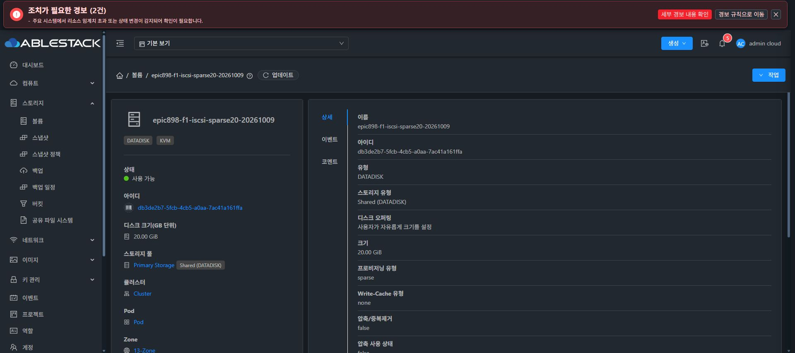
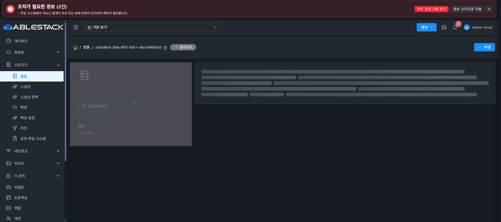
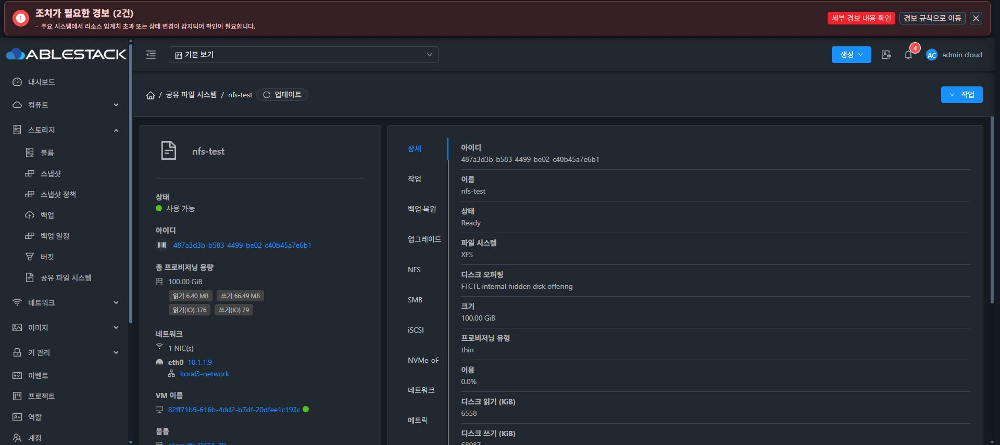

# SPARSE 블록 시험 볼륨 준비와 원래 상세 경로 회귀

## 정상 UI 볼륨 준비

일반 볼륨 생성 화면의 기본 FTCTL 오퍼링을 그대로 제출하지 않았다. 기존 사용자 정의 오퍼링 `c48ab8d8-faba-4d43-85a6-e98a9ecc0cd5`의 상세에서 sparse/shared/customized=true를 확인하고 재사용했다. 새 오퍼링 생성이나 기존 오퍼링 변경은 없다.

각각 정상 UI에서20GiB, 13-Zone, Primary Storage, 스토리지에 생성=true, 인스턴스에 연결=false로 생성했다. 선택 화면의 물리 잔여3.47TiB를 확인했으며 기존 과할당 계수·용량 임계치를 변경하지 않았다.

| 후속 시험 | 볼륨 UUID | 실제 UI/API 결과 |
| --- | --- | --- |
| iSCSI RAW | db3de2b7-5fcb-4cb5-a0aa-7ac41a161ffa | epic898-f1-iscsi-sparse20-20261009, Ready/사용 가능, 21474836480 bytes/SPARSE, 미연결 |
| NVMe RAW | ec92d6c6-2fde-4f35-9d31-e8a7efd69c63 | epic898-f1-nvme-sparse20-20261009, Ready/사용 가능, 21474836480 bytes/SPARSE, 미연결 |

정상 API readback에서 정확한 UUID·이름·크기·오퍼링·pool90b0c4e3·경로UUID·VM/attached 없음과 provision=sparse를 대조했다. 공개 proof SHA-256은 `79289342acef16fdf1338b55dfee787ae0ab9ac4f96b33e6ffe8c687b61c5e1a`이다. 비밀번호는 기존 login의 RAM 입력으로만 사용하고 파일·argv에 저장하지 않았다.

이 단계는 후속 RAW 시험의 준비이다. F1 호출·VM 연결·포맷·타겟/namespace 생성·외부 block I/O는0이며 물리 qcow2/backing/실제 게스트 RAW signature는 연결 전후 별도로 검증한다. all4 profile 완료로 표시하지 않는다. 기존 DATA·10TiB 부분 포맷 볼륨·다른 VM을 변경하지 않았다.

## 사용자 원래 상세 주소 회귀

UI3df730e74a06/정상334 tests/18 suites·lint·production 배포 후 원래 `487a3d3b-b583-4499-be02-c40b45a7e6b1?tab=details`를 Chrome로 직접 열었다. 초기 조회가 종료되고 nfs-test/Ready/XFS/100.00GiB/활성NFS 정보를 확인했다. NFS→상세 탭 왕복 후 동일 정보가 유지되고 로딩 표시가 사라졌다. 실제 확인 시각은2026-10-09T11:46:02Z이다.

기존100GiB THIN은 읽기 확인만 수행했다. 신규 THIN 생성·원본 자원 변경은0이다. 최종 UI 표준화 #1275는 미착수이다.

