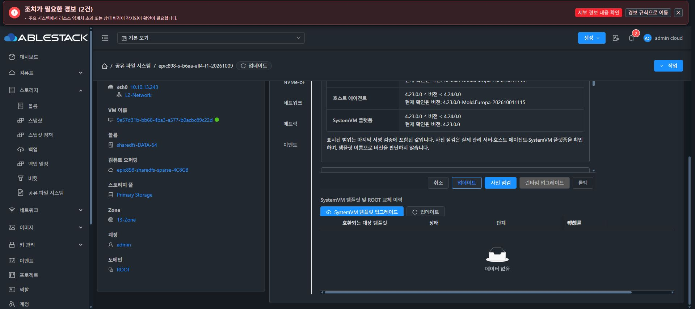
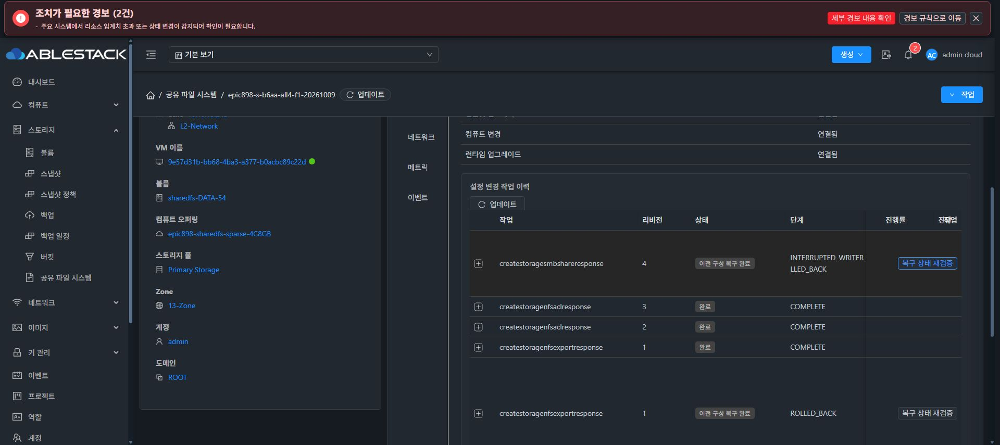
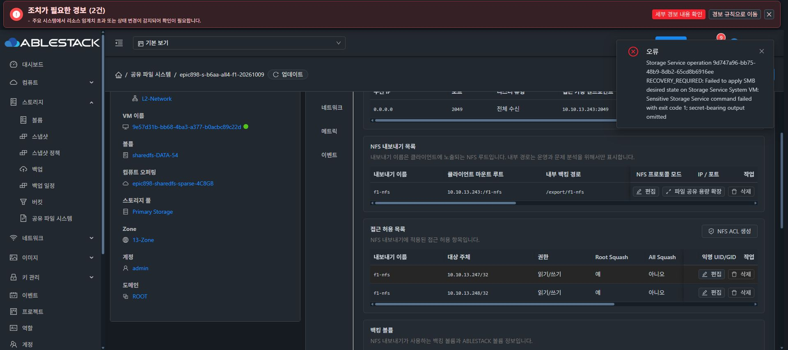

# 2026-10-09 SMB 첫 설정·실패 복구·현재 신원 보존 경계

이 기록은 Epic #898 중간 인수다. 소스 통과와 실제 공유 성공을 구분하며, 최종 UI 표준 #1275는 미착수다.

## 배포와 원래 작업 복구

Java 소스278a25e6b15 / 정상848 tests·124 classes·Checkstyle F/E/S0, native260653a4 / focused46·관련42·release47 selectors401 tests가 통과했다. 실제 immutable Manager로 native UNCONFIGURED 공개 fixture의 strict 소비·빈 상태의 repair 거절·foreign/string bool 부정 검증을 대조했다. ABI class2/member2459 누락0 이후 실제 Manager 외부+$5 두 클래스만 교체했다.

실제 JAR SHA-256은086411414765db2f7b78e6bff75ada09b8482e237a448d3c142f277160781e3f, PID1263599다. 백업은/root/epic898-smb-848-backup-20261009-151032. 다른 JAR entry, UI index/config 및 기능 locale2를 보존했다. API 로그인·8서비스 Running·3호스트 Up를 확인했다. 명시적인 Spring 로그 문자열은 찾지 못했고 API 서비스 준비 증거로 구분한다.

UI에서 테스트 키 서명 번들16d3527c-cbaf-43f3-9189-f82552c73bd7 등록·검증·게시 뒤, F1 UI 사전 점검·적용238a25af-7e8b-48ea-9e22-d01e201537ee가 COMPLETE100이었다. CLI SHA-256 3a558d39e42907a56b929cd1a87f33146f73d5c321bb2e8222b73c6f7a8f453d와 일치했다. CODE 적용 동안 원래 pending9d747/rev4의 공개 metadata가 같고 두 FILE DATA UUID가 유지됐다. 이미지 소스b6aa, 기능 UI 소스a385는 별도 lineage다.

원래 실패9d747a96-bb75-48b9-8db2-65cd8b6916ee는 UI 복구 상태 재검증으로 ROLLED_BACK / INTERRUPTED_WRITER_ROLLED_BACK이 됐다. native IN_SYNC / 이전 generation3·operation23340c92·SHA3f20d0533dab73092aa11b9005a7c15501c2056a2b026c5dd572eb16b3cb87bd와 pending 없음이 정확했다. NFS DATA abfa... / XFS b54f... 및 SMB DATA ceaee... / XFS6ff9399c-fc78-4ef3-a598-85ad87586ccf는 EXACT·동일 마운트였고 C1 새 읽기·재접속의4096바이트 SHA9ba0b028...도 유지됐다.

## 두 번째 실제 실패

UI의 현재 백킹 볼륨 목록에서 이미 포맷된 SPARSE20GiB ceaee4ff-0dc6-4c4f-ac5d-e28e658906a7를 선택해 f1-smb를 재시도했다. 추가 디스크나 재포맷을 수행하지 않았다. 두 번째 작업cfe87d14-7b32-4b9c-999d-fcdae29dbb3d/revision4는 RECOVERY_REQUIRED다.

이번 실제 journal에서 smbd.service가 자기 pending grant로 시작·재시작됐고 PID118714/startTicks877789/cgroup system.slice/smbd.service, nmbd118726을 확인했다. 실제 Samba는4.17.12-Debian이며 격리4.22 fixture와 별개다. 기본 master는IPv4/IPv6 wildcard445를 점유하고 passdb/secrets는 protected root0600으로 생성됐다. 관리 endpoint 신규 start journal은 없다. 이전 SMB desired 파일은 여전히 없으므로 UNCONFIGURED의 DB-present 거절은 올바른 fail-closed다.

소스는 NetBIOS 이름 변경 시 inactive 기본 데몬까지 재시작한 뒤 관리 endpoint를 대조한다. 기본 IPv4가 requested와 겹치고 IPv6가 stale이면 explicit legacy drain 검사가 거절한다. 원래 forward payload 전체는 저장되지 않았고, JDBC 공개 projection은 실패 후 DB 상태이므로 actual wanted로 표시하지 않는다. cold 기본 데몬 활성화·fallback wildcard·legacy IPv6 충돌은 격리 fixture로 재현했다. 최소 cold-forward2 파일 수정은 fdd182c8d06 / focused52·bash-n PASS이며 아직 실제 게스트에 배포하지 않았다.

## 원본 신원과 현재 신원

cfe의 원래 암호화 capsule을 같은 instance/operation scope, vault 보호·체크섬, RSA OAEP·AES-GCM AAD/cipher 인증으로 RAM에서 읽었다. 공개 projection만 출력한 결과 passdb와 secrets의 original record는 존재하며 absent=true/present=false였고 AD identity는 없었다. 원래 SMB canonical도 NULL이다. 이 인증된 원본 부재 기록을 현재 생성된 DB에 소급해 적용하지 않는다.

현재 DB를 삭제·초기화하거나 기존 UNCONFIGURED 검사를 완화하지 않는다. 명시적 유지보수·정확한 이름·동일 pending/current/ROOT binding·owned process/session 검증 후 CURRENT 자료를 별도 암호화해 보존하고 configuration SOURCE만 복원하는 신규 경로를 구현 중이다. 원본 snapshot/ref와 CURRENT ref를 분리하며, 성공 의미는 originalConfigurationSourceRestored=true/currentIdentityRetained=true/originalIdentityRestored=false다. unknown/foreign/live session/AD/ROOT/SERVICE/formatter/응답 불명확이면 복구 필요 상태를 유지한다. 이 경로는 아직 실제 실행하지 않았다.

## SID 진단 한계

부모 진단에서 net getlocalsid를 순수 조회로 취급한 판단은 잘못됐다. 실행 뒤 secrets의 mtime/ctime이06:22→06:32로 변경됐고 inode1574/size430080는 같았다. passdb metadata는 같았다. 당시 기본 데몬도 실행 중이므로 명령의 초기화 부작용과 동시 데몬 쓰기는 아직 분리 증명하지 않았다. 공개 출력은 daemon loaded SID의 증거로 쓰지 않고 추가 호출을 중단했다. 원상화·삭제를 하지 않고 현재 자료를 보존한다.

Canonical 관측에는 net getlocalsid 호출이 없다. 기존 samba_public_sid.py는 보호된 NOFOLLOW FD와 libtdb O_RDONLY로 exact NetBIOS SID key를 읽고 전후 파일 metadata를 대조하며 missing-key 초기화 fallback이 없다. 후속 관측은 이 경로를 재사용한다. 명시적인 초기화/JOIN 경로와 조회를 구분한다.

실제 SMB 인증·I/O, iSCSI/NVMe Cloud UI/all4, ROOT·복원·lease 및 AD 인수는 남아 있다. 이슈900/892에 실패·복구·남은 경계와 진단 오류를 기록했고 새 이슈 종료는0이다. 모든 기능 인수 뒤 최종 UI #1275를 시작하기 전에 전체 작업을 중단해 사용자 보고·추가 지시를 기다린다.
