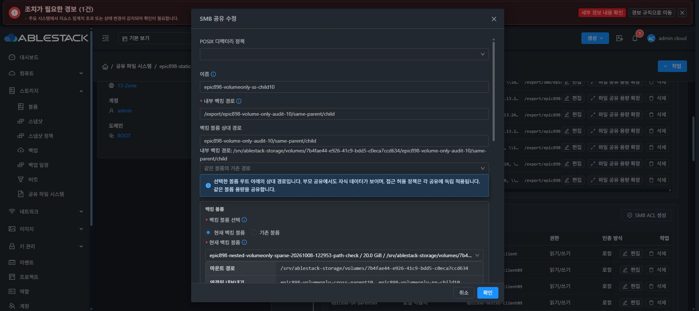

# Volume-only 실제 API·UI 인수 기록 — 2026-10-09

이 문서는 검토된 namespace 1dad 관리 모듈 배포 이후의 실제 결과다. 전체 614 WIP 및 all4 coordinator/profile/ROOT 적용 HOLD와 구분한다. 원본·partial·AD OOBE는 변경하지 않았으며 최종 UI #1275 착수도 0이다.

## Cross-protocol 충돌 negative

과거 BLOCKED job 829c 기록을 보존하고 새 명시적 intent/idempotency key로 old a0b의 자기 prefix에 SMB share 7ec0c41b 를 생성했다. 실제 backing root는 /srv/ablestack-storage/volumes/a0b, FS UUID a433 이고, 기존 LOCAL_USER UID 1002 ACL은 password 파라미터 없이 적용했다.

API는 id + volumeid 7b4 + crossprotocol false만 보내고 name/path/relative/filesystem/importmode는 생략했다. Job 4bc878b4 / operation 932c5ee0 는 target NFS가 사용하는 동일한 물리 경로를 준비 전에 code 530 / BLOCKED로 거절했다.

부모 실제 UI도 현재 볼륨 7b4, cross switch OFF, 기존 상대 경로 유지로 제출했다. Job 7f49383d (DB 909, actor 2) / operation c67f3896 도 동일하게 BLOCKED였다. UI는 기존 name/relative와 FORMAT_IF_EMPTY를 전송했으므로 API의 volume-id-only 요청과 구분한다. Native prepare 전에 거절됐고 추가 포맷은 0이다.

API 직전 baseline 대비 UI 이후 source 전체 config·old volume/FS/경로·leaf/ACL, target NFS 전체 config·파일 inode/hash, GEN 42 / SHA 4bcac862... / canonical 7 files, original sentinel·SID·boot·SMB PID·receipt mtime가 모두 동일했다. 증빙 910-volume-only-1dad-negative-proof.json 및 910-volume-only-ui-negative-proof.json 이다.

## Same-protocol 재바인딩 positive

부모 승인 범위의 새 prefix만 사용했다. 새 7b4에 SMB parent 3dc8b627-3901-4dec-9f76-e30007c390b0 / epic898-volumeonly-ss-parent10 / relative same-parent를 만들고, old a0b에 SMB child 328dbc27-96a1-4bc9-a371-22e4e6072ec6 / epic898-volumeonly-ss-child10 / relative same-parent/child를 만들었다. 둘 다 MOUNT_EXISTING, crossprotocol false, noCleanup이며 기존 LOCAL_USER UID 1002 ACL을 password 없이 적용했다.

Old source의 새 자기 테스트 파일 volume-only-source-preserve-20261008.txt를 guest setpriv UID/GID 1002로 O_EXCL 생성·write·fsync했다. 실제 inode 16777357 / device 2064 / UID:GID 1002:1002 / mode 0660 / SHA 091ddfba9af9e21f66300dd4c5e71a21ea60d0923f1c96db836133345045afb4 를 기준으로 고정했다. Source directory inode 16777356 / 0770 및 named/default ACL도 기록했다.

자식 id + volumeid 7b4만을 한 번 보내고 name/path/relative/filesystem/importmode/crossprotocol은 생략했다. Job ff178b16-8fac-49af-a5c8-04c39072d4c0 는 00:00:32 KST에 status 1 / code 0으로 완료됐다.

| 검증 | 실제 결과 |
| --- | --- |
| 공유 identity | id/name/public path/relative 보존 |
| 새 DATA binding | volume 7b4 / FS UUID 5b11 / serial 7b4 / size 20 GiB / /dev/sdc / VOLUME_SERIAL |
| 물리 backing root | /srv/ablestack-storage/volumes/7b4/.../same-parent/child로 갱신 |
| Stale inspection | 새 volume/FS/serial/path로 재검사됐고 old FS a433 참조 제거 |
| Parent 관계 | 같은 volume/FS + 정규 relative/physical parent-child tuple 일치. 선택적 parentshareid API 필드는 없음 |
| 원래 source | directory inode 16777356 · ACL, file inode 16777357 · UID/mode/hash 그대로 남음 |
| 새 target | child inode 134 / device 2080 생성, source 테스트 파일은 없음 |
| Target parent | inode 33685633 · mode/ACL 보존 |
| 재포맷 | formatInvoked false, 기존 PID 89199 / receipt 94f3306d 유지 |
| 원본 회귀 | original sentinel inode 16777345 / SHA fe084, boot c53 보존 |
| Native 상태 | GEN 47 / SHA 97004df0... / IN_SYNC / pending NULL |

이동은 공유 설정의 DATA 재바인딩이다. 데이터 복사·원래 파일 삭제를 주장하지 않는다. Source 파일과 directory가 남고 target 파일이 없음을 실제로 확인했다. 새 볼륨 생성·format·password reset·delete·추가 move는 0이다. 부모 실제 UI에서도 parent/child 두 행이 새 SPARSE volume과 Ready로 표시됐다. Child 편집을 읽기 전용으로 열어 기본 선택 7b4 · managed backing root · 기존 relative 유지를 확인하고 스크린샷 저장 후 취소했다. 추가 UI 제출/이동은 0이다.

증빙은 910-volume-only-same-protocol-positive-proof.json, 910-volumeonly-same-before-move-guest-baseline.json 및 910-volumeonly-same-after-move-guest-proof.json 이다. NS/SN named ACL의 Ganesha 4.3 EACCES, 경계/child delete/cold recovery 및 전체 Epic 인수는 별도 미완료다.

Named ACL mixed · symlink/bind 경계 · 새20 child-delete는 아직 남아 있으므로 #910은 OPEN이다. 현재 client mount/formatter는 0이며 다음 별도 GO까지 추가 변경하지 않는다.

## 부모 실제 UI 확인

namespace1dad 관리 / 기능 UI373a에서 SMB 부모와 자식 모두 새 SPARSE 볼륨과
Ready로 표시됐다. 자식의 편집 대화상자를 읽기 전용으로 열면 기본 선택이
7b4 UUID의 현재 백킹 볼륨이며, source에서 유지한 relative와 새 managed root가
표시된다. 확인을 제출하지 않고 취소했다. 추가 이동은0이다.

이 검증 중 SMB 백킹 볼륨 행이 첫 공유 이름만 보여 같은 볼륨 자식 참조를 누락하는
기능 표시 결함을 발견했다. 별도 소스64be87e3112에서 이름 전체를 집계하며
용량 행은 UUID별 하나로 유지하도록 수정했다. 신규 focused 회귀2개와 lint가
통과했고, immutable UI 모듈 빌드를 진행 중이다. 아직 해당 UI 수정의 실제 배포
증거는 아니다. 템플릿/CSS/대화상자 배치는 바꾸지 않았으며 최종 UI #1275는
착수하지 않았다.

## NEW20 NFS child 삭제 실증 — 2026-10-09 00:52–00:55 KST

부모의 명시적 GO 이후 NEW20의 NFS child `ca41e478-ab1c-4339-a05e-574aa4d3d0dc` 하나만 정상 API로 삭제했다. Job `42a90bcb-100d-44ec-857f-512e2f517916`는 00:52:44 생성, 00:52:57 완료, status 1 / success true였다. Managed operation `6f046dee-6f36-4c91-88cd-71012a03e6d7`도 COMPLETE / revision 48 / progress 100이며 native GEN 47 → 48, SHA `7b5d9c896e1363a6aae8823c07c5adb7d1b2c4397d034ad619c6eba24fb54755`, IN_SYNC / pending NULL을 확인했다.

parent pseudo를 mount하여 새 자기 파일 `child/new20-nn-childdelete-held-20261009.txt`를 만들고 같은 열린 FD로 120 초간 write/fsync/read를 관측했다. inode `135`, UID/GID `1002:1002`, mode `0640`이며 총 596 회, 오류 0, 최대 측정 지연 16.0 ms였다. 정상 FD close / worker exit 0 / umount / worker 없음 / 자기 mount 0을 확인했다. 전체 event stream을 파일에 저장한 것으로 주장하지 않으며, 구조화된 초기·중간 관측과 최종 count/cleanup 결과를 남겼다.

| 항목 | 실제 전후 결과 |
| --- | --- |
| parent Export_Id / Filesystem_Id | `46750` / `14045721289127484551.9992890067150287163` 그대로 |
| Ganesha daemon | PID `98665` / startTicks `583781` → PID `255722` / startTicks `1354270`; 실제 restart |
| child 직접 pseudo | fresh mount exit `32`, 서버 `No such file or directory`, mounted false |
| parent fresh 접근 | 같은 child 디렉터리와 기존 file `133` 읽기 정상 |
| 기존 file | inode `133`, UID/GID `1002:1002`, mode `0640`, SHA `d8108a34...` 그대로 |
| parent / child 디렉터리 | inode `33685632` / `132`, device `2080`, owner/mode 그대로 |
| binding / fstab | parent bind 및 marker 보존, child alias bind/marker만 제거 |
| 남은 fstab 기록 | child의 backing marker 행은 잔존; 완료된 정리라고 확대하지 않음 |
| DATA / format | FS `5b11` / serial `7b4` / 20 GiB 그대로, format journal SHA/mtime 및 PID `89199` 동일 |
| 원본 회귀 | sentinel inode/hash/UID/mode, old FS `a433`, SID/boot/network/SMB PID 보존 |
| canonical 7 files | NFS desired 파일만 변경, 다른 6 개 해시 그대로 |
| 종료 | client flag `Y` 그대로, flag 쓰기 0, cleanupPending false |

현재 daemon이 재시작됐음에도 이 특정 parent 열린 FD의 관측에서는 오류 없이 I/O가 보존됐다. 모든 NFS 세션의 무중단이나 Ganesha PID 보존을 증명한 것으로 확대하지 않는다. 새 파일 외 기존 파일 쓰기, 추가 export 삭제, format, volume 삭제, password reset, 원본/partial 변경은 0 회다.

증빙은 `910-new20-nfs-child-delete-api-proof.json`, `910-new20-nfs-delete-managed-operation-readonly.json`, `910-new20-nfs-delete-held-client-proof.json`, `910-new20-nfs-delete-direct-pseudo-proof.json`, `910-new20-nfs-child-delete-preservation-comparison.json` 및 native baseline 전후 파일이다. 실제 UI의 child absent / parent Ready 확인은 부모가 별도 수집한다. Named ACL mixed, symlink/bind 경계, 전체 cold recovery 및 다른 Epic 기능은 미완료이며 `#910`은 OPEN이다.
