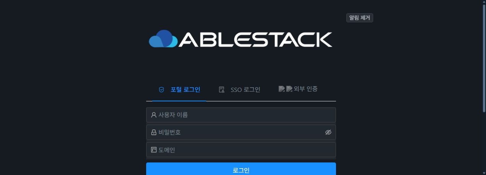
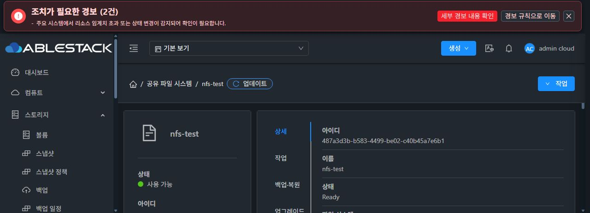

# CREATE_NEW 복원 계획의 템플릿 고정 검증

계획 작성과 실행 사이 기본 SYSTEM 템플릿이 바뀌어 다른 이미지를 선택할 수 있는 공백을 보완했다. 고정 소스는 6b37a166f2d05c9d88eb64912ccf5e9146c733a3다. 제품 변경은 관리 서버 두 파일이며 새 테스트와 기존 AD 성공 사례를 보완했다. UI·API·DDL 변경은0이다. 관리6class 배포와 API·UI 로그인 회복 확인을 완료했고, 실제F2생성은 아직0이며 최종UI #1275는 미착수다.

## 구현 범위

계획에 선택 모드·정확한 UUID·DB 원 checksum·전체 details canonical SHA·zone·arch를 고정하고, capability 소비 및 새 Cloud 할당 직전에 재검증한다. DEFAULT_SYSTEM은 현재 기본 선택이 달라지면 거절한다. EXPLICIT_SYSTEM은 지정한 이미지, PRIVATE_USER는 기존 정상 permit 검증을 유지한다. AD source는 원 요청의 명시 fresh UUID와 seedAbsent를 default normalize 전에 검사한다.

원 raw 요청 mapping은 유지하고 서버 blueprint만 normalize한다. 생성된 target UUID와 검증된 실제 VM/ROOT binding은 같은 artifact update에 기록한다. binding 실패는 관측 가능한 exact provenance를 보존하고, 새 정상 review/token이 같은 VM/ROOT를 재검증한 경우만 재개한다. 없는 provenance, 관측하지 못한 ROOT 또는 바뀐 ROOT를 자동 채택하거나 새 자원 할당으로 바꾸지 않는다.

기존 createConfigurationNewService의 alloc→deploy 완료 전 예외/유실 때 provenance 미기록 위험은 별도 잔여다. 이번 pin 수정으로 전체 부분 생성의 중복 할당 문제가 해결됐다고 주장하지 않는다. SharedFS/VM/ROOT/DATA의 durable ID를 시작 전에 기록하고 같은 ID로 재개하는 후속 구현을 준비한다.

## 고정 소스와 정상 모듈 검증

집중 신규17/관련62 =79tests/9suites 통과 후 기존 AD 성공 사례를 실제 template/ROOT verifier로 보완해96tests/10suites를 통과했다. 첫 정상02b는 기존 positive fixture의 pin 부재로1실패했고, 두 번째8ca는 test 한 줄의 Checkstyle 길이에서 멈췄다. 생산 guard를 낮추거나 테스트를 제거하지 않았다. 줄 분리만 한6b의 집중 의미 검증은96 결과를 재사용했다.

최종 정상 모듈은920tests/125suites·failures/errors/skips0·Checkstyle·reactor PASS다. 이전888 대비 새 CloneTemplatePin17과 해당 이전 PIN 이후의 KVM15를 구분했다. 신규 코드 tests만으로920을 채웠다고 해석하지 않는다.

Java9904의 NUL SHA a9f8792dd47be366b28257e615f5e41bb549f57d0c161774a57cf0fcad2e506f와 tracked source 전후 SHA가 같다. 현재 archive의 file/symlink15523과 directory5189를 구분했고 missing/different0이다. 과거11208 비교 범위를 현재 수치로 다시 표시하지 않는다. 5모듈 immutable output6312개를 고정했다.

정상888 산출물과 비교한 관리 server delta는 두 outer와 익명/내부4개를 포함해6클래스다. API/schema/provider delta0이며 KVM Wrapper1은 관리 배포 payload에서 제외했다. 실제1337 캐시의 기존6 entry SHA가 baseline과 같고, 기존 exported ABI·상속과 signature6 및 member refs2708/failed0을 확인했다. Runtime family3의 bytes도 같다. 이 검증은 이전 실제 캐시 기반이며 새로운 SSH live 관측으로 확대하지 않는다.

배포 준비에서 JAR15f361/PID1331803·provider9·운영UI/config·source/volume refs를 새로 확인한 뒤, backed-up deployed JAR의 해당6 entry만 atomic overlay했다. 전체 다른 JAR나 게스트 CLI19ad를 교체하지 않는다. 현재 df11의 원 key/cipher/ref/frozen CLI를 유지한 복구가 선행이다.

[최종 정상 증거](clone-template-pin-6b37a166/normal-source-validation.json), [실제 production delta](clone-template-pin-6b37a166/production-class-delta-vs-888.json), [캐시 runtime ABI 검증](clone-template-pin-6b37a166/cached-runtime-abi-review.json).

## 실제 관리 모듈 배포와 보존 확인

6-class 배포 한 번이 exit0으로 끝났다. 실제 JAR45d7426a272a16a27db5214b6a49f85139290a262afe1a10161f930c7434aac2/PID1378056이며 root backup은 /root/epic898-f2-template-pin-6b37a166-backup-20261010-104903이다. 새 API login과3hosts Up/Enabled·8service Running·8SharedFS를 확인했다. VM21/volume33의 공개 ROOT/DATA/size/provision/path/NIC refs와 F1 operation17이 전후같다. df11 rev11 RECOVERY_REQUIRED/INTERRUPTED_RECOVERY_REQUIRED100은 유지한다. module restart로 원 복구 작업을 재실행하지 않았다.

실제 새6클래스 SHA, Runtime3, 나머지 library, 운영UI indexe755/configd3e symlink·WEB-INF·전체 assets를 확인했다. guestCLI19ad/key/cipher/ref/journal/DDL/KVM/VM/DATA 변경은0이다. [실제 배포 후 검증](clone-template-pin-6b37a166/management-six-deployment-postcheck-public.json).

## 실제 UI 로그인 회복과 미확인 경계

보호된 원487 nfs-test의 read-only 화면에서 정상 업데이트 GET200을 확인했다. 실제 재시작 구간에는 documented CDP loadingFailed13과 로그인redirect를 관측했다. HTTP401 자체는 그 창에서 관측하지 않아 추정하지 않는다. 기존admin 정상로그인 한 번→원487 directroute 복귀→spinner종료·Ready/XFS100GiB/NFS·공개수동업데이트 성공을 확인했다.

부분 조회 경고를 유지한 failure-spinner 종료와 경고 내 수동retry 경로는 놓쳐 미검증이다. recovery GET200/FINISHED2에는 background/후속조회가 포함될 수 있어 requestcoalescing 성공으로 표시하지 않는다. 실제 재시작을 추가하거나 fake network/DOM/Vue 상태를 넣지 않았다. 최종 UI #1275는 시작하지 않았다.

[UI 실제 관측](../epic-898-ui-20261007/ui1269-natural-restart/ui1269-natural-restart-public-proof.json)을 모듈 API 보존 결과와 구분한다. 부모가 두 이미지를 직접 검토했다.
