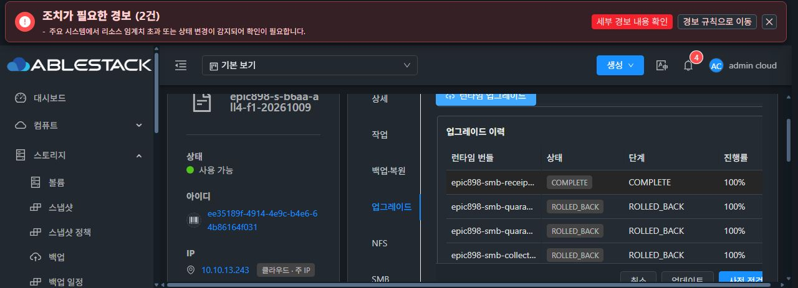

# CODE 29 · SOURCE 재개와 관리 transport 실패의 현재 관측

이 문서는 2026-10-10 CODE 29 적용부터 원 fef 작업의 SOURCE 캡처·재개와 관리 실패까지 최신 검증 기록이다. 기존 6bc 정지 수집 실패와 887 코드 검증 문서는 당시 관측을 보존한다. 같은 원 fef의 정상 UI cache-recovery 1회는 job d8d3c47c-199d-42dc-a2a4-b61013275a87, 03:31:07 → 03:33:18 KST / 131 s 뒤 jobstatus2/error530으로 실패했다. 원 작업은 RECOVERY_REQUIRED / INTERRUPTED100이며 03:33:18.907에도 HOST_EXCEPTION이 확인됐다. native status는 RESUMED/success/exit0를 유지하고 전후 SOURCE/scope/원 pin·보호 자료·DB metadata·DATA는 그대로다. 근본 원인은 미확정이다. primary 29 + #1333 = unique 30, 29 OPEN / #911 기존 CLOSED / 새 close 0이다.

## 정상 모듈·이미지·실제 설치 계보

| 범위 | source/검증 | 실제 모듈 및 한계 |
| --- | --- | --- |
| 관리 Java | 1337a93e0966380457988d9befd7d21548bf4542 / 정상 888 tests·124 selectors / Checkstyle PASS | JAR 15f361afb6b33517e37e3930e825649558a34eb65e96f821ee402fcfb6f272e8 / PID 1331803. native issuer 2a663 → 같은 888 소비자의 6양성/9거절은 별도 고정 bridge 증거다. |
| native CODE | 29cab7746b1d48eadd22bf88c0a85bdc73db2a4d / 정상 457 tests·49 selectors PASS | 정상 UI c90bfcc9 COMPLETE/100 / 설치 CLI 19adfa998ab568b2e16e89002d239a1d5d121444f6a4510e180d7a638e5388f4. 기존 이미지 전체를 이 pin으로 재라벨하지 않는다. |
| Mold UI | 3df730e74a0682cb1322575e7226ad12f2035a76 / 정상 334 tests·18 suites·lint·production 850 PASS | index 4595c74ee9cacf57aa625e8906023451a76d39aec4bc9358603da3164bb7cdc1 / protected config d3e285317289b4eb4034141b63e4604ffd014d8bc1385aa28a007a4317c397f5. 기존 symlink·WEB-INF·style 보존, #1275 미착수. |
| 기반 이미지 | b6aa0338bd961496c4b61c207eb5ab75c142b306 / kernel 6.12.95·Ganesha 5.5.3·SPARSE | 실제 검증된 base 이미지와 후속 signed CODE 계보를 구분한다. 이미지 SHA 5a40f3ec… / bz2 SHA 30b98674…는 그대로다. |

## 실제 CODE 성공과 원 작업의 관리 실패

CODE 결과는 원 SOURCE 정지의 typed 15필드 증거로 runtimeCodeVerified=true를 확인했으며 healthSuccess=false / serviceAvailabilityVerified=false를 유지했다. CODE COMPLETE가 당시 전체 서비스 health 성공은 아니다. NFS/QGA나 아직 구성하지 않은 프로토콜을 임의 성공·실패로 바꾸지 않는다.

원 fef126a6/revision 5의 native 단계는 SOURCE 자료 생성·코드 호환 증빙·소유 SMB 재개까지 진행했고 journal RESUMED/status success=true/exit0/sourceSmbResumed=true를 반환했다. 보호 자료는 present/root0600이며 실제 정상 PID 756716은 passdb/secrets FD 2개를 보유한다. 이는 DB 보유와 service ownership 증거이고 client session이나 외부 auth 성공을 의미하지 않는다. 원 journal CLI 2dc pin, GEN4/BOOT/ROOT·두 FILE DATA/장치·XFS/mount·NFS 4096 B sentinel을 유지했다.

관리 job e7d16a74의 원 fef 작업은 RECOVERY_REQUIRED / INTERRUPTED_RECOVERY_REQUIRED / progress100에 남았다. 02:51:39.337 HOST_EXCEPTION이 확인됐으며, 앞선 02:28:27 HOST_NONZERO/exit1과 분리한다. **native RESUMED를 관리 terminal 완료나 LOCAL ACL·외부 SMB auth/I/O 성공으로 승격하지 않는다.** 현재 실패 근본 원인은 미확정이다.

## 실제 배포 경로의 공개 크기 시험

원본 native CLI/export/capsule을 재호출하지 않고 공개 RAM 데이터만 사용한 기존 proof를 읽었다.

| provider | 공개 stdout | 결과 / elapsed | 판정 한계 |
| --- | --- | --- | --- |
| actual 13.2 Python/libvirt C binding | 25 B / 1,518,638 B | exit0·JSON parse 완료, 각각 0.253 s / 0.359 s, out/err truncated=false | Java/JNI wrapper 호출은 아니다. |
| actual 13.2 production classpath / HostWrapper.waitForGuestCommand | 25 B / 1,518,638 B | host success=true/exit0·shape/parse 완료, 각각 464 ms / 1,610 ms. loaded wrapper bytes는 expected class와 일치 | 배포 wrapper는 truncation flags를 노출하지 않아 null이다. false로 바꾸지 않는다. original CLI 호출0/source·service 변경0. |

같은 크기의 공개 C+Java 응답 두 경로가 통과했다. 단순 응답 크기만으로 실패했다고 확정할 근거가 없으며, 동시에 원 SOURCE producer·management delegate의 실패가 해결됐다고도 주장하지 않는다. 이 관측은 공개 transport 경로 대조이며 원 capsule·private 값/hash 출력은 없다.

## 재개와 HOST_EXCEPTION의 시간 관계

| 관측 | KST / 제출 뒤 | HOST_EXCEPTION 이전 |
| --- | --- | --- |
| 정상 UI 제출 | 02:49:22 | 기준 |
| 코드 호환 증빙 mtime | 02:49:30.177824 / +8.178 s | 128.822 s |
| 암호화 자료 mtime | 02:49:30.457828 / +8.458 s | 128.542 s |
| SMB PID의 추정 시작 | 02:49:31.692557 / +9.693 s | 127.307 s |
| RESUMED journal mtime | 02:49:32.673859 / +10.674 s | 126.326 s |
| 관리 HOST_EXCEPTION | 02:51:39 | 실패 분류 |

실제 kernel startTicks/uptime/btime과 공개 stat만 읽었다. btime 기준 차이는 약 0.983 s, 추정 해상도는 1 s다. journal mtime과 프로세스 시작은 관리 실패 전에 재개가 관측됐음을 보강하지만, timeout·scope·parser 등 특정 원인을 확정하지 않는다. 원 파일 내용/private hash·추가 export·signal은 읽거나 실행하지 않았다.

## 남은 인수와 변경 범위

같은 원 작업의 cache-recovery는 terminal 실패로 확인됐다. 전후 공개 상태·SOURCE scope·원 2dc pin·보호 자료/호환 증빙·두 DB metadata와 장치/NFS sentinel의 모든 비교가 같고, restoreSupported/current ownership/session empty/resumed는 true다. 관리 terminal 완료·ACL·외부 auth/I/O는 0이다. 원 scope/자료/pending을 보존하며 자동 추가 retry·SOURCE 재export·force clear·재포맷을 하지 않는다. Root는 다음 KVM safe exception 진단 수정만 검토 중이며 새 코드가 적용되거나 원인이 확정된 것으로 표시하지 않는다. 이후 LOCAL ACL·실제 SMB auth/RW/fresh reconnect/거절, 기존 Ready RAW2의 iSCSI/NVMe 실제 auth/I/O, all4 profile/원자성·cold, backup/F2, ROOT/retained/AD 및 lease/cancel 인수가 남는다.

NFS C1/C2와 이전 CURRENT 복구·SMB share Ready·C3 cold/DNS/TGT/DC SPN은 완료 subset이고 전체 all4/AD/ROOT 완료를 대신하지 않는다. Windows OOBE와 exact 새 10 TiB 선택은 기존 human pending이며 재질문하지 않는다. SYSTEM 등록은 all4 뒤 부모 영향 승인 단계이고 만료 USER permit은 우회하지 않는다. sealed RAM 시험 키는 승인된 정상 시험 경로이며 stable CI provisioning/RPM publication을 기능 전체의 추가 hard blocker로 만들지 않는다.

**#1275 최종 스타일/11탭 QA는 미착수다. 착수 직전 전체 STOP·사용자 보고·직접 지시 대기를 유지한다.** 취소된 Kubernetes/LB/포트포워드 작업은 범위에서 제외한다.

[공개 상태·배포·크기 시험·시간 증빙](20261010-code29-source-recovery-public-proof.json)은 허용된 상태·boolean·모듈·timing과 원본 증빙 SHA를 포함한다. 비밀번호·개인키·원본 capsule/cipher 내용·SID 값은 기록하지 않았다.
