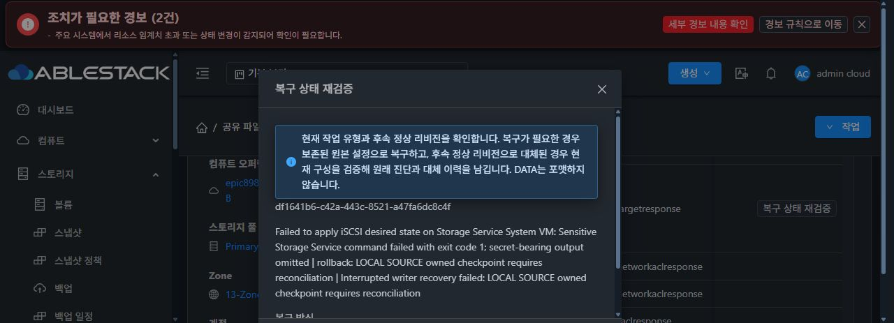
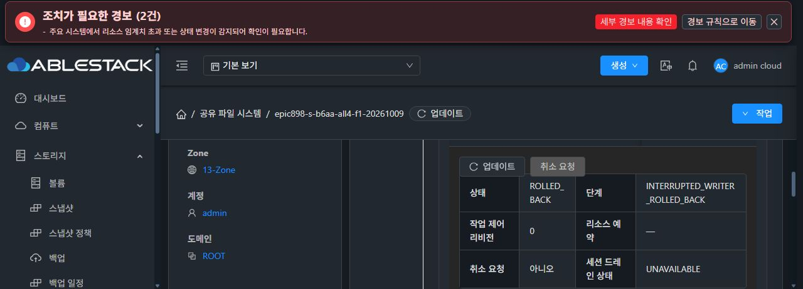

# 원 df11 SOURCE 정상 UI 복구 완료

원 iSCSI 생성 실패 df1641b6/rev11의 SOURCE 복구를 정상 UI에서 새 동의로 한 번 제출했다. 같은 작업의 UI와 정상 operation API는 ROLLED_BACK / INTERRUPTED_WRITER_ROLLED_BACK / 100이며, native pending=null 및 원 SOURCE imported=true/RESUMED를 확인했다. 새 작업 UUID·CURRENT retain·직접 API apply·강제 완료·journal 재해시·키 삭제·format·RAW I/O는0이다.

이번 복구 전 관리 진단 클래스053070의 정상931/126 검증과 outer1 제한 배포를 마쳤다. 이 변경은 실패의 기존 공개 예외 종류 보존만 담당한다. 이번에는 실패하지 않아 nativeReason은 미관측이고, 이전 HOST_NONZERO/exit1의 원인이 확인됐다거나 진단 변경이 복구 성공의 원인이라고 주장하지 않는다. 이전 실패 자료를 보존한다.

## 실제 UI · API · native 대조

UI에서 원 UUID df1641b6-c42a-443c-8521-a47fa6dc8c4f와 SOURCE 선택을 확인했고, 정상 제출 ACK 뒤 같은 rev11의 이전 구성 복구 완료를 관측했다. 정상 operation API도 정확한 UUID/instance3480/rev11/state/phase/100이 일치했다.

로그인 navigation 후 CDP 초기 제출 응답을 놓쳐 정확한 job ID를 포착하지 못했다. 한정 API 조회와 읽기 전용 command/actor/제출시각 JDBC 조회는0rows였다. 보조 코드 실행 전에 관리 서버 javac 부재와 로컬 생성문 들여쓰기 오류를 정정했다. private params/credential 출력·저장과 상태 쓰기는0이다. job ID·jobstatus1은 미확인으로 남기며 추가 넓은 검색·재제출을 중단했다. 이 한계와 UI/operation API/native 완료 증거를 구분한다.

Native의 원 CLI19ad/BOOTdc4b/GEN10-e4f/구성SHA10d361은 그대로이고 pending이 없어졌다. 원 checkpoint09845/refa6d984·공개 키·root0600/cipher1530683B를 유지했다. sourceSmbResumed/sourceRuntimeVerified/currentOwnership/sessionEmpty/restoreSupported가 literal true다. 원 record와 imported fingerprint의 DB2 일치·scope/public key 일치와 imported stopped DB 메타의 일치를 확인했고, live TDB 원문과 SID 값을 읽거나 출력하지 않았다.

ROOT f24d/sdb6, FILE1 abfa/XFSb54, FILE2 ceaee/XFS6ff의 장치·mount를 유지했다. NFS/SMB own4096B 파일 해시와 UID/GID가 같고, RAW db3de/sdd의 serial20GiB·ROOT 제외·무FS/partition/mount·앞64KiB+offset1MiB/4KiB blank를 확인했다. NVMe ec92는 guest 연결 없음이며 UI20GiB/SPARSE와 VM 연결 없음이다. 원 복원에 따른 DB inode/time과 daemon PID 변화는 정상 차분으로 따로 기록했다.

[공개 증거 manifest](df11-normal-source-ui-recovery/df11-normal-source-recovery-public-evidence-manifest.json), [정상 operation API](df11-normal-source-ui-recovery/df11-normal-operation-api-terminal-public.json), [native 복원 후 상태](df11-normal-source-ui-recovery/after-df11-native-reason-ui-recovery-bounded-public-snapshot.json).

이 완료는 원 SOURCE 구성·신원 복구의 인수다. 새 iSCSI/NVMe all4·AD·ROOT·복수 NEW 복원은 후속 인수이고 최종 UI #1275는 미착수다.
