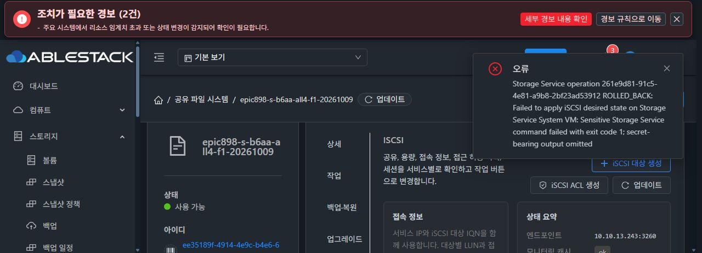

# 정상 CODE 완료와 managed iSCSI 첫 재시험

정상 UI preflight jobb244fe54는 status1/result0, CODE opdc6b3b5a는 PREFLIGHT_READY60이었다. 같은 CODE를 정상 UI로 한 번 적용한 job3b37db85-48fa-44cc-ba71-228b663cb19d는 status1/result0, op는 COMPLETE/100, transaction runtime-5bd46c64-123e-4eca-a8f3-6d68063f2b3b이다. runtimeCodeVerified/healthSuccess/serviceAvailabilityVerified 모두 literal true를 확인했다.

실제 CLI f9a2d5와 ffef current/previous29 버전, archive493b/manifestcff12/updater161c 및 signedRuntime/files/ENTRY readback이 같다. BOOTdc4b/GEN10-e4f/구성SHA10d/pending없음/writer-idle을 유지했다. generic SMB ownership/TCP/DB alignment true, NFS·SMB own4096B 해시/UIDGID와 RAW blank를 확인했다. 원 df11의 PIN19/ref/pub/cipher는 역사 메타로만 보존했고 새 CLI에서 old status/import를 재호출하지 않았다.

## 정상 managed target 1회와 rollback

정상 UI의 target/listener/ACL/session이0임을 확인하고 create를 선택했다. 자동 IQN iqn.2026-05.local.storage:epic898-s-b6aa-all4-f1-20261009-9506을 수정하지 않고, CURRENT 선택의 기존 SPARSE RAW db3de/LUN0/20GiB/default3260·ROOT제외·format0을 확인해 버튼 한 번으로 제출했다. API createStorageIscsiTarget은 HTTP200/job50f85ef3-6950-4592-90ac-58df15f71fa0을 반환했다.

이 job은 status2/resultcode530/errorcode530, op261e9d81-91c5-4e81-a9b8-2bf23ad53912는 ROLLED_BACK이다. public error는 민감 출력 생략/hostexit1만 있고 fixed stage/category/returnCode 및 LOCAL_SOURCE_CHECKPOINT_REJECTED는 미관측이다. 현재 원인은 미확정이다. 기존 custom .local.epic898의 첫 실패와 이번 정상 managed .local.storage 경로를 구분한다.

after snapshot은 f9/BOOT/VM/currentGEN10/pending없음·장치/mount·NFS/SMB·RAW64KiB+offset1MiB/4KiB blank가 같다. DB2의 owner/mode/size/link와 holder2/deletedfalse를 보존했고 정상 rollback inode/time 변화는 별도 차분이다. writer-idle을 확인했다. 추가 submit/recover/target writer·CHAP/ACL·RAW/NVMe I/O는0이다.

[정상 CODE 완료 proof](ffef-code-and-managed-raw/ffef-code-complete-public-proof.json), [서명·데이터 readback](ffef-code-and-managed-raw/after-normal-ffef-code-public-snapshot.json), [새 target 실제 실패](ffef-code-and-managed-raw/ffef-managed-iscsi-target-261e-public-proof.json), [rollback 보존 비교](ffef-code-and-managed-raw/managed-target-261e-rollback-preservation-public-proof.json).

현재 fixed5는 targetcli required-command 실패만 담당한다. 다른 입력/vault/device/dependency/listener/readiness 경계와 source 준비 단계의 민감 내용 없는 고정 phase 진단 보완을 준비한다. 무관한 포맷·private 출력·기존 foreign target 보호 완화·확인되지 않은 원인 수정은 하지 않는다. all4 인수는 미완료이고 #1275는 미착수다.
