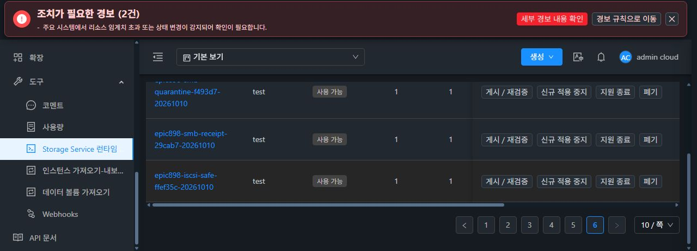

# 안전 iSCSI 단계 진단 CODE의 정상 카탈로그 등록

검증한 ffef35c4986 소스의 CLI f9a2d5 및 기존 boot/monitor ENTRY3를 원 builder4fcc로 묶었다. 정상 Native457/49·KVM72/7 결과를 재사용하고 source bytes가 변하지 않았음을 확인했다. 새 Ed25519 시험 개인키는 RAM/full-sealed memfd에만 두었고, regular file·argv·env·로그·출력에 저장하지 않았다. 입력 bytearray/descriptor를 정리했으며 전체 heap 소거를 주장하지 않는다.

새 별도 시험 keyId epic898-test-iscsi-safe-ffef35c와 version epic898-iscsi-safe-ffef35c-20261010을 사용했다. archive398313B/SHA493b68b8, manifestcff12f8a, publicPEM9d9bfdb, signature64B/97220331과 tar ENTRY3/root0755/hash closure 및 실제 signature verify를 확인했다. 기존 devtrust의 keyId나 개인키를 대체·복원하지 않았다.

관리 서버의 configured trust directory는50→51, F1 updater trust는12→13으로 새 publicPEM만 추가했고 원 entries의 hash/owner/mode는 같았다. 관리 JAR0cf/UI index/config 및 원 source CLI19ad/BOOT/GEN10/pending없음은 유지했다. 관리 webapp의 독립 public5파일은 기존 UI assets의 변경과 구분하며 HTTP200/길이/해시/서명을 확인했다.

정상 UI로 REGISTERED→VERIFIED→AVAILABLE을 완료했고 UUID051be815-6ff9-4552-a4cf-bd0abd728c33를 실제 GET으로 대조했다. ABI1/schema1/serviceImpactNONE과 archive/manifest/keyId/version이 같다. 이는 시험 서명 카탈로그의 실제 검증이며 정식 CI 키를 찾았다거나 새 CODE가 이미 guest에 설치됐다는 뜻이 아니다.

[로컬 서명·ENTRY 증거](ffef-code-catalog/local-signed-payload-proof.json), [기존 trust 보존과 실제 public 게시](ffef-code-catalog/actual-public-trust-publication-proof.json), [정상 UI 카탈로그 AVAILABLE](ffef-code-catalog/ffef-code-catalog-available-public-proof.json).

이 단계의 실제 CODE apply·RAW I/O는0이다. 관리8a 클래스 보완과 host 진단 정렬의 postcheck 뒤 정상 CODE preflight/apply와 같은 SPARSE RAW의 UI/I/O 검증을 이어간다. SYSTEM-A whole image/ROOT upgrade 및 최종 UI #1275와 구분하며 #1275는 미착수다.
