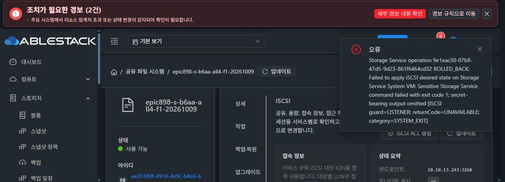

# guard CODE 설치와 실제 LISTENER 실패 경계

guard CODE를 정상 UI로 한 번 적용했고 같은 op9ca27/tx20a는 정상 runtime API와 UI에서 COMPLETE100이다. actual c265/8de signedRuntime/files/ENTRY readback 및 runtimeCodeVerified/healthSuccess/serviceAvailabilityVerified가 true이며, GEN10/BOOT/pending없음·원 파일/RAW와 역사 source19/f9 자료를 보존했다. initial apply 이벤트가 Network.enable 누락으로 포착되지 않아 정확한 applyjobID는 미확인이다. 재적용·broad job 조회는 하지 않았다.

같은 RAW db3de/LUN0/20GiB/CURRENT/default3260·ROOT제외·format0을 정상 UI의 자동 managed IQN...9657과 LISTENER_GROUP/listenerports3260/cleanupvolumeonfailurefalse로 제출했다. job771f4418-21b5-4ce4-8840-5f1f42eb3a3f는2/530, op9e1eac30-07b8-47d5-9d23-861f6464cd32는ROLLED_BACK이다.

기존RAM 오류에서 실제 공개 projection ISCSI guard=LISTENER/returnCode UNAVAILABLE(null)/category SYSTEM_EXIT를 확인했다. kind literal은 consumer 출력 형식이 아니고 enum 뒤 문장부호를 최초 extractor가 허용하지 않아 놓친 점을 정정했다. 추가API조회·민감원문출력은0이다.

Source의 selected_listeners_for_target는 요청포트와 활성listener 교집합이 없을 때 LISTENER/SystemExit를 낸다. 관리 ensureProtocol이 신규 endpoint에2049를 고정 저장하는 source bug를 확인했다. 실제request3260 및관측phase와2049desiredlistener 불일치 경로가맞지만 이번9e actualpayload2049를새로읽었다고주장하지않고 소스 기반 추론으로 구분한다. 프로토콜별default port 신규생성을 사용하는 최소fix와 producer→native 선택 회귀를 준비한다.

after2df/d1a2는 BOOT/VM/c265/currentGEN10/pending없음/device/mount/NFS/SMB/RAWblank/NVMeunattached/역사df11metadata12개가 같다. DB2 inode/time은 정상rollback 차분이고 owner/mode/size/link/device를 유지했다. holder2/deletedfalse/rootS/notpaused 및writeridle을 확인했다. 정상UI listener/target/ACL/session0과 기존API target0/session decoded0을 연결하며 외부container row count와 혼동하지 않는다. 추가writer/복구/CHAP/RAW I/O는0이다.

[CODE 완료](guard-code-listener-failure/guard-code-complete-public-proof.json), [CODE 전후 보존](guard-code-listener-failure/guard-code-data-preservation-public-proof.json), [실제 request/job/고정단계](guard-code-listener-failure/guard-managed-target-9e1e-terminal-public-proof.json), [rollback 보존](guard-code-listener-failure/guard-target9e-rollback-preservation-public-proof.json), [빈 UI/API 목록](guard-code-listener-failure/guard-target9e-after-ui-api-lists-public-proof-v2.json).

이것은 실제 실패 경계와 복구 인수이며 all4 기능 완료는 아니다. 다음관리fix/UI 재시험을 진행하고 최종UI #1275는 미착수다.
