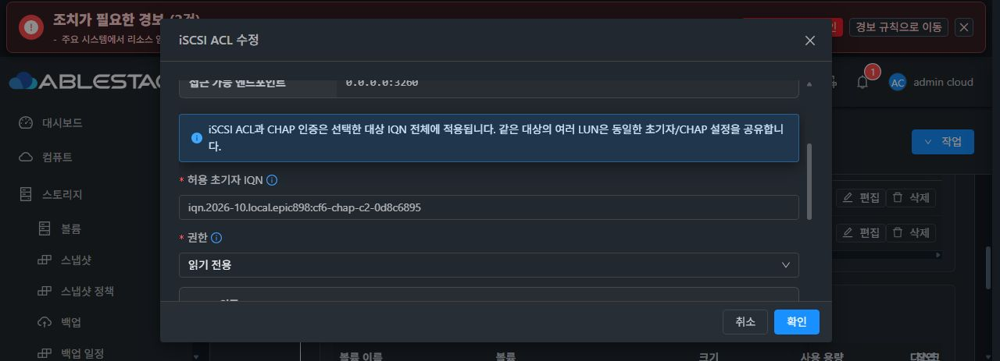

# 실제 iSCSI CHAP 및 읽기 전용 권한 결함

## 대상 생성과 실제 매핑

관리 서버 소스 cf6baa485126의 기본 포트 수정 후 동일한 SPARSE 20 GiB RAW 볼륨을 정상 UI에서 iSCSI 대상으로 생성했다. Job a5303fa7-152b-4b6e-adb7-a4344a9298be는 status 1 / result 0이며 대상 0393e4f7-56a2-4e91-9e2e-efa76c300dcb는 Ready다. UI에서 0.0.0.0:3260과 LUN 0을 확인했다.

Native에서 대상 IQN, 단일 portal, 활성 TPG, LUN 0의 symlink, 해당 iblock backstore 및 RAW /dev/sdd의 일련번호 db3de2b75fcb4cb5a0aa와 21474836480바이트 크기를 확인했다. ROOT /dev/sdb6는 제외했다. 포트 수정 전 실제 payload가 2049였다는 직접 관측은 없으므로, 이전 실패와 소스 연결은 추론으로 구분한다.

## 실제 기본 CHAP 및 제한 I/O

C1 READ_WRITE와 C2 READ_ONLY ACL은 정상 API로 설정했다. 시험 자격 정보는 메모리에만 두었으며 새 자격 정보를 GUI에서 입력한 것으로 주장하지 않는다. 기존 ACL의 UI 표시와 대화상자 검증은 별도로 수행했다.

C1과 C2 모두 자격 없음 및 잘못된 비밀의 LOGIN_ONLY 접속에서 authenticationRejected=true, loginAccepted=false와 쓰기 0을 확인했다. 정상 C1은 지정한 1 MiB 오프셋에 4096바이트를 한 번 기록했다. FUA 및 SYNCHRONIZE CACHE 후 즉시 읽기와 새 연결 읽기의 SHA-256은 모두 40804e47bb6a66d3a0dbfe20fc9ed3f32bfabcad0680d047f741d5be7f357e6a로 예상값과 일치했다. 정상 C2의 읽기 및 새 연결 읽기도 같은 해시였다.

LUN 바인딩은 서버의 일련번호, IQN/LUN 및 READ CAPACITY 결과로 확인했다. 클라이언트의 네트워크 VPD 일련번호를 읽었다고 주장하지 않는다.

## 읽기 전용 권한 결함과 보존

C2의 RO_WRITE 시험이 예상과 달리 성공했고 4096바이트 쓰기가 보고됐다. 시험 시점의 실제 관리 API 및 UI는 READ_ONLY였고, 이후 한 번의 native 관측에서 같은 ACL의 mapped LUN 0 write_protect는 0이었다. 이는 읽기 전용 거절 성공이 아니라 실제 권한 결함이다.

실패 후 추가 클라이언트 쓰기, 상호 CHAP 및 NVMe 실제 작업을 중단했다. 소스에서 ACL 생성과 인증 설정만 수행하며 LUN별 permission을 적용하지 않는 경로를 확인했다. 설치된 targetcli는 기본 ACL 생성 시 모든 TPG LUN을 write_protect=False로 자동 매핑하므로, 기존 관리 서버 계약은 같은 IQN의 초기자 ACL을 합쳐 모든 LUN에 적용하는 방식이다. 수정은 이 계약을 유지하면서 자동 매핑을 끄고 관리 payload의 활성 ACL 권한을 각 LUN에 명시적으로 RO/RW 매핑하는 방식으로 준비한다. 같은 초기자의 상충하는 권한은 관리 서버에서 변경 전에 거절하고 설정 생성 단계에서도 검증한다. Native만의 서로 다른 LUN 권한 fixture를 전체 관리 API의 지원 정책으로 확대하지 않는다.

사후 실제 상태는 generation 13, operation 39bb9e03-236a-41c1-a87a-d693b9915ff5, configuration SHA-256 9d678db9bf8779d520530f97dede0b98b736589eb6d4325d51c8edf5ff165542다. Pending 없음, writer idle, 모든 프로토콜 세션 0을 확인했다.

RAW 시험 구간은 동일한 패턴을 유지했고 헤더 64 KiB 및 구간 앞뒤 4096바이트는 0이었다. 이는 제한된 보존 관측이며 전체 디스크의 구간 외 해시를 검증한 것은 아니다. 기존 NFS 시험 파일 SHA-256 9ba0b0280276cad982cfa3df6e6821f2b4b8ea04761b905cc1d089cbd72c4c8a, SMB 시험 파일 SHA-256 65ea0e1ddd48fc6690d1772282d3edd5e0843da33bbea1c60848db3dfb4cc9c0, 두 XFS 및 ROOT 매핑을 유지했다.

수정과 재검증이 남아 있으며 #892는 열린 상태다. 최종 UI 표준 정리 #1275는 미착수다.

## 공개 증거

- 기본 대상 실제 매핑 proof: SHA-256 390c648944ae5ae8d9c1eb92ae35f9965a94c1b37c324af572804c5f49cf83af
- 읽기 전용 결함 사후 proof: SHA-256 85288c2cbc127bfa5944ca63bd75781ff83a342ceeb2caf744a5eb1651c22290
- 기본 CHAP controller proof와 실제 UI 이미지는 후속 증거 묶음에 포함한다.

[실제 CHAP controller 결과](iscsi-chap-readonly-actual/basic-iscsi-chap-ram-controller-public-proof.json), [권한 결함과 제한 보존 관측](iscsi-chap-readonly-actual/chap-c2-ro-write-defect-readonly-public-proof.json), [대상 실제 매핑](iscsi-chap-readonly-actual/portfix-own-target-ready-public-readback.json).

