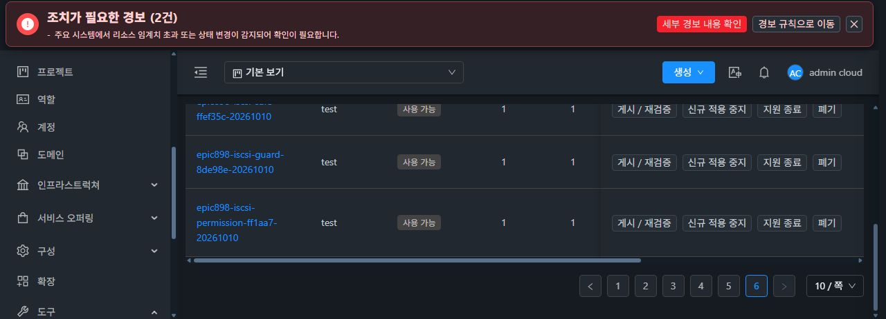
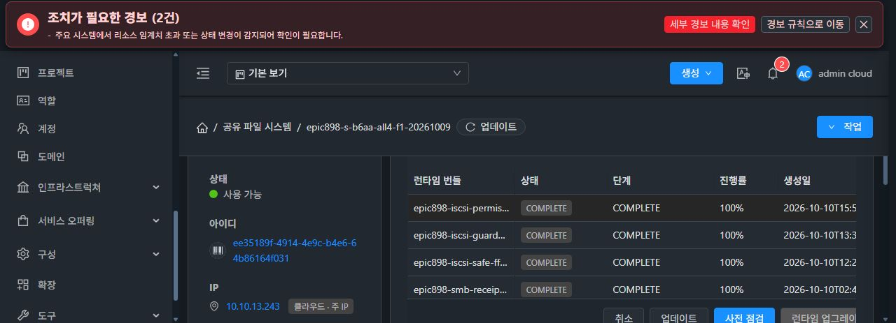

# iSCSI 읽기 전용 권한 적용과 IQN 단위 충돌 차단

실제 READ_ONLY ACL에서 4096바이트 쓰기가 성공하고 configfs mapped LUN write_protect=0이 관측된 결함을 수정했다. 소스 PIN은 ff1aa74eeda6fffba46c97d6f56c678cbdc2bf33이다.

기존 관리 서버는 같은 IQN의 초기자 ACL을 합쳐 모든 LUN에 적용한다. 이 계약을 유지한다. 관리 서버는 활성 초기자의 상충하는 권한을 생성·수정 전에 거절하고 설정 생성 시에도 검증한다. 수정이 거절되면 기존 규칙의 principal/permission 및 DAO와 게스트 상태를 변경하지 않는다. 비활성 대상과 ACL은 권한 합집합에서 제외한다.

게스트는 targetcli LUN/ACL 생성의 자동 매핑을 끄고 payload의 활성 ACL에 허용된 LUN만 명시적으로 매핑한다. READ_ONLY는 write_protect=1, READ_WRITE는 0을 설정한다. 적용 후 보호된 writer 아래 exact mapped grant 집합, 링크 대상, ACL/node 디렉터리 신원과 권한값을 확인한다. 읽기 값이나 링크·매핑 집합이 다르면 적용을 실패 처리하고 기존 롤백 경로를 이용한다.

설치된 rtslib의 MappedLUN 범위는 0..255이며 TPG LUN 범위 0..65535와 구분한다. 현재 동일 번호의 mapping은 vendor MappedLUN 범위를 따른다. 이를 커널 전체 LUN 한계로 주장하지 않는다. 활성 grant의 지원 범위와 잘못된 권한은 vault/desired 파일 publication 및 파괴적 target 삭제보다 먼저 검증한다.

변경은 제품 3파일(CLI, iscsi_auth.py, Manager)과 테스트 3파일로 제한한다. UI/KVM/API/DDL 변경은 없다. 기존 인증 writer와 private vault, LOCAL_SOURCE 및 rendered-generation 보호 본문을 유지한다. CODE 파일 교체만으로 현재 target 매핑이 다시 적용된다고 가정하지 않고 실제 배포 후 정상 구성 적용 경로로 확인한다.

핵심 검증은 native 권한 10개, 기존 lifecycle 13개 및 관리 서버 연계 10개를 통과했다. 관리 서버가 만든 실제 whole-IQN payload를 같은 후보의 전체 게스트 apply heredoc에 전달하여 두 LUN의 C1 RW 및 C2 RO, 총 4개 mapping을 확인했다. 충돌 생성/수정·serializer, 원 규칙 보존·DAO/apply 0, 비활성 grant 제외, 잘못된 readback 및 mapping 교체 경계를 검증했다. Native만의 혼합 LUN fixture를 관리 API의 per-LUN 권한 지원으로 확대하지 않는다.

Patch SHA-256 171b02f722db8e3616afda8d12c71abe8fde220b36687fc3f22ff5f5d2a8a19a, 핵심 proof 17794f397b95558cb88ee9ec887053f28dca7abe431e8f5e093da641426acef8, 독립 peer proof ff7f88dc1f60d727f6b080dbf5d08ff191880ee0afa9e84358cdd79460eb91da다.

정상 native는 480개 테스트 / 51개 그룹, 관리 모듈은 972개 테스트 / 128개 그룹에서 실패·오류·skip 0, Checkstyle 및 빌드 성공이다. Native552 및 관리 관련 소스5040의 전후 일치와 exact archive를 확인했고 별도 immutable 산출물을 보존했다. 정상 바이트 차이는 Manager 본체와 내부 $5의 2개 클래스였으나, $5의 실행 코드·descriptor·참조는 기존 실배포 클래스와 같으므로 재사용한다. 기존 공개/보호 ABI를 보존하고 권한 검증 protected 메서드 1개를 추가했다. 후보 본체의 2603개 멤버 참조 및 클래스 링크는 모두 해결했다. 실제 관리 클래스와 서명 CODE 배포는 후속이다. 실제 C2 쓰기 거절은 아직 완료로 판정하지 않는다. #892는 열려 있고 최종 UI 정리 #1275는 미착수다.

[핵심 회귀 proof](iscsi-permission-fix/focused-source-proof.json), [독립 검토](iscsi-permission-fix/independent-final-peer-public.json), [정상 native](iscsi-permission-fix/native-normal-source-proof.json), [정상 관리 모듈](iscsi-permission-fix/manager-normal-core-proof.json), [소스 및 산출물 최종 proof](iscsi-permission-fix/final-normal-source-proof.json), [제한 클래스 호환성](iscsi-permission-fix/outer-one-runtime-abi-review.json).

## 실제 관리 클래스 반영

실제 SSH 기준값 03db24d3, 정상 API 자원 기준값 178e74a0 및 게스트 기준 관측 cd992c2a를 확인한 뒤 정확한 배포 묶음 4개를 업로드·검증했다. 기존 GEN13, pending 없음, writer idle, 빈 세션 및 시험 파일·RAW 제한 구간을 보존했다.

관리 본체 클래스 1개를 한 번 반영했고 mold를 한 번 재기동했다. 새 JAR SHA-256은 ed3a6be2492af27d2c57072959e25db232050fecd7715154695244f6c5d424bf, PID는 1408330이며 백업은 /root/epic898-whole-iqn-ro-ff1aa74e-backup-20261010-153548이다. 다른 논리 JAR entry, 런타임 3개 클래스, 재사용 클래스와 라이브러리, UI 및 config를 보존했다. 게스트 호출은 0이며 게스트 코드와 실제 권한 적용은 후속이다.

사후 SSH에서 새 JAR/PID/94b3 본체와 기존 Runtime·라이브러리·UI3490/config/trust52 일치를 확인했다. 정상 API의 사후 비교도 완료했다. 호스트 3대 Up, 서비스 8개 Running, FS 8개·VM 21개·볼륨 33개·F1 operation 22개와 기존 카탈로그 두 개의 UUID 및 pin을 포함한 7개 참조 집합이 모두 유지됐다. 정상 로그인도 성공했다. 첫 사후 수집의 로컬 파일명 오류는 별도 보존했고 관리 장애로 해석하지 않았다. 추가 재시작은 없다.

[업로드 검증](iscsi-permission-fix/upload-verify-only-public-result.json), [실제 반영 결과](iscsi-permission-fix/apply-once-public-result.json), [정확한 배포 묶음 검증](iscsi-permission-fix/local-delivery-proof.json).

[정상 API 사후 자원 보존 proof](iscsi-permission-fix/post-ff1-normal-api-readiness-public-proof.json) SHA-256 e15abe4a3a58b78e7940b04068b0af82b02d51a1d6865d7e69b93035592af4dc. SSH 사후 proof SHA-256 a4f8fb57935b4352c93e5334136addb1eae2cec5364390417a353e74ca85fefe.

## 서명 런타임 카탈로그

정상 native480 소스·immutable와 일치하는 ENTRY3를 RAM 내 시험 키로 서명했다. 공개 archive SHA-256은 194e81a61ab7b1d5df27a2137522fb5e574115ede9a4a71689aa991d7926267f, manifest는 5d41b3509f1f7e6738a8a7f4c3938ae5423f379daca541a46e83d8a49de14fe8, 공개 키는 b546a683920dbf66146b9acb64871adf72572107c7eacb63664230218286fc57이다. 개인키의 일반 파일·argv·env·공개 출력 저장은 없고 descriptor를 닫았다.

공개 파일 5개와 시험 공개 키만 추가해 관리 trust52→53, F1 trust14→15가 됐으며 모든 기존 키와 관리 JAR/UI/config 및 F1 c265/GEN13/BOOT를 보존했다. HTTP 200, 크기·해시 및 서명을 확인했다.

실제 카탈로그 UI에서 f14582e9-9912-4dfa-8489-de5cca0a203f를 등록하고 VERIFIED 및 AVAILABLE로 전환했다. 검증 job95a44503-58d9-42b0-8726-b0ea88490428과 게시 jobc4740df4-4ac1-426c-812b-b7640b04d696은 모두 status1/result0이다. ABI1/schema1/serviceImpact NONE 및 공개 pin이 일치한다. 게스트 CODE 적용과 실제 권한 재시험은 후속이다.

[로컬 서명 proof](iscsi-permission-fix/local-signed-payload-proof.json), [공개 신뢰 키·파일 게시](iscsi-permission-fix/actual-public-trust-publication-proof.json), [정상 UI 카탈로그 AVAILABLE proof](iscsi-permission-fix/catalog-available-public-proof.json).

## 정상 UI CODE 적용 및 후속 ACL 조회 실패

정상 UI preflight job48efd41b-3aa2-449c-8f69-6138916eb90f는 status1/result0/PREFLIGHT_READY였다. 동일 operation af2b6a99-ad8c-4657-970a-be5e5404c08f / transaction runtime-2b1938a1-321d-43b5-8c4b-558200c6b7a3의 적용 job5e14f915-abb4-43d6-995e-7f81abe38e3f는 status1/result0/COMPLETE100으로 완료했다. 설치 CLI9b1 및 runtimeCodeVerified·healthSuccess·serviceAvailabilityVerified=true를 확인했다. BOOT·GEN13·기존 데이터와 빈 세션은 보존됐다. CODE 교체만으로 LUN 권한을 다시 적용하지 않았으므로 이 시점의 C2 write_protect=0은 후속 구성 적용 대상으로 구분한다.

같은 C1 ACL을 재적용하는 첫 API jobf0216e93-8642-406e-a957-71394e007b59가 status2/result431로 실패했다. 다음 C2 호출·클라이언트 시험은 0이며 RAM 자격을 폐기했다. 실제 C1/C2 ACL은 같은 UUID로 Ready/BLOCK_TARGET 및 RW/RO를 유지했다. 실패 후 구성·데이터·빈 세션·기존 WP0/0도 동일했다.

원 오류의 NFS ACL 조회 실패 접두어=true, block ACL 접두어=false를 확인했다. 소스의 getStorageServiceSyncId가 모든 ACL에 FILE_SHARE 전용 requireAcl을 호출하는 경계와 일치한다. 블록 ACL 처리 분기에 도달하지 못하는 공통 범위 계산 결함으로, 새 권한 validator의 거절로 표시하지 않는다. 해당 관리 서버 분기 수정과 정상 검증·배포 후 실제 RO 거절을 이어간다.

[CODE 완료 및 정확한 pin](iscsi-permission-fix/code-complete-public-proof.json), [설치 코드·데이터 보존](iscsi-permission-fix/after-ff1-code-proven-85288-guardian-public-proof.json), [첫 ACL 실패](iscsi-permission-fix/retry-iscsi-chap-ram-controller-public-proof.json), [NFS 조회 오류 접두어](iscsi-permission-fix/c1-job-nfs-vs-block-prefix-public-proof.json), [현재 ACL 목록](iscsi-permission-fix/own-current-iscsi-acl-identifiers-public-proof.json), [실패 후 보존](iscsi-permission-fix/after-c1-rotation-failure-proven-85288-guardian-public-proof.json).
