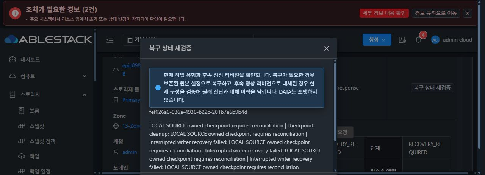
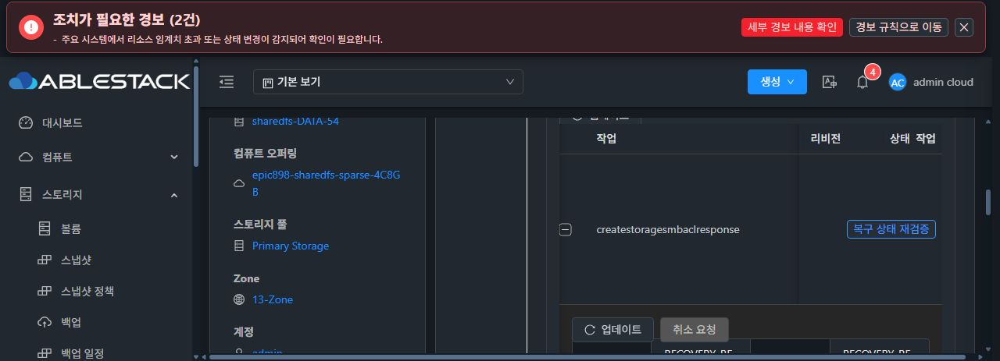
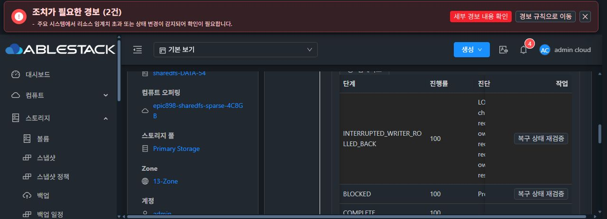

# 대용량 보호 입력의 메모리 청크 전송

원 복원의 관리 체크포인트는 이미 출판돼 있었지만 후속 import에 필요한 약1.5MB 입력이 QGA guest-exec의 PID 응답 전 시간 초과됐다. 같은 크기의 공개 입력도 재현됐고, 32KiB 청크의 공개 클러스터 시제품은 성공했다. [앞선 실제 재현과 시제품 보존](20261010-kvm-safe-transport-diagnostic.md)을 바탕으로 KVM 제품 전송을 수정했다.

소스 ad29797bef84b890e641ebdc606417037ddd7469는 wrapper와 회귀 테스트2파일만 변경한다. 32KiB 이하 입력은 기존 direct stdin을 유지한다. 큰 입력은 지원 RPC 확인 뒤 root 소유 anonymous memfd에 청크를 전송하고 write count·DATA close ACK·PID/start/argv/executable/inode를 확인한다. COMMIT 뒤 길이·SHA-256·전체 seals를 검증해 동일 CLI의 /dev/stdin에 전달한다. 입력의 정규 파일 fallback을 제공하지 않고 원문 argv·로그를 추가하지 않는다.

부분 전송·close 미확인·소유권 변경에서는 COMMIT하지 않는다. COMMIT 뒤 완료 응답을 잃으면 실행 여부 UNKNOWN으로 두고 CLI 자동 재호출이나 프로세스 신호를 보내지 않는다. receiver 대기는 최대300초이며 전송에 cleanup2초를 남긴다. 전체 CLI는 기존 command timeout을 유지하고 STATUS RPC에 남은 시간만 사용한다. 600초 command도 지원한다. 기존 capability 스키마와 작은 입력의 오류·성공 동작을 유지한다.

집중 Java19와 컴파일된 제품 receiver의 실제 로컬 kernel11 검사를 통과했다. 고정 커밋의 KVM 모듈 및 의존 모듈 정상 package 검사69/7 selectors·Checkstyle도 성공했고 실패·오류·생략은0이다. 소스 전후와 커밋 archive10764파일이 일치했다. 실제 소스 Java9903/KVM425/native142/UI719를 집계해 과거 수치를 재사용하지 않았다.

정상 산출물3050개를 별도 고정했다. 직전 immutable61과의 제품 차이는 Wrapper 클래스1개(SHA2eedeaf9)이고 API 및 다른 제품2665파일은 같다. 기존 public/protected14개 name·descriptor·visibility를 유지했다. checked InterruptedException 추가는 JVM descriptor를 바꾸지 않는다. fresh 실제 호스트5 JAR/12 class 및 JDK17에 대해 추가 member52/52를 해결했고 누락0이다.

[공개 검증 증빙](20261010-kvm-chunked-protected-input-normal-public-proof.json). 아래 제한 배포를 마쳤으며 원 SOURCE의 정상 UI 복원 결과와 외부 LOCAL SMB 인증/I/O는 아직 검증 전이다. Native CLI·관리 서버·UI는 이번 수정에서 변경하지 않아 기존457/888/366 검증을 재사용한다. 최종 UI 표준 정리 #1275는 미착수이며 시작 전에 전체 작업을 중단·보고한다.

## 제한 배포와 원 자료 보존

검토한 manifest de940da4의 한 클래스만 13.2 호스트에 1회 적용했다. 기존 a1cf JAR을 root0700 백업에 보존하고 fsync/atomic replace로 360a444 JAR을 적용한 뒤 mold-agent.service만 재시작했다. 새 Agent PID1799382, 클래스2eedeaf이며 다른482파일의 내용·ZIP 메타데이터·510 raw local record와 실제 libvirt/Gson/API/Logger provider를 보존했다. VM15개의 PID/start는 같고 게스트 재시작·데이터 포맷 명령은0이다. 백업 /root/epic898-chunked-input-host-wrapper-backup-20261009-220702의 시간은 UTC다.

배포 뒤 F1 보호값10개·DB/mount/holders·원 key/cipher/compat/ref·GEN4/BOOT·native RESUMED·원 pending PREPARED가 같았다. MGT/UI는 HTTP200·indexe755/configd3e·서비스8 Running/호스트3 Up 및 원4작업 상태를 유지했다. 배포 proof7c957592와 보존 proofc3394c55를 리뷰한 뒤 동일 원 fef 작업의 정상 UI 복원1회를 진행하도록 했다. 이 기록의 배포 성공을 원 복원terminal이나 외부 SMB I/O 완료로 확대하지 않는다.

## 동일 원 복원의 실제 UI·API·게스트 완료

배포 뒤 원 fef/rev5를 정상 UI의 ‘원래 작업 복구’로 한 번 제출했다. job767e0132-25a1-4545-af2a-2b59097bd34e는 jobstatus1/result0이며 원 작업은 ROLLED_BACK / INTERRUPTED_WRITER_ROLLED_BACK / 100으로 완료됐다. 새 operation 생성·중복 submit·직접 API apply·manual DB/journal/terminal 수정·force·키 삭제·포맷은0이다.

Native current는 원 GEN4/daf·BOOTdc4·CLI19ad·두 DATA/FS/mount·NFS sentinel을 유지했고 pending은 없어졌다. 원 scope/key/cipher/ref7ed/코드 호환 증빙도 유지했다. 신원 파일의 원자적 복원으로 DB inode/mtime/ctime와 서비스 PID930717이 바뀌었으며 이를 전후 전체 동일이라고 주장하지 않는다. 두 DB size/소유권/mode/link와 정상 holder2/deletedfalse를 확인했다. 실제 인증된 importStopped 원 byte fingerprint3파일/DB2가 일치하고 journalImported=true/RESUMED이며 보호값/SID/키 원문은 출력하지 않았다.

[실제 최종 공개 증빙](../epic-898-ui-20261007/ad297-source-recovery/original-fef-recovery-final-public-proof.json)과 [실제 API terminal](../epic-898-ui-20261007/ad297-source-recovery/ad297-original-fef-recovery-terminal-public.json)을 보존했다. 아래 화면은 실제 UI이고 가로 스크롤의 좌·우 상태를 분리해 캡처했다. 시각 열의 잘림은 DOM 데이터 검증과 API terminal로 보완하며 최종 #1275 레이아웃 수정은 하지 않았다.

대용량 입력의 실제 전송 실패 재현, 제품 RAM 청크 전송 제한 배포, 동일 원 UI 복원의 완료를 연결해 확인했다. 정확한 QGA daemon 내부 실패 구간까지 확정한 것은 아니다. 이후 LOCAL ACL 및 C1/C2의 실제 SMB 인증·I/O 검증을 진행한다. 복원 완료를 전체 #892 all4 실패 인수나 #900 AD/SMB 완료로 확대하지 않고 해당 이슈는 계속 열어 둔다.

## 13번 클러스터의 나머지 호스트 정렬

13.2에서 원 UI 복원 성공을 확인한 뒤 13.1→13.3 순서로 같은 Wrapper2eedeaf만 적용했다. 각 실제 baseline과 ABI13/추가참조73/73을 검증해 전체 JAR을 교체하지 않았다. 13.1 JAR54ced30e/PID1351441/VM10와 다른482파일, 13.3 JAR7f7ee1ee/PID1622051/VM2/DC와 다른474파일을 보존했다. 두 호스트의 ZIP 수치가 달라 각 baseline을 사용했다. root0700 백업·fsync atomic·mold-agent-only restart·실패 rollback 정책을 유지했고 guest/VM 재시작은0이다.

Root의 정상 read-only API로 순서별 Host Up을 확인했으며 최종13.1/13.2/13.3 모두Up/HTTP200이다. [호스트별 실제 제한 배포·API readiness 공개 요약](20261010-kvm-all13-hosts-rollout-public-proof.json). LOCAL SMB의 후속 실제 UI/외부 접속 결과는 [별도 core 검증](20261010-local-smb-core-ui-io.md)에 기록한다.
