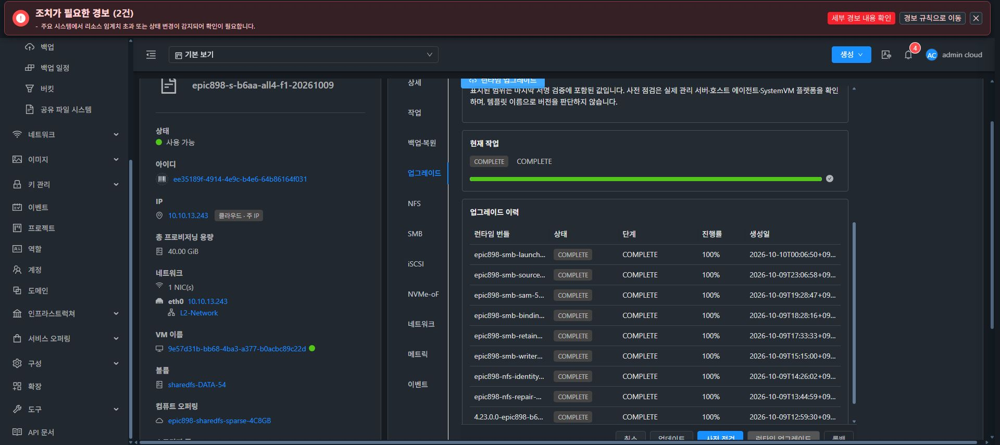

# LOCAL SMB 정지 후 수집 실패의 실제 원인과 복구 경계

> 이 문서는 최초 실패와 단계별 수정 이력이다. 아래의 cipher 없음·SMB 정지·미배포 표시는 각 단계의 당시 관측이다. 최신 실제 CODE COMPLETE와 native RESUMED, 관리 복구 미완료 상태는 [최신 검증](20261010-code29-source-recovery-actual.md)을 따른다.

13번 클러스터 F1에서 정상 UI 복구가 소유 SMB/nmbd를 정지한 뒤 암호화 체크포인트를 만들기 전에 실패했다. 실제 설치 코드의 기본 collector 어댑터가 `posix_policies` 키워드를 받지 못하는 TypeError가 최초 오류임을 확인했다. 기존 테스트에서 collector를 교체한 fixture가 이 불일치를 가렸다. 원본 DATA·신원 자료를 보존한 상태에서 기본 어댑터를 통과하는 회귀와 최소 수정으로 복구를 진행한다.

## 실제 적용 코드와 관리 서버

- native 소스 `6bc43598bc01f7ab1ed57a5fbb9196f479801782`: 정상 454 tests/49 selectors, 실패·오류·생략0. 실행기 부모/자식·systemd cgroup·역사적 서명 ENTRY 소유권과 상태 요청 stdin 전달을 수정했다.
- 정상 UI CODE 작업 `9292382a-8ad5-4dae-b025-7ee39750b27d`: COMPLETE/100, 카탈로그 `224ab0b1-3a29-4821-8762-bc26eeca7b44`, transaction `runtime-71674b05-f59f-4e85-9291-e36decddbf67`, healthSuccess/consumerCompatible=true. 실제 CLI SHA-256은 `2dc47c3a31ac5f1e7250281e52bce50e10e428d541252b099f3cb8a539548c38`이다.
- 테스트 Ed25519 키는 RAM에서만 사용했다. archive389841B/SHA-256 `741696daa9020868dd6049db3a3023a12addae37fc230beb177f3a4a9a35f878`, manifest1439B/SHA-256 `edfdcde86160bd141a30e48e5a2dbe275b56c9959759868cfa5c1d0f616db4d8`, signature64B이다. 기존 trust를 보존하고 정식 CI 키와 구분했다.
- 관리 서버는 기존 정상 b9c/882 검증 출력과 JAR SHA-256 `52cc153e3a7f509d4bcb43894977594cd2c9f8c9abc63fc4cca299702ef97136`을 유지했다. UI도 기존 정상334 출력과 index SHA-256 `4595c74ee9cacf57aa625e8906023451a76d39aec4bc9358603da3164bb7cdc1`을 유지했다.

## 실제 실패 위치

대상 공유 파일 시스템 `ee35189f-4914-4e9c-b4e6-64b86164f031`, instance `3480bb2c-99ee-42f2-91cf-715ded5dd35f`, VM `i-2-54-VM`에서 원래 작업 `fef126a6-936a-4936-b22c-201b7e5b9b4d`/revision5를 정상 UI로 복구했다. journal은 RECOVERY_REQUIRED이며, LOCAL checkpoint `5a7319c4-d43f-3f1d-a941-ec40f6c81dec`의 cipher는 아직 없다. SMB와 nmbd는 이 작업이 소유권을 확인해 정지한 상태다.

설치 코드의 정의를 RAM에 읽어 효과 없이 순서별로 관찰한 결과는 다음과 같다.

| 단계 | 실제 결과 |
| --- | --- |
| 원본 SOURCE7·scope·boot 권한 | 통과 |
| 원래 정지 DB 메타데이터와 현재 관측 비교 | 동일, 신원 DB holder0 |
| 원본 POSIX receipt 수집 | 통과, records0 |
| 기본 collector 호출 | TypeError: `SmbSourceCheckpoint.__init__.<locals>.<lambda>() got an unexpected keyword argument 'posix_policies'` |
| 이 진단에서 encrypt/export/import/resume | 호출0 |

기존 진단의 sourceSmbCanonicalPresent=false는 원하는 상태 파일의 축약 키를 잘못 사용한 관측 오류였다. 전체 SOURCE7 키를 확인한 후 실제 값 true로 정정했다. 별도 진단 스크립트의 launcher NameError도 이 최초 제품 오류와 구분한다.

## 수정 어댑터의 실제 읽기 전용 사전 검증

수정된 기본 어댑터의 정의를 실제 F1 RAM에서 읽어 원본 수집과 validator를 호출했다. SOURCE 권한·정지 메타데이터·POSIX 수집을 유지한 채 default collector의 files7/accountFiles4 및 validator가 모두 통과했다. 설치 코드는 CLI2dc 그대로이며 encrypt/export/import/resume 호출0, cipher는 여전히 없다. 전후 VM/BOOT/CLI/current/pending/DB metadata/장치/mount/NFS sentinel의 9개 필드는 동일했다. 이 unsigned 사전 검증을 최종 코드의 서명 적용·호환 증빙·정상 UI 복구 완료로 확대하지 않는다.

[최초 실패와 수정 어댑터 읽기 관측의 공개 증거](20261010-stopped-default-collector-public-proof.json).

## 보존과 다음 검증

boot `dc4b6429-35d3-4224-b199-3a0c6c829de0`, current generation4/구성 SHA-256 `dafecb8bd68c29c0abd2b6e5ff31422361bb325768a54c77de7e305f24db544a`, 원래 PREPARED 작업, 두 신원 DB 메타데이터와 두 SPARSE20GiB DATA의 장치·XFS UUID·mount를 보존했다. NFS4096바이트 sentinel SHA-256 `9ba0b0280276cad982cfa3df6e6821f2b4b8ea04761b905cc1d089cbd72c4c8a`도 유지됐다. 새 포맷·수동 서비스 시작·journal 재해시·force clear·기존 키/참조 삭제는 하지 않았다.

커밋 03485cd931ede6ab4c1792b1c4aa1f411fc4d66f에서 키워드 전달과 원 STOP 코드 호환 검증을 수정했다. 기본 어댑터→generic collector→RSA/AEAD 및 원 STOP journal→immutable 호환 증빙→cipher 생성→소유 서비스 재개→상태 조회 회귀를 확인했다. 집중43, 정상456 tests/49 selectors/101.065초, 실패·오류·생략0이며 source59/storage141 전후 바이트가 동일하다. 실제 서비스 제어는 이 회귀의 격리 제공자이며 실제 클러스터 인수와 구분한다.

원 journal CLI SHA는 2dc 그대로다. 현재와 이전 서명 ENTRY·설치 receipt를 확인하고, 지정된 두 LOCAL class의 보조 메서드3개/원형 frozen 본문/collector 역치환만으로 현재 CLI 전체 바이트가 원본과 같을 때만 허용한다. 첫 상태 조회는 쓰기0이며, 원래 키·names·nvmeHosts·domains와 실제 FD9 잠금을 검증한 export만 별도 immutable 증빙을 만든다. 다른 코드·메타데이터·키·잠금·scope/BOOT, 기존 cipher, 누락/변조한 receipt/ENTRY는 거절한다. generic collector·SID helper·CURRENT 모듈은 원래 바이트를 유지했다.

새 producer SHA07d033b7…을 기존 Java882 고정 출력으로 소비해6양성/9거절을 통과했다. 소스034의 CLI e7b721eb…으로 version epic898-smb-collector-03485c-20261010 번들을 RAM 테스트 키로 서명했다. archive395640B/f29c0c48…, manifest1441B/fbee7b7e…, sig64B의 공개5파일을 게시했고 기존 trust를 보존했다. 관리 서버/UI 산출물 재배포0이다. 게시 시점에는 실제 새 CODE·원 fef UI 복구·ACL/외부 SMB I/O가 아직 완료되지 않았다.

[고정 소스456·기존 Java882 연동·서명 공개 게시의 증거](20261010-collector-fix-source-publication-proof.json).

## 실제 034 CODE 자동 롤백과 별도 코드 검증

정상 UI 카탈로그6c2e3aa3와 CODEd9c473ad/transaction runtime-d0e2c4eb의 실제 적용은 ROLLED_BACK/100으로 끝났다. 현재 CLI2dc/6bc로 돌아왔으며 previous signed/files/entrypoint readback을 확인했다. 원래 fef 복구·ACL·외부 SMB I/O는 호출하지 않았다.

원인은 적용 후 일반 operation verify가 success=true/rc0이면서 status=degraded를 반환한 것이다. 설정된 SMB1은 원래 작업이 정지해 listener 없음·smbd failed·nmbd inactive이며, NFS listening/status ok와 QGA active·domain error=false는 유지됐다. 관리 서버는 이 전체 서비스 health의 status=ok만 허용해 자동 원복했다. BOOT/VM/CLI/current/pending/DB metadata/장치/mount/NFS sentinel의 전후9필드가 같았다.

[실제 CODE 자동 원복·일반 health 및 보존 증거](20261010-code03485-owned-stop-health-rollback-public-proof.json).

일반 health는 degraded로 유지한다. 수정 중인 runtime-only 경로는 원 DB LOCAL 복구 의도와 새로운 서명 코드가 읽기 전용으로 증명한 원 SOURCE 정지의 scope/BOOT/구성/메타데이터/cipher 부재를 함께 검증한다. 정확한 kind LOCAL_SOURCE_STOPPED_RUNTIME_QUARANTINE의 15필드를 사용하고 serviceAvailabilityVerified=false를 유지한다. 지원하지 않는 이전 코드에 새 증빙을 요구하는 사전 차단은 추가하지 않으며, 서명된 대상 활성화 후 증빙을 확인한다. 조건이 빠지거나 다른 실패가 있으면 기존 자동 롤백을 유지한다. 이 후속 수정은 아직 실제 배포되지 않았다.

공개 관측은 준비 디렉터리의 `actual-current-recovery-500/stopped-collector-6bc-readonly.json` 및 `after-fef-ui-recovery-6bc-readonly.json`, 실제 CODE DTO `6bc-code-runtime-public.json`에 있다. 비밀번호·개인키·private DB 원문/SID는 기록하지 않았다. 최종 UI 표준 정리 #1275는 미착수다.
