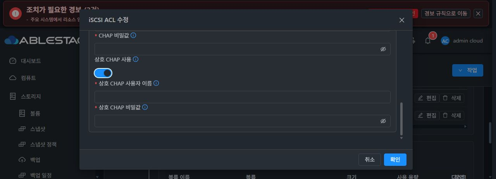
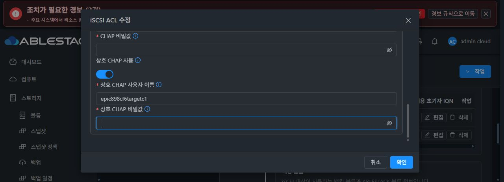
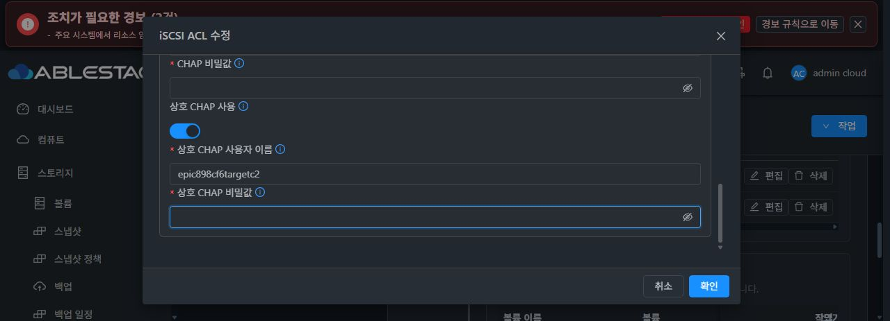

# Mutual CHAP 기능 입력 정상 UI 검증

소스 PIN `20a3c7c7e7e4144c128ccbe2ec527d2a322e223d`의 정확한 UI archive로 검증했습니다. 기존 CHAP 섹션에 mutual switch·username·password 입력 14줄을 추가한 기능 보완이며 script/API payload/기존 validation/locale/style/header/footer/buttons는 동일합니다. 최종 UI 표준 #1275는 미착수입니다.

정상 1회 결과는 **373 tests / 22 suites, 실패·오류·skip 0**, 전체 `lint --no-fix` PASS, production build 1회 PASS입니다. production은 720.967초였으며 config 생성도 PASS입니다. 기존 21개 selector와 신규 컴포넌트 spec 한 개를 중복 없이 실행했습니다. Node14.21.3/heap12GiB를 사용하고 package/package-lock SHA가 같은 기존 cache를 재사용했습니다.

후보와 canonical UI 965 tracked 경로의 path-NUL-bytes-NUL SHA는 모든 단계 후 `28e93c97ae276405a336753af14545ff99327cb05fdc7417518839d3b6dbcf8f`로 동일합니다. archive SHA `8c15e796e049bd5f5b492043c0fec35feccd7cf6944fc7efb559e5e6c2932e2e`입니다. build 산출물 850개를 별도 `immutable-dist`에 복사하여 manifest 전체 SHA와 동일함을 확인했습니다.

- Vue SHA: `9729f7d57a8c086b50fdccf36019e6e34f56da870e564013af316a3ddaa7f7c1`.
- 새 spec SHA: `0cf8174e9973fe1d9c8ee8ef9d95ed878d899748af7429904e51676b4d5d552a`.
- index SHA: `3dc40c928b5f1a3d52f721c97fa33567348702e1f2a92fdec1c3e46384a9fddd`.
- candidate 기본 config SHA: `44d080ee12cd291185d65c81a605e71e455dada1a295b46d51e7de86c877b860`. 실제 운영 config `d3e28531…` symlink와 구분하며 배포에서 제외합니다.

기존 운영 dc145/indexe755 산출물과 비교한 제한 payload는 **6파일**입니다. CSS는 scope ID만 정규화하면 기존 내용과 동일합니다. 기존 config symlink, WEB-INF, color.less, old hashed assets와 실제 runtime 공개 2개 디렉터리/10파일은 삭제하거나 덮지 않습니다. 기존 UI helper를 재사용한 offline bundle 검증 PASS이며 root0700 backup, index-last atomic replacement, 실패 시 원 index/동일 경로 파일 원복을 유지합니다. 기준 MGT JAR `93540870…`/PID1400221, libs9/trust52 보존을 helper에 고정했습니다.

이 준비 작업의 업로드·배포·API·guest 호출은 0입니다. 실제 UI 배포는 Root가 Native writer/session idle을 확인한 뒤 단독 actor에게 부여한 GO 범위입니다. C2 실제 READ_ONLY write가 성공한 별도 per-LUN 권한 결함은 Backend의 후속 수정 대상으로 남으며 이번 UI 정상 PASS를 iSCSI 권한·all4 인수 완료로 승격하지 않습니다.

주요 증거:

- `/root/work/epic898-preparation/ui-mutual-chap-20a3c7c7/normal-proof.json` SHA `75fa8d14fef1f0ac174347d7ad12fca57601f2d0048d3b67856902c66aa7bf62`.
- `/root/work/epic898-preparation/ui-mutual-chap-20a3c7c7/normal-test-results.json` / normal-tests/lint/production/config 로그.
- `/root/work/epic898-preparation/ui-mutual-chap-20a3c7c7/full-ui-source-manifest.json`.
- `/root/work/epic898-preparation/ui-mutual-chap-20a3c7c7/immutable-output-manifest.json` SHA `106fd45a0ac36f3c099470cff69053042e7d6143874a21a709938413a2e87a81`.
- `/root/work/epic898-preparation/ui-mutual-chap-20a3c7c7/narrow-static-deploy-review.json` SHA `f37546d6bbd3460b58c1e8d2a0a3130d2c0b0488305ab4f1fd17db15f918e6bb`.
- `/root/work/epic898-preparation/ui-mutual-chap-20a3c7c7/review-ui-mutual-chap-20a3c7c7.tar.gz` SHA `fd4fa1eb79c7a5ab9c2415c968d77627e912eb464f093ef586ea37d9def306eb`.
- `/root/work/epic898-preparation/ui-mutual-chap-20a3c7c7/deployment-preparation/deploy-ui-mutual-chap.py` SHA `64a4e10710950ae949749128cc2ac94ddf940541c8dc4253538463a9718aaf89`.
- `/root/work/epic898-preparation/ui-mutual-chap-20a3c7c7/deployment-preparation/deployment-preparation-proof.json` SHA `b58383937559702691065ab5043976675a14a71a9e028bf72e390f9e87731ce9`.

[정상 검증 proof](mutual-chap-ui-normal/normal-proof.json), [제한 자산 검토](mutual-chap-ui-normal/narrow-static-deploy-review.json), [배포 준비 proof](mutual-chap-ui-normal/deployment-preparation-proof.json).

## 실제 UI 모듈 배포

필요한 자산 6개를 한 번 반영했고 각 HTTP 응답 200, 크기 및 SHA-256 일치를 확인했다. 새 index SHA-256은 3dc40c928b5f1a3d52f721c97fa33567348702e1f2a92fdec1c3e46384a9fddd이며 백업은 /root/epic898-ui-mutual-chap-20a3c7c7-backup-20261010-145411-955ac3이다.

Index를 마지막에 atomic 교체했고 config d3e의 symlink, WEB-INF, color.less, 기존 해시 자산, 런타임 공개 파일 및 다른 모든 웹 파일을 보존했다. 관리 JAR 935408/PID 1400221, 라이브러리 9개, 공개 신뢰 키 52개는 동일하며 재시작은 수행하지 않았다. 실제 브라우저 입력·검증 결과는 후속이다. 이 정적 배포 완료는 실제 상호 CHAP 인증 완료를 의미하지 않는다.

[실제 선택 6개 자산 배포 proof](mutual-chap-ui-normal/actual-ui-mutual-six-apply-public-proof.json) SHA-256 a33ec55e89ce99b268632e410f90b2011ffee9d7652780708d586487ca17dcc9.

## 실제 브라우저 확인

새 UI에서 기존 C2 ACL의 READ_ONLY, CHAP 활성화 및 사용자 이름이 유지되고 비밀 필드는 비어 있음을 확인했다. 상호 CHAP 스위치를 켜면 사용자 이름과 비밀 입력이 실제 표시됐다. 새 비밀 입력 없이 확인하면 기본 CHAP 자격 누락 메시지로 차단됐고 ACL 변경 API 호출은 0이었다. 기본 검증이 먼저 동작했으므로 실제 상호 CHAP 전용 오류를 검증한 것으로 확대하지 않는다. 폼을 취소했으며 실제 상호 CHAP 인증과 추가 클라이언트 쓰기는 수행하지 않았다.

[브라우저 표시 및 제출 차단 proof](mutual-chap-ui-normal/actual-mutual-ui-controls-public-proof.json).

## 실제 상호 CHAP 설정 후 UI 조회

정상 API로 같은 C1/C2 ACL의 상호 CHAP을 설정한 뒤 두 UI 행의 사용 상태와 기존 대화상자의 상호 CHAP 체크, 사용자 이름 유지 및 두 비밀 필드 공란을 확인했다. 새 GUI 비밀 입력은 없었다. 이 API 설정과 UI 조회를 구분한다. 상호 CHAP 전용 누락 경고는 실제 UI에서 입증하지 않았으며 기존 기본 CHAP 누락 경고와 API0 결과를 그 검증으로 확대하지 않는다.

[실제 UI 조회 proof](mutual-chap-ui-normal/actual-mutual-chap-ui-readback-public-proof.json) SHA-256 9fcfb13a0866a813c43b2a10d1697a44f05cb6f28cf88821c12a44921e71a9fd.
