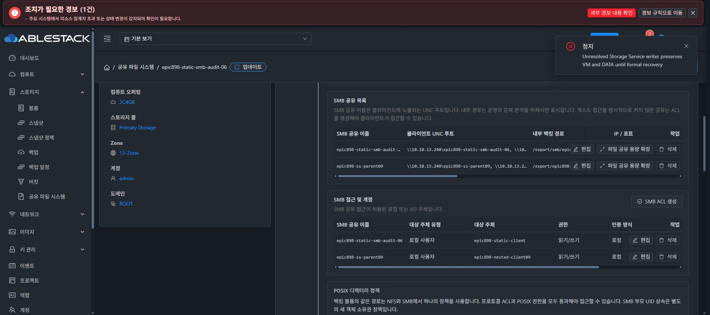

# 동일 DATA 파일 시스템 사용량 중복 합산 수정

NFS/SMB 공유를 추가하면서 같은20GiB DATA의 사용량이 약174→349→699MiB로 늘어나는 현상을 실제 UI에서 확인했다. 원인은 KVM의 QGA guest-get-fsinfo가 bind mount마다 같은 serial/device 파일시스템을 반복 반환할 때 사용량을 모두 합산하는 코드였다.

실제 VM50자료에서sdb동일파일시스템3개 mount행은 used183300096bytes/total21407727616으로 동일했다. ROOT는 같은serial이라도 sda1/sda6별도파일시스템이라 합산해야 한다. b4021615733은 FS name/type 및 canonical disk주소별 동일FS를 max로 중복제거하고 서로다른FS를 합산한다. invalid/fraction/negative/overflow/중복disk/shuffledJSON도 bounded하게 처리한다.

- 전체module508개/86개클래스실행,실패·오류·생략0. 실제sanitizedQGAfixture를포함한신규8개검증.
- Java9841개NULsourceSHAe4ba587ed54a8f7fa7f3c52db47a3f5c60bd3273ae90791f6f96ea5c42b59d10.
- LibvirtComputingResource8개classfamily만수정. 기존fb2public/protected456개interface유지/제거0을확인했다. 이비교가외부deployedJAR호환검증을대신하지않아실제연결·통계도확인했다.
- 호스트13.1/13.2/13.3각기존전체JAR해시를확인한뒤필요8개class만백업·순차overlay했다. 다른JARentry바이트보존,전체JAR교체0/관리서버재시작0/게스트서비스변경0.
- 새agentPID13.1=2356184,13.2=1995685,13.3=3253614. 실제Cloud3호스트Up/Enabled및새QGA건강응답·agent연결을확인했다.
- 정상통계수집후actuallistVolumes.usedfsbytes183324672가관측됐고GUI20GiB/174.8MiB/EXACT로표시된다. 테스트쓰기차이를제외한동일FS값과일치하며중복집계가없다.

새디스크·포맷은없다. 원래DATA50은기존THIN이며보존·MOUNT_EXISTING검증범위이다. 신규ROOT/DATA는SPARSE/FAT만사용한다. 이수정과source/actualsubset을#905다른전체capacity/권한/다중프로토콜회귀완료로과장하지않으며최종UI표준화도미착수이다.
