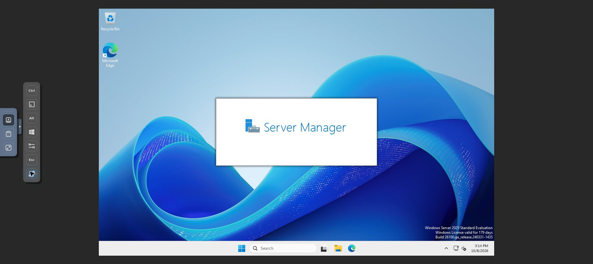
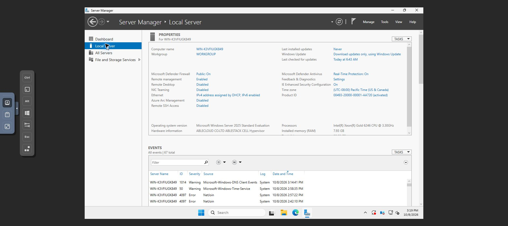
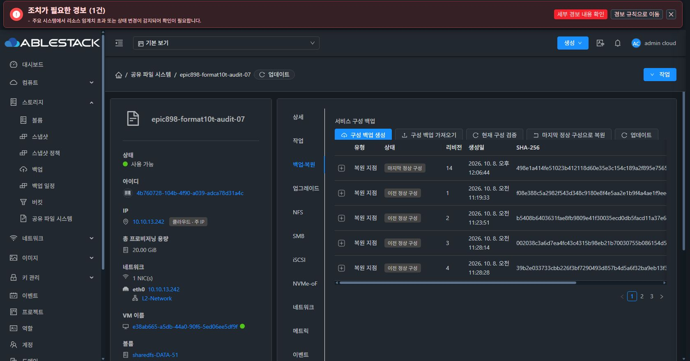
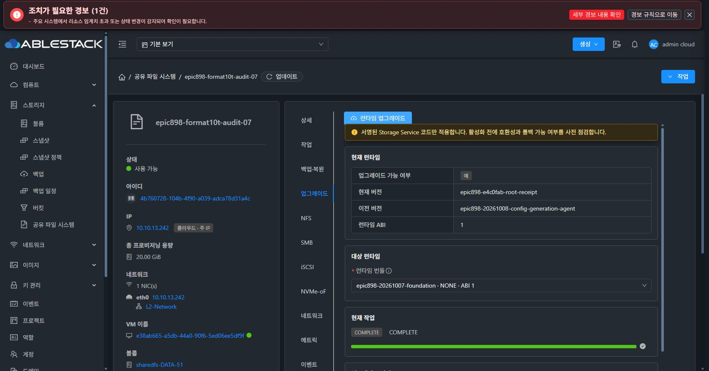
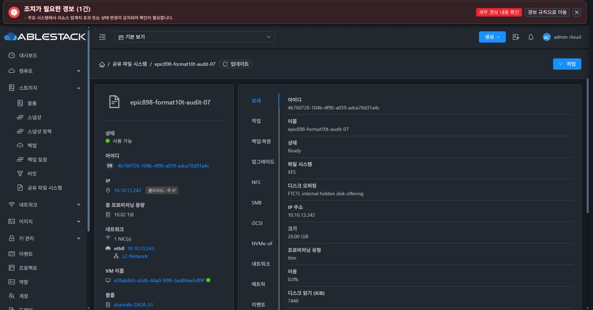

# 2026-10-08 기능 UI 및 콘솔 검증

최종 UI 표준화 #1275는 착수하지 않았다. 기능 탭 분리와 실제 UI 검증만 진행했다.

- Chrome/noVNC의 SMB-Client 로컬 Administrator 로그인 후 실제 Windows 데스크톱을 확인했다. 문자열 입력의 CapsLock 변경을 관측해 실제 키 입력으로 보정했다. 제공 암호의 로컬 LogonUserW 검증도1회 성공했다. 암호 변경은 하지 않았다.
- Server Manager Local Server 화면에서 WORKGROUP/호스트 명과 Pacific 시간대를 읽었다. 중복 SID·MachineGuid 및 DC6167은 QGA 이벤트와 대조했다. Sysprep은 사용자 승인 대기이며 아직 실행하지 않았다.
- 백업·복원 별도 탭에서 실제 복원 지점 목록, 업그레이드 별도 탭에서 현재 runtime 버전과2개 이력 조회 완료를 확인했다. 당시 UI938/source backend223이었다.
- 백엔드 b38 module44entry 배포 뒤 VM51 총 프로비저닝 용량은10.02TiB다. 기본20GiB(기존THIN 보존)+새SPARSE10TiB partial DATA를 모두 포함한다. API/DB/libvirt attachment는 그대로다.
- SPARSE10TiB 포맷은 실패/RECOVERY_REQUIRED 상태로 보존한다. 이 이미지의 용량 수치는 포맷 완료나 파일 시스템 건전성 증거가 아니다.

이미지 무결성:
[
  {
    "file": "smb-client-local-console-login.png",
    "sha256": "4436524c0763fa349abc2a377721c75d0513f73cba3706af335b1a9d2b385bb7"
  },
  {
    "file": "smb-client-workgroup-local-server.png",
    "sha256": "fe365543dbe4e471f3bd5c32e776b839d27d15942f4fe5525d3e484e14ec2cd6"
  },
  {
    "file": "sharedfs-backup-separated-tab.png",
    "sha256": "b0ea6cba5ba003d034aa94af7ad1189f45ea86f7a76c4bf86fa5ed472b08a615"
  },
  {
    "file": "sharedfs-upgrade-separated-tab.png",
    "sha256": "14827b79021a71e2ba07044c19ce3ea1043ab4f3111f6e776216885c6a5e0ce4"
  },
  {
    "file": "sharedfs-attached-partial-capacity-10t.png",
    "sha256": "041fa1bb64277eb0fead9f6dce41bec7a70ed809c6d4109d0fb0ecdc9ef4c8b5"
  }
]
