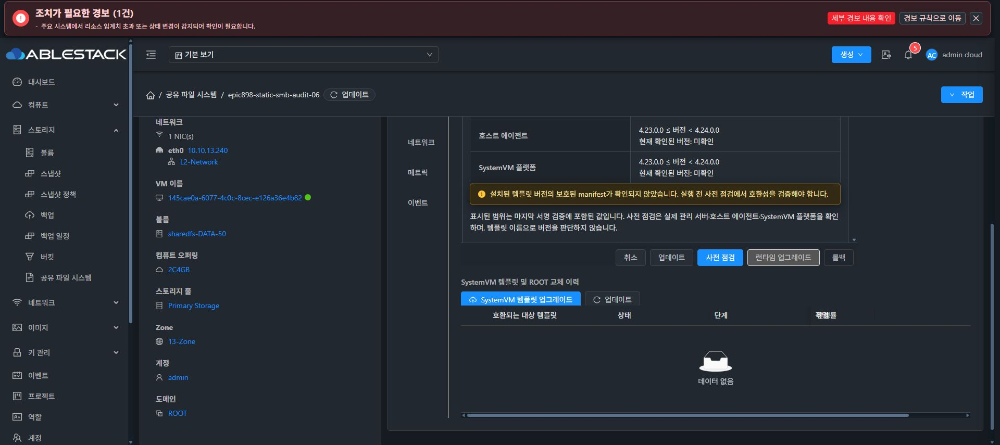
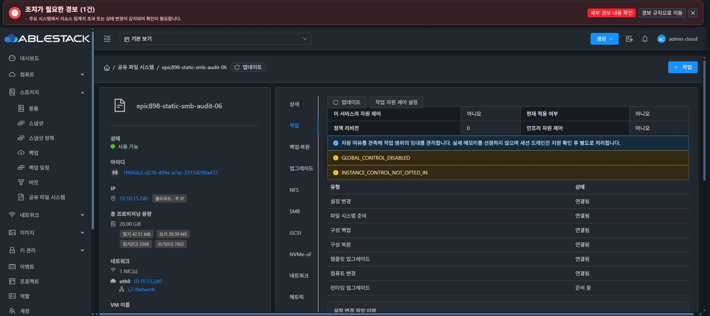
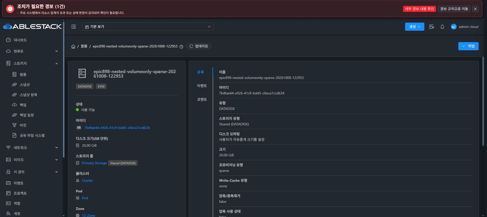

# 모듈379 배포와 SPARSE20 볼륨 UI 검증

379d9ce7963f3c32cf5feddfed476f455cddd3f4의 server/KVM/storagevm 모듈은 정상Checkstyle/93classes566tests와 기존b38Runtime 조합19classes156tests/Runtimeinterface15+StorageServicegetter1 ABI 검증을 통과했다. native support flag-only38a4 안정합성런타임CLI99c1cbdd...는 실제UI upgrade COMPLETE 및readonlyPOSIX support stricttrue, GEN38/fe812.../bootc53/SID/DATA/NFS·SMB PIDs/보호receiptmtime 보존을 확인했다. 전체 rendered/AD 소스 또는 Ganesha 새패키지 설치로 주장하지 않는다.

관리 서버에161entry만반영하고 기존strictRuntimeImpl2개를정확히보존했다. 새로운outer/inner3개전부제외하여orphanhelper0을검증했다. actualJAR3ee6827604bc48409157588d0051e3fa5c8a5cac2832817ef34bb1c922fb9e39/PID1157754/backup213642. 세호스트는각각cloud-api1+KVMcommandwrapper1개만기존JAR에반영해b402사용량dedupe를포함한나머지entry를보존했다. 세호스트UpEnabled 및일곱Running인스턴스의새healthtransport/nativeok를검증했다. 이조회성공을partialXFS/clientIOfull인수로확대하지않는다.

실제API/작업UI는설정·포맷·백업·복원·ROOT·scale6개연결,oldRuntime1개준비중으로표시한다. global/per-instancefalse/revision0/activefalse를유지해enable/lease/drain0이다. NFSVFSACL은기존guestunsupportedfalse이며fresh패키지실증전true로표시하지않는다.

새20GiB volume7b4fae44-e926-41c9-bdd5-c0eca7ccd634는SPARSE/virtual21474836480/actual3743744B,backingnone/QCOW2v3/L1·L2metadata40table/inode1313342를세호스트의동일GFS파일에서확인했다. literalqemu-imgpreallocationargv는INFO로그에없어그항목을성공으로계수하지않는다. API·DBprovisioning과실제metadata구조는확정했다. 기존DATA/partial021b포맷0.

이fixture는hiddenbacking조회제약을살펴보려고처음displayfalse를명시했다. 일반미연결DATA에서정상UI선택을위해displaytrue로변경한뒤volumes.path가NULL로지워지는#1333P1을실제재현했다. sourceVolumeApiServiceImpl가path생략else에서도setPath(null)를호출했다. 물리inode/size/metadata는그대로였다. 검증된원래UUIDpath를정상updateVolumejobe548...로복구했고DB/byte/owner/pool/Ready/SPARSE/미연결이일치했다. 원래ManagedHiddenDATA의표시나경로는변경하지않았다.

#1333은Epic898에연결했고sourcefix+의미있는metadata보존회귀의격리모듈빌드를진행한다. 수정배포전새20의추가연결/포맷/삭제는0으로유지한다. 최종UI#1275는시작하지않았으며전체기능후착수직전중단·보고·추가지시대기한다.
