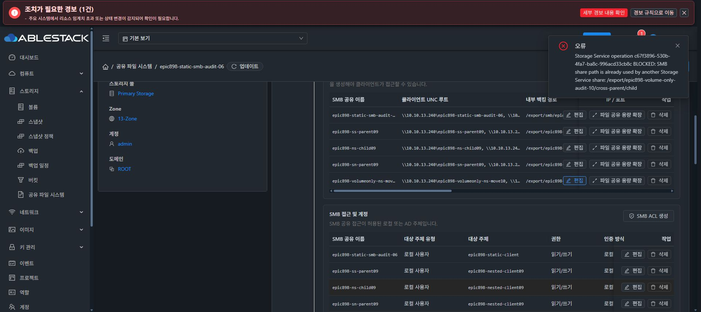

# 볼륨별 SMB 경로 검증 UI 회귀

13번 관리 namespace1dad / 기존 기능 UI373a 조합에서 SMB 탭을 확인했다.
이전 다른 볼륨의 같은 상대 경로 때문에 생성 전 거절되던 새 공유
epic898-volumeonly-ns-move10 / 7ec0c41b-afa9-48ed-ba5c-fcb55ba29661과
기존 LOCAL_USER epic898-nested-client09의 ACL이 모두 Ready로 표시됐다.

정상 편집 대화상자에서 현재 백킹 볼륨을 새 SPARSE20GiB
7b4fae44-e926-41c9-bdd5-c0eca7ccd634로 선택했다.
상대 경로 cross-parent/child는 유지되고 실제 계산 경로의 volume UUID만 7b4로 바뀌었다.
NFS와 같은 경로 공유 switch는 OFF로 유지했다.
대상에는 이미 NFS parent/child가 있어 이 수정은 거절되어야 한다.

확인을 한 번 제출한 결과 operation c67f3896-530b-4fa7-ba8c-996acd33cb8c가
BLOCKED이고 같은 경로가 사용 중이라는 오류가 실제 UI에 표시됐다.
대화상자는 종료됐다. 이는 별도 API volume-id-only 요청과 구분하는 실제 UI 동작이다.
UI는 정상 폼의 다른 기존 설정도 제출하므로 exact id+volumeid-only 증거로 확대하지 않는다.

API negative job4bc878b4의 source/target/GEN42/파일 보존 비교10개는 통과했다.
UI 요청도 정상 Async job7f49383d-2564-466c-9a80-bb3c58795f80 / actor2 /
2026-10-08 14:51:21 UTC에 연결했다. code530, operation c67f3896 BLOCKED이다.
일반 UI 파라미터는 name·relativepath 유지, path NULL, crossprotocol false,
importmode FORMAT_IF_EMPTY였다. 실제 prepare 전 차단돼 포맷은 0이다.
source 전체 config·볼륨/FS/경로, target NFS config, source leaf·ACL,
target inode/hash, canonical7·GEN42/4bcac862, sentinel·SID·boot·SMB PID와
receipt mtime 보존 비교10개가 모두 통과했다.
scratch 근거는 910-volume-only-ui-negative-proof.json이다.
최종 UI 표준화 #1275는 시작하지 않았으며 이 과정에서 레이아웃 코드는 수정하지 않았다.

