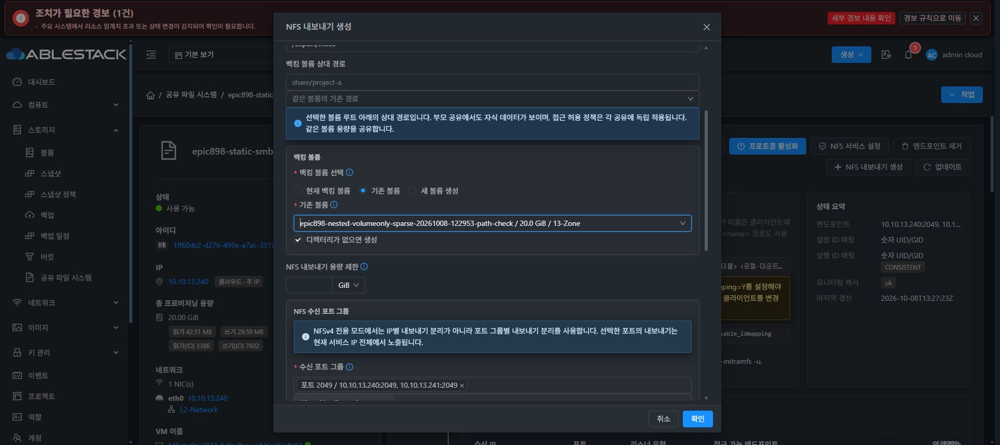
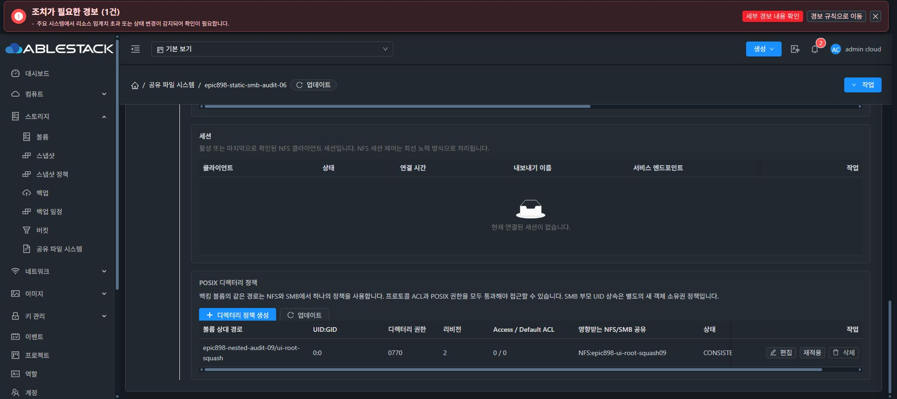

# 새 SPARSE DATA 준비 및 NFS 중첩 UI 검증

기존 경로 보존 P1 #1333의 UI·API 회귀가 통과한 후 새 볼륨7b4fae44-e926-41c9-bdd5-c0eca7ccd634만 준비했다. 고유 두20GiB DATA를 함께 표시하되 기존a0bbe 볼륨과 부분10TiB021b는 포맷하지 않았다. 새볼륨은 SPARSE/QCOW2 metadata preallocation과 정확한 물리파일·owner·pool·UUID를 먼저 검증했다.

기존 볼륨 선택 UI에서 새20G를 확인했다. 이 선택은 MOUNT_EXISTING만 수행하므로 빈 디스크 포맷을 몰래 허용하지 않았다. 일반attachVolume도 SharedFS roleguard에 의해 effect 전에431을 반환했다. 정규createStorageNfsExport 내부 pipeline이 새UUID의 attach·serial/size/ROOTancestor 제외·blank 확인 후 FORMAT_IF_EMPTY를 수행했다.

정상job72a6df16.../export6b6dd32b-df24-40d7-aea7-9a636199991d에서 새XFS5b11b028-0234-428d-99ef-0edd336ad955,/dev/sdc,serial7b4fae44e92641c9bdd5,size21474836480B,EXACT를 확인했다. mkfs.xfs PID89199는-f -K/SKIP_DISCARD로0.3197초 후exit0, 성공·포맷receipt94f3306d 및COMPLETE를 보존했다. Root/sda6+sda ancestor에서sdc가 제외됐고 원래a0bbe/FSa433/sentinel inode16777345·1001:1001·0660·SHAfe084 및bootc53가 유지됐다.

실제 UI에서 같은 새볼륨의 하위 NFS를 생성했다. 이름epic898-volumeonly-nn-child10, 상대epic898-volume-only-audit-10/cross-parent/child, CURRENT exact7b4,1002:1002/0770,Root+AllSquash/RW/2049/recursiveOFF를 선택했다. child UUIDca41e478-ab1c-4339-a05e-574aa4d3d0dc Ready를 UI와API에서 확인했다. runtime normalized mode는MOUNT_EXISTING/formatInvokedfalse였으며 기존formatter/receipt 그대로, 재포맷0이다. 부모·자식의 동일FS와 신규SPARSE매핑, 고유용량합계40GiB를확인했다.

외부Linux client에서 child로파일을작성·fsync한뒤 parent/child 두mount로같은내용을읽었다. inode133/UID:GID1002:1002/mode0640/SHA d8108a34...가일치했다. parent inode33685632/child132는같은dev2080/FS5b11의권한·identity를유지했다. Client idmapping flagY는변경하지않았고 두mount는정상정리했다. protected journal root0600/COMPLETE/PID89199/formatreceipt가동일하며원본sentinel도보존했다.

이번20G검증은 정확한10TiB SPARSE 성공시험을대체하지않는다. 다음volume-only 이동·overlap negative/child삭제보존 및full4/ROOT/AD가남아있다. 최종UI#1275는착수하지않고기능완료뒤시작직전중단·보고·추가지시대기한다.
