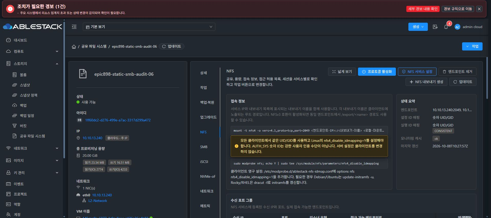

# NFS 중첩 데이터 보존, RO 및 숫자 ID 실제 검증

기존 DATA50/XFS를 포맷하지 않고 새 테스트 prefix만 사용했다. 최종 UI 표준화는 수행하지 않았다.

- RootSquash 새 leaf의 실제 root클라이언트 쓰기→65534:65534, 명시 singleleaf POSIX preview/apply 후 NoRootSquash 새 파일→0:0을 확인했다. 기존 child와 원래 sentinel의 inode·소유권·mode·SHA는 보존했다.
- 동일 export를 UI RO 옵션만 전환한35c66f61/generation22 후, client RO 옵션을 지정하지 않은 정상RW mount에서 기존 파일 읽기는 성공하고 새 파일 생성은 서버 EROFS(errno30)로 거절됐다. 생성 대상 파일은 존재하지 않으며 정상 umount했다.
- 중첩 NN parenta4415adf/child63ecccd8는 같은 DATA의 nn/nn-child 상대 경로에서 생성했고 crossRW/file hash 및 실제 서버anonUID1001을 확인했다. name-domain 클라이언트 표시65534는 별도로 기록했다.
- 실제 UI에서 자식 이름을 명시해 child export설정만 삭제한834eff6c/generation23 이후 parent export와 physicalparentinode133/child33685634/file33685636의 내용·1001:1001·mode를 보존했다. 부모 mount에서 child파일 읽기가 성공하고 제거된 child pseudo의 직접 mount는 ENOENT로 거절됐다. 데이터 디렉터리 삭제·포맷은 없다.

NFS 서비스 설정 UI에서 NAME_DOMAIN→NUMERIC을 선택했다. owner/squash와 별도 서비스 정책이며 클라이언트 설정은 자동 변경하지 않는다는 안내를 확인했다. operationc6454d7b/generation24는 COMPLETE, 실제 UI에 설정·실행 NUMERIC/CONSISTENT가 표시됐다.

실제 Ganesha Allow_Numeric_Owners/Only_Numeric_Owners true를 확인한 후 같은 NN parent를 fresh NFSv4 mount했다. 기존 fileinode33685636가 클라이언트에서1001:1001로 표시됐고 새 numericfileinode134의 쓰기/fsync/읽기 및1001:1001을 검증했다. 서버의 기존 소유권·mode·hash 및 원래 sentinel은 보존됐다. host13.1의 nfs4_disable_idmapping은 이미Y라 변경0이며 기존·후속 값과 inode 동일, 정상umount/ownmount0을 확인했다.

이 기록은 실제 API/UI/클라이언트의 일부 조합이다. 전체 NN/SS/NS/SN/cross-volume·symlink/bindmount 경계·독립 ACL·일반 오류 원자복구·다중 부팅/포트 조건은 계속 검증 중이다. #894/#906/#910을 아직 완료 처리하지 않는다.
