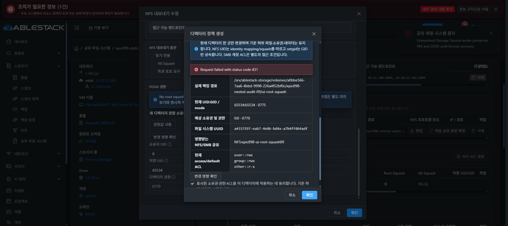

# NFS 정책과 공통 POSIX 미리보기 UI 검증

actual MGTd3f9/functional UIcfecc/native4a3b에서 기존 DATAa0bbe566/XFSa4337197을 재사용했다. 신규 디스크나 포맷은 없고 별도 테스트 상대 경로 epic898-nested-audit-09/ui-root-squash만 생성했다. 원래 SMB 공유·sentinel·DATA root 소유권은 변경하지 않는다.

Chrome에서 name epic898-ui-root-squash09, 현재 볼륨, 새 leaf 생성, rootSquash=true/allSquash=false, 익명 및 owner65534:65534/mode0775/noRecursive/기존2049 listener를 지정했다. 실제 operation0b644a05가 COMPLETE/generation17로 완료되었고 NFS 목록과 기본 ACL에 같은 정책 및 Ready가 표시됐다.

편집 UI에서 root squash를 끄는 draft 변경을 하자 새 디렉터리 권장0:0/mode0770이 표시됐다. 기존 디렉터리는 별도 미리보기·명시 적용이 필요하다는 안내를 확인했다. 변경 영향 확인을 통해 공통 디렉터리 정책을 열고 explicit owner 변경 옵션을 지정해 미리보기만 실행했다.

실제 preview는 protected DATA FSUUID와 새 leaf의 물리 경로, 현재65534:65534/0775, 제안0:0/0770, 영향 NFS 공유1개, 현재 ACL을 표시했다. 명시 확인 체크 전 적용 버튼이 비활성이며 기존 하위 파일 보존·단일 디렉터리만 변경한다는 조건을 확인했다. 아직 실제 POSIX 적용 및 NFS noRootSquash 업데이트는 실행하지 않았다.

현재 단계는 UI 생성 및 API/native mapping·권한 preview 증빙이다. 실제 NFS mount/root RW와 정책 전환·RO·allSquash 및 공유 정책 rollback 검증은 진행 중이며 전체 기능 완료로 판단하지 않는다. 내부 path는 클라이언트 NFSv4 pseudo 이름과 구분한다. 최종 UI 표준화 #1275는 미착수이다.

## 실제 NFS 읽기·쓰기와 적용 API 입력 오류

실제 Ganesha pseudo /epic898-ui-root-squash09로 host13.1 root NFSv4 mount 후 새 파일ui-root-client-rw.txt 쓰기/fsync/읽기가 통과했다. leaf inode33685632/65534:65534/0775, 새 파일inode33685633/65534:65534/0640/SHA3f7d12를 확인했다. 정상 umount 후 마운트 디렉터리도 정리했다. 내부 논리 상대 path를 NFSv4 pseudo로 오인한 초기 mount 오류는 시험 주소 오류로 별도 남겼다.

실제 POSIX 미리보기 토큰과 확인 체크를 사용한 적용2회는 API 입력 파서가 previewToken 기본255자 제한으로 handler 전에 HTTP431을 반환했다. 새 미리보기에서도 같은 제한이 발생하므로 token stale 문제로 추측하지 않고 정확한 입력 계약 누락으로 수정한다. 기존 검증 라이브러리의 bounded token 상한과 API필드만 정렬하는 검증이 진행 중이다.

apply 이후 읽기 검사에서 leaf/newfile/원래 sentinel의 inode·UID/GID·mode·SHA가 모두 그대로다. actual policy 적용 및 NFS noRootSquash 업데이트는 아직 없다. source2403741e5b5의 UI오류는 승인 토큰을 출력하지 않고 API errortext만 표시하도록 개선됐으며 8개 테스트/lint가 통과했다. 새 생산 빌드는 진행 중이고 actual 재검증은 API수정 배포 후 수행한다.
