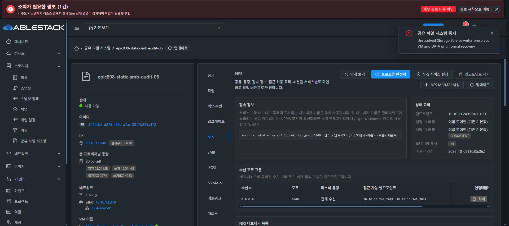
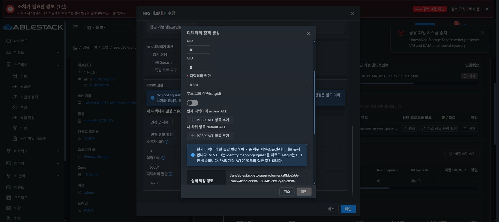

# NFS 정책과 공통 POSIX 미리보기 UI 검증

actual MGTd3f9/functional UIcfecc/native4a3b에서 기존 DATAa0bbe566/XFSa4337197을 재사용했다. 신규 디스크나 포맷은 없고 별도 테스트 상대 경로 epic898-nested-audit-09/ui-root-squash만 생성했다. 원래 SMB 공유·sentinel·DATA root 소유권은 변경하지 않는다.

Chrome에서 name epic898-ui-root-squash09, 현재 볼륨, 새 leaf 생성, rootSquash=true/allSquash=false, 익명 및 owner65534:65534/mode0775/noRecursive/기존2049 listener를 지정했다. 실제 operation0b644a05가 COMPLETE/generation17로 완료되었고 NFS 목록과 기본 ACL에 같은 정책 및 Ready가 표시됐다.

편집 UI에서 root squash를 끄는 draft 변경을 하자 새 디렉터리 권장0:0/mode0770이 표시됐다. 기존 디렉터리는 별도 미리보기·명시 적용이 필요하다는 안내를 확인했다. 변경 영향 확인을 통해 공통 디렉터리 정책을 열고 explicit owner 변경 옵션을 지정해 미리보기만 실행했다.

실제 preview는 protected DATA FSUUID와 새 leaf의 물리 경로, 현재65534:65534/0775, 제안0:0/0770, 영향 NFS 공유1개, 현재 ACL을 표시했다. 명시 확인 체크 전 적용 버튼이 비활성이며 기존 하위 파일 보존·단일 디렉터리만 변경한다는 조건을 확인했다. 아직 실제 POSIX 적용 및 NFS noRootSquash 업데이트는 실행하지 않았다.

현재 단계는 UI 생성 및 API/native mapping·권한 preview 증빙이다. 실제 NFS mount/root RW와 정책 전환·RO·allSquash 및 공유 정책 rollback 검증은 진행 중이며 전체 기능 완료로 판단하지 않는다. 내부 path는 클라이언트 NFSv4 pseudo 이름과 구분한다. 최종 UI 표준화 #1275는 미착수이다.
