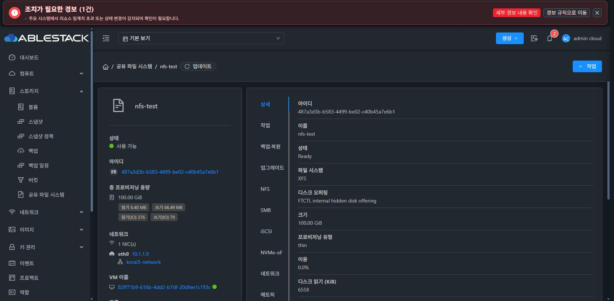

# 원본 SharedFS 상세 직접 진입 재검증

13번 클러스터의 사용자가 보고한 nfs-test 상세 URL
/sharedfs/487a3d3b-b583-4499-be02-c40b45a7e6b1?tab=details 에
Chrome의 새 탭으로 직접 진입했다. 같은 브라우저의 기존 로그인 세션을 사용했다.

초기 관찰에는 Storage Service 개요 조회 spinner가 보였고, 다음 완료 관찰에서는
spinner가 사라지고 상세 selected, Ready/XFS/100.00 GiB, 개요의 활성 NFS가 표시되었다.
상세 탭에는 정보가 표시되며 작업·백업/복원·업그레이드 등 기능 탭이 분리되어 있다.
원본 VM/NIC/기존 DATA에는 변경하지 않았다. 표시된 기존 thin 볼륨은 이 검증에서
생성하거나 포맷한 볼륨이 아니다.

이 관찰은 현재 배포된 기능 UI373a와 관리379 + Volume1333 조합의 직접 진입 증거다.
후속 namespace1dad 빌드는 아직 진행 중이며 그 배포 완료 증거가 아니다.
지연/실패 주입이나 사용자 다른 브라우저의 과거 세션을 재검증한 것으로 확대하지 않는다.
최종 UI 표준화 #1275는 시작하지 않았다.

