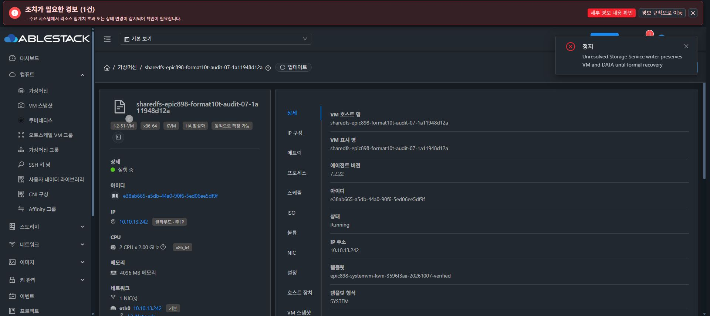

# 부분 SPARSE 포맷의 SharedFS 중지 차단

d3f9bcdef9e 실제 관리 서버 배포 후 partial SPARSE10TiB VM51의 연결 정보를 먼저 조회했다. SharedFS4b760728, VMe38ab665, instance0b5a950b, DATA021b0cac 및 미완료 포맷 operation1c1a61a3의 동일 연결과 RECOVERY_REQUIRED 상태를 확인했다.

SharedFSServiceImpl.stopSharedFS의 requireNoUnresolvedWriter가 VM stateTransit/provider stop/guest probe보다 앞에 있고 실제 이 작업 행을 거절하는 것을 소스에서 확인한 후 해당 SharedFS UI의 중지 메뉴만 실행했다. 일반 VM 중지 API는 이 선행 보호가 없을 수 있어 실행하지 않았다.

실제 Chrome에서 강제 옵션을 켜지 않은 SharedFS 중지 요청이 오류로 거절됐고 “Unresolved Storage Service writer preserves VM and DATA until formal recovery”가 표시됐다. 새 API에서 VM Running을 다시 확인했다. 재포맷·mount·분리·삭제·재부팅 또는 수동 journal/DB 복구는 수행하지 않았다.

이 증거는 SharedFS 중지 진입점의 선행 보호에 대한 실제 API/UI 검증이다. 일반 VM stop/destroy/expunge 등 별도 진입점의 보호 및 Stopped 부분 포맷 보호를 모두 통과했다는 뜻은 아니다. 발견된 직접 VM API 우회는 후속 소스 보완 및 검증 대상으로 유지한다. partial021b 데이터와 원래 초기20GiB를 보존하고 최종 UI 표준화는 착수하지 않는다.

## 일반 VM 정지 API 우회 보호의 실제 검증

fb2ecb0faab는 SharedFS 역할 VM의 일반 stop/reboot/destroy/expunge/restore/migrate에 권한 후 안전 gate를 연결하고 일반 VM은 기존 경로를 유지한다. 500개 모듈 및 exact기존 runtime조합115개 검증과 lazy Provider startup 테스트를 통과했다. 관리 서버142개 항목 배포 후 새PID1142754/JAR7d2d1aa7d04db6aabaa32fd7dcabc6c148ed80aa722522eb5fc2683a8c7da5a8에서10:38:37UTC 새로운admin API/7Running/3UpEnabled를 확인했다.

부분 DATA51의 기존1c1a61a3 RECOVERY_REQUIRED를 새 API로 먼저 확인했다. actual genericUserVm stop의 선행 gate가 state/power 효과 전에 거절하는 것을 소스·회귀로 확인한 뒤 Chrome 일반 VM 화면의 정지 메뉴를 강제 옵션 없이1회 실행했다. 실제 UI가 Unresolved Storage Service writer preserves VM and DATA until formal recovery 오류를 반환하고 새로운 listVirtualMachines는 Running을 유지한다. 수동 powerstop이나 writer복구 우회는 없다.

이번 실제 검증은 일반 VM STOP 진입점의 보호이다. 파괴적 destroy/expunge를 실제 데이터에 시도하지 않으며 다른 lifecycle의 전체 API/권한/동시작업 회귀는 남는다. 원래 partial 상태와 attachment/헤더/쓰기counter/bootID의 추가 보존 관측을 구분해 기록한다.
