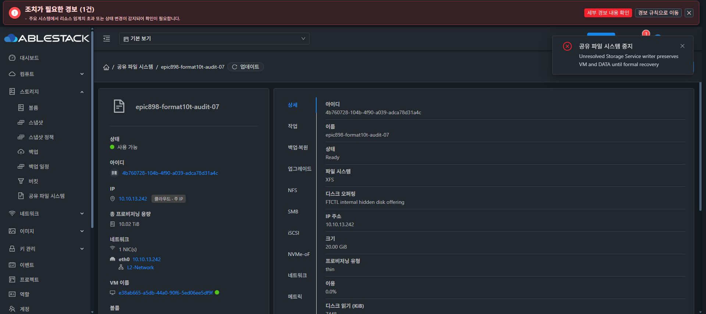

# 부분 SPARSE 포맷의 SharedFS 중지 차단

d3f9bcdef9e 실제 관리 서버 배포 후 partial SPARSE10TiB VM51의 연결 정보를 먼저 조회했다. SharedFS4b760728, VMe38ab665, instance0b5a950b, DATA021b0cac 및 미완료 포맷 operation1c1a61a3의 동일 연결과 RECOVERY_REQUIRED 상태를 확인했다.

SharedFSServiceImpl.stopSharedFS의 requireNoUnresolvedWriter가 VM stateTransit/provider stop/guest probe보다 앞에 있고 실제 이 작업 행을 거절하는 것을 소스에서 확인한 후 해당 SharedFS UI의 중지 메뉴만 실행했다. 일반 VM 중지 API는 이 선행 보호가 없을 수 있어 실행하지 않았다.

실제 Chrome에서 강제 옵션을 켜지 않은 SharedFS 중지 요청이 오류로 거절됐고 “Unresolved Storage Service writer preserves VM and DATA until formal recovery”가 표시됐다. 새 API에서 VM Running을 다시 확인했다. 재포맷·mount·분리·삭제·재부팅 또는 수동 journal/DB 복구는 수행하지 않았다.

이 증거는 SharedFS 중지 진입점의 선행 보호에 대한 실제 API/UI 검증이다. 일반 VM stop/destroy/expunge 등 별도 진입점의 보호 및 Stopped 부분 포맷 보호를 모두 통과했다는 뜻은 아니다. 발견된 직접 VM API 우회는 후속 소스 보완 및 검증 대상으로 유지한다. partial021b 데이터와 원래 초기20GiB를 보존하고 최종 UI 표준화는 착수하지 않는다.
