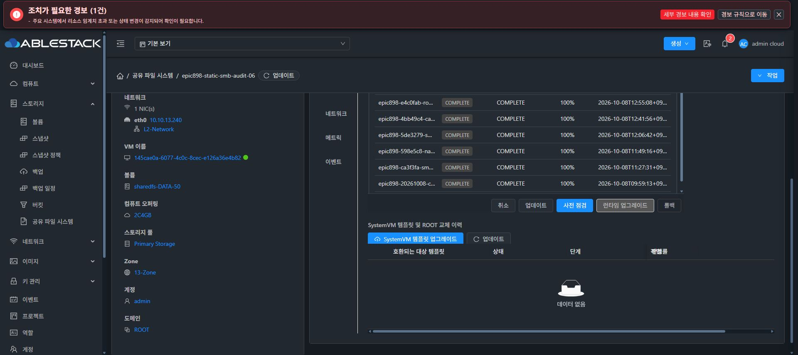
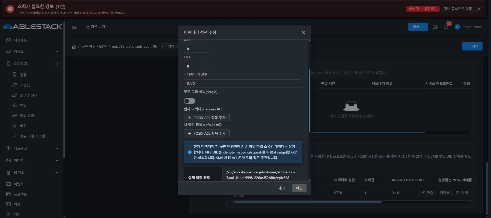
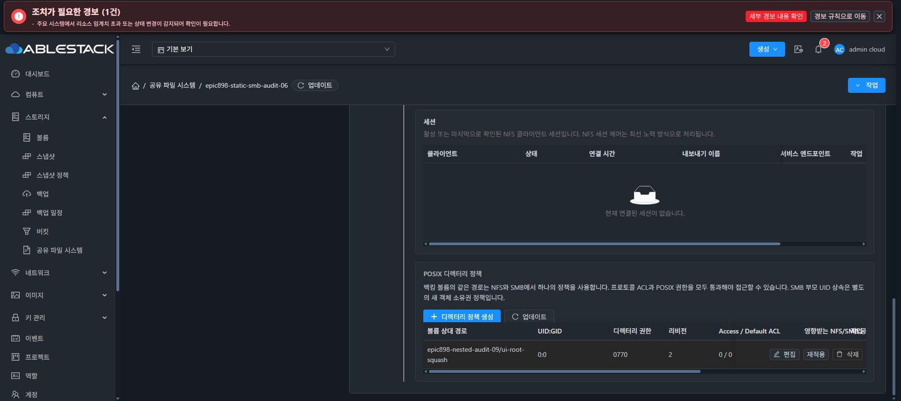
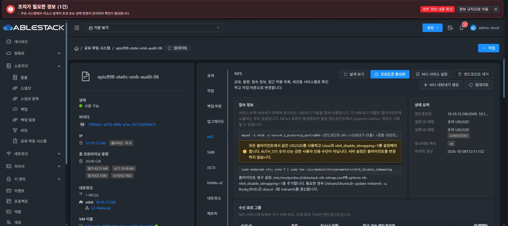
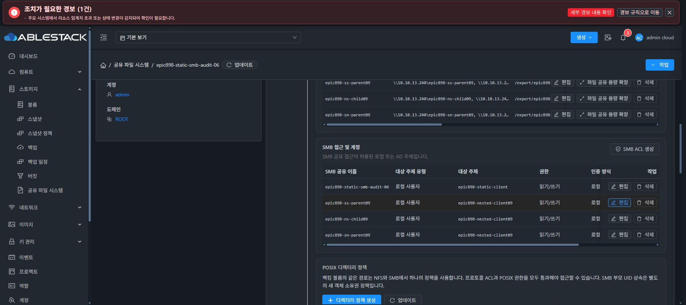

# POSIX 부팅 재적용 및 승인 UI 검증 — 2026-10-08

실제 재부팅에서 이전 미리보기의 UID65534가 저장된 요청에 남고 실제 적용된 UID0와 충돌하여 부팅 복구가 실패했다. 이 상태를 정상 복구로 판정하지 않았다.

`7b86b9f94598972fbdedfc4550a513d1cafec18a`는 적용 후 정확한 instance/policy/revision/volume/path/request SHA와 디렉터리의 filesystem/device/inode/UID/GID/mode/ACL SHA를 보호 증빙에 저장한다. 부팅 중 동일 요청과 현재 상태가 모두 일치할 때만 메타데이터 및 canonical desired 쓰기 없이 재적용을 생략한다. 기존 증빙 없는 정책과 foreign inode/FS/ACL은 자동 승인하지 않는다. 안정 런타임 native123+ROOT9 테스트 통과.

실제 설치 대상은 안정 base4a3b41에 POSIX 전용 패치만 더한 합성본이다. 에픽의 전체 rendered/AD 소스를 설치한 것으로 표시하지 않는다. CLI SHA `01b8b5f3928ffa766be49446d921a4be479c3257240457f73680f18c39e039aa`, archive `5652fa1af354ccedd2f69e0163992f0ec1c33d1899b43a0b7c10f3ab0055fc09`, signed manifest `dba8b87729ea64c8accc27e6e7fad6c18ea184e3416aa968a194eee7aefeabde`.

카탈로그 `9338fd6d-f176-4254-8e40-9d84fe96c9a7` AVAILABLE 서명 검증 후 VM50 실제 UI에서 사전 점검과 업그레이드 COMPLETE100%를 확인했다. 기존 b38 RuntimeUpgradeManagerImpl을 유지한 현장 혼합 구성의 버전 관측 UNKNOWN 제한은 그대로 남아 있으며, 최종 strict compatibility 전체 인수로 승격하지 않는다.

다음 재적용 UI 미리보기에서는 정책의 actual config0:0/0770 대신 NFS 권고65534:65534/0775가 예상 권한에 표시돼 적용을 취소했다. backend intent.config와 실제 apply payload는 저장된 정책을 정확히 사용함을 소스에서 확인했다. UI373a5ef02fb8은 미리보기 응답 config의 applyOwner/ownerUid/ownerGid/directoryMode로 예상값을 표시하고 소유권 보존이면 현재 관측 값을 사용한다. unrelated recommendation·미승인 draft로 대체하지 않는 3개 회귀를 포함해11개 테스트 및 lint가 통과했다. 생산 빌드844파일을 실제 배포했고 index SHA83552bf6531944f71d0677a62413c51de7e57044216583c395743ec87d99d335, backup210119와config/WEB-INF/MGT PID 보존을 확인했다. 새 UI 미리보기는 current/expected 모두0:0/0770 및 exactFS UUID를 표시했고 정상 명시 재적용 후 policy revision2와 operation revision38 COMPLETE100%가 실제 UI에 나타났다. 보호 증빙과 부팅 NOOP 확인은 계속 진행 중이다.

정책 명시 재적용은 완료했고, 재부팅 성공 검증은 아직 완료하지 않았다. 최종 UI 표준화 #1275는 시작하지 않았으며 기능 완료 후 시작 직전에 전체 작업을 중단하고 사용자 지시를 기다린다.

재적용 후 실제 보호 증빙은 root0600/schema1/COMPLETE로 확인됐다. policy revision2와 정확한 scope, requestSHA bbd6126f... 및 filesystem/dev2064/inode33685632/0:0/0770/ACL SHA가 현재 디렉터리와 일치했다. native GEN38/checksumfe812ac6.../IN_SYNC/pendingNULL, DATAroot128/0:0/0755 및 sentinel16777345/1001:1001/0660/SHAfe084 보존을 확인했다. 이어 cleanupfalse 정상 SharedFS UI 재시작을 실행했고 VM UI 복귀를 확인했다. 게스트 부팅 aggregate·canonical7/receipt 무변경 검증은 진행 중이며 성공으로 선판정하지 않는다.

## 정상 재부팅 실증

12:09:09UTC 새boot c53e1cbb...에서 boot reconcile result success 및 ExecMainStatus0를 확인했다. 정상 oneshot inactive는 실패로 해석하지 않았다. NFS2049/NUMERICtrue 및 SMB240/241 개별owned listeners가 복구됐다. GEN38/canonical checksumfe812ac6.../IN_SYNC/pendingNULL와 protectedreceipt scope/requestSHA/identity7/COMPLETE가 재부팅 전과 동일했다. receipt의 mtime1791461040.425와verifiedEpoch1791461040.429는이번bootStart1791461227보다이전이어서이번부팅의receipt재기록0을관측했다. 모든canonical파일의쓰기0으로확대하지않는다.

DATAroot128/0:0/0755, originalsentinel16777345/1001:1001/0660/SHAfe084, leaf33685632/0:0/0770/ACL SHA 및 SID·primary240+alias241/MAC/gateway를 보존했다. actualUI NFS 숫자UID/GID CONSISTENT와 SMB두IP수신행/실행데몬상태를 확인했다. 이 시험은 POSIX committedreceipt coldreplay의 성공이며 전체ROOT/AD/네프로토콜/template인수로확대하지않는다.

