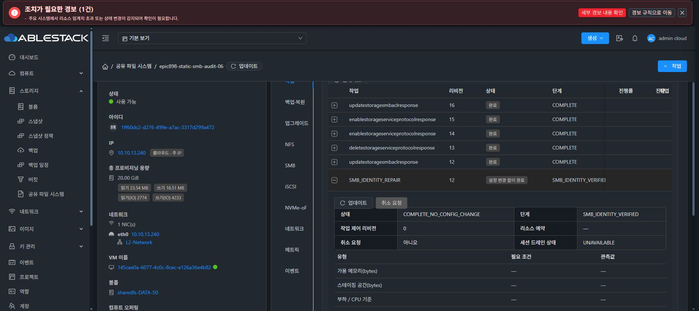
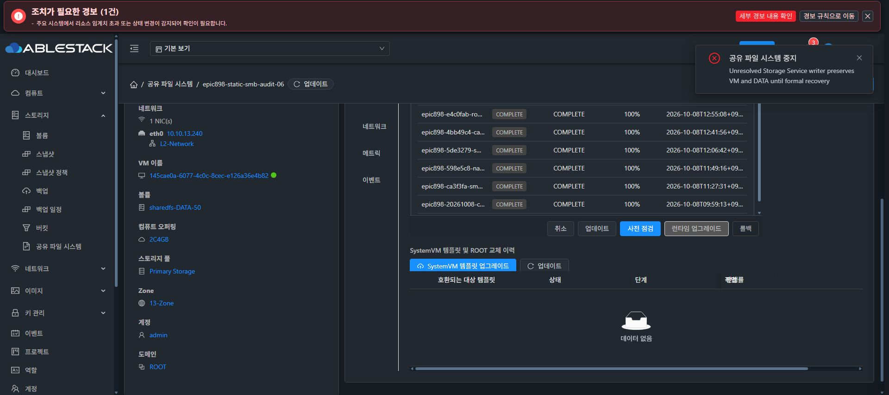

# 런타임 적용 및 작업 제어의 실제 UI 검증

현재 기능 UI는 cfecc6db309c9de26f5de7ca38d9ecac9fb59698의 독립 생산 빌드이다. 844개 정적 파일 및 index SHA-256 dc5545756bbf5296fb02edeaad689fef62042afd3f392c7aa37cf030609ba999를 실제 확인했다. config.json·WEB-INF·관리 PID를 보존했다. 최종 UI 표준화 #1275는 수행하지 않았다.

## 작업 제어 조회

Chrome의 작업 이력에서 SMB_IDENTITY_REPAIR 완료 행을 펼쳤다. 실제 API와 UI에 COMPLETE_NO_CONFIG_CHANGE / controlRevision0 / cancelable=false / drainUNAVAILABLE이 표시됐다. 제어 기본 플래그가 비활성인 상태와 실제 기능 미지원 관측을 성공 지원으로 위장하지 않으며 취소 버튼은 비활성이다. 공통 완료 문구는 “설정 변경 없이 완료”로 표시됨을 확인했다. 실제 drain/cancel/lease/profile 실행은 아직 검증 대상이다.

## 서명 런타임의 실제 UI 적용

새 예방 수정 runtime 4a3b41c18f44a7e2cdfb78f8139724f647af05f0를 실제 UI 드롭다운에서 선택하고 사전 점검한 뒤 적용했다. catalog99790c83-6566-440f-9856-91ff36449e07 / version epic898-4a3b41-smb-ready-network이며 서명·해시 검증 후 AVAILABLE이다. archive SHA-256 e0de64a2a68071f1ac898d8d5c33f5617df7e3730834866121808f28bae9a3cb, manifest d32249b99ac4b464d8e70b111f1498a6caaa8a1e44a1281f18b62f437209c9a9이다.

실제 적용 row2abecb8f-4650-40cf-b679-c6af32dabc04가 COMPLETE / 100으로 종료됐고 현재·이전 버전 및 이력도 UI에서 확인했다. 적용 전 Gen16/config569cfe2d.../bootbc60/A1487+B1491 및 원본 DATA/SID/sentinel을 고정했으며 적용 후 설치된 파일과 실제 불변 항목을 별도 검증 중이다.

이 서버는 전체 서명 템플릿 대기 때문에 b38 런타임 업그레이드 구현2개 클래스를 보존한 임시 backend 조합이다. UI의 관리/호스트/플랫폼 관측 버전은 미확인으로 표시되는데 이 기존 구현이 사전 점검 READY를 반환한다. 따라서 이 테스트는 서명 코드의 현재 테스트 VM 적용 및 실제 UI 흐름 증거이며 신규 엄격한 플랫폼 버전·AD 손실 검증의 성공 증거로 사용하지 않는다. 소스의 UNKNOWN 거절 조건은 완화하지 않았고, 최종 동일 소스 템플릿 및 전체 구현 배포 후 호환성 게이트를 별도로 통과해야 한다.
