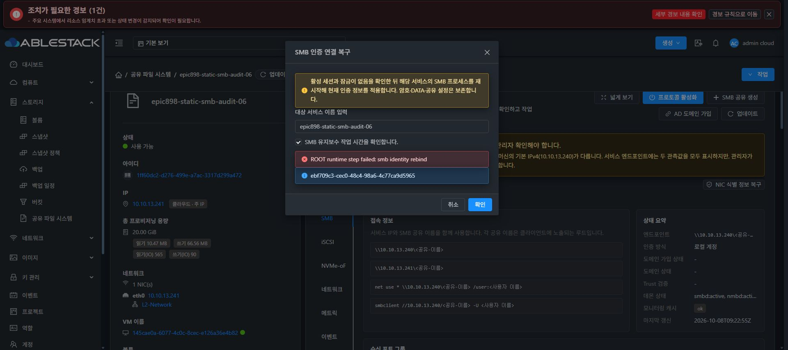

# SMB 인증 연결 복구의 실제 UI 검증

기능 UI 0c70b1cafb1637bf71d1b2f8cb44ff0823231b1a를 독립 git archive에서 생산 빌드했다. 844개 정적 파일의 해시를 대조해 배포하고 기존 config.json, WEB-INF 및 관리 서버 PID를 보존했다. index.html SHA-256은 471f32b10ed7967d38fa86296c6b3016c71f7000413349421d5fc50005fc6e3c이다. 최종 표준화 #1275 작업은 수행하지 않았다.

Chrome에서 실제 서비스 SMB 탭을 열어 신규 인증 연결 복구 버튼을 확인했다. 초기 확인 버튼이 비활성인 상태와 정확한 서비스 이름 및 유지보수 확인 체크 후 활성화됨을 검증했다. 해당 테스트 서비스만 UI로 실행했다.

작업 cb8bb5c9-d717-45ac-b351-a4a8afe0199a / async job ebf709c3-cec0-48c4-98a6-4c77ca9d5965는 게스트 rebind 단계에서 실패하여 RECOVERY_REQUIRED로 보존되었다. 실제 UI는 오류와 job ID를 유지했다. 성공 처리하거나 새 키로 자동 재실행하지 않았다.

읽기 검사에서 옛 master A1291/B67681은 소유된 dedicated unit의 A346908/B346911로 바뀌었고 현재 passdb/secrets descriptor는 정렬되었다. expected와 현재 scope, bootId, generation11, 설정 해시 및 보호 DB identity가 모두 같다. TCP endpoint 준비와 소유권도 확인되었으며 TCP/SMB/tree/open/byte lock은 0이다. 재기동 직후 readiness 검사 시점에 대한 추가 진단과 같은 operation의 멱등 재개가 필요하다. 이 증빙만으로 실제 SMB 인증·파일 I/O·재부팅을 통과했다고 주장하지 않는다.

기존 DATA와 비밀번호·desired generation은 변경하지 않았다. 실제 인증 검증과 held FD·cross-endpoint lock·선택 B 변경·정상 재부팅이 다음 게이트이다. original39/41/49와 partial SPARSE10TiB VM51은 제외했다.
