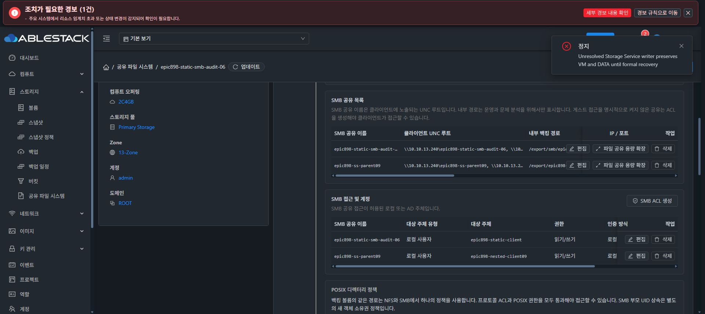

# SMB 중첩 자식 공유 제거의 실제 UI와 데이터 보존 검증

기존DATA50/XFSa433을 포맷하지 않고 새 prefix epic898-nested-audit-09/ss 및 ss/child만 사용했다. parent521d647f-133a-42ab-8614-2604b7547740와 child4f2cca2c-9a68-46ff-b107-3be1801857d6는 정상API에서 생성됐으며 실제SMB UI에 양쪽IP/경로/Ready가 표시됐다. NEWprincipalepic898-nested-client09/actualUID1002를 사용하고 기존UID1001의 alias를 만들거나 기존 계정 비밀번호를 변경하지 않았다.

두 새leaf에만 user1002:rwx named/defaultPOSIXACL을 적용했다. 정상NEWprincipalpasswordupdate1(2c922946) 이후 coupledRAM클라이언트에서 두 공유 인증과 childwrite→parentread/SHA14d7da26이 통과했다. CIFSclientUID0은 mount표시이며 실제파일UID1002와 구분한다.

Chrome에서 자식 이름을 정확히 입력해 자식 설정만 삭제한operation9fbf219b-7798-4dcc-a41d-90985af85a40은 COMPLETE/generation30이다. 부모 공유와 기존부모 세션을 실제UI에서 확인했다.

동일RAM자격 증명으로 parentheldFD를 유지한1549회쓰기에서 오류0이며 부모에서 기존child파일hash가 같다. 제거된childshare의 새mount는errno2/ENOENT로 거절됐고 childconfig는 제거됐다. NT_STATUS_BAD_NETWORK_NAME 문자열은 직접 관측하지 않아 그증거로 주장하지 않는다.

실제physicalparentinode50331777/child16777352/file16777353, named/defaultACL1002, 실제file1002:1002/0660/hash와 원래DATAroot/원래sentinel이 모두보존됐다. A1487/start1341와 B1491/start1343 및 owned445도 동일하다. 테스트writer/FD/mount를 정상정리하고RAM비밀번호를폐기했으며processExit0/ownmount0을확인했다.

이 기록은 SS중첩의인증·교차I/O·자식설정삭제보존 subset이다. NFS/SMB교차방향·samephysicalcrosspolicy·경로/볼륨변경·symlink/mountboundary·독립ACL·재부팅 및모든원자복구는계속검증중이다. 신규디스크0/원래DATA변경0/최종UI표준화0을유지한다.
