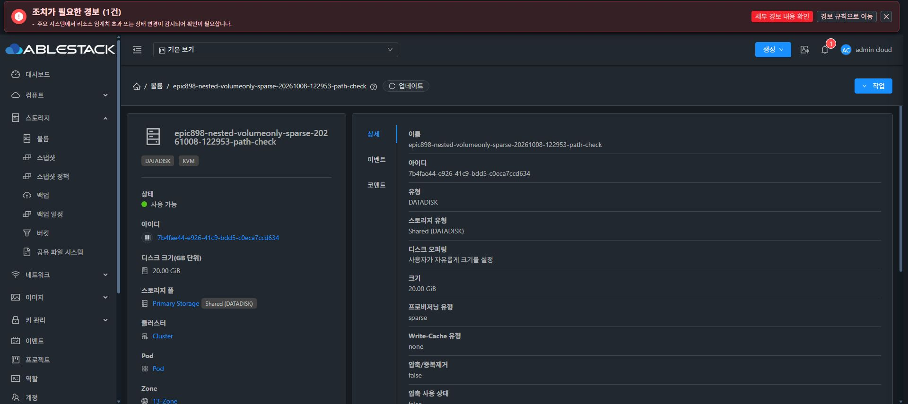

# #1333 볼륨 경로 보존 P1 구현·배포·UI 검증

정상 updateVolume에서 path를 생략해도 VolumeApiServiceImpl의 else가setPath(null)를호출하여volumes.path를지웠다. 새20GiB SPARSE 미연결fixture의display 설정변경에서실제재현했다. 물리파일·inode·size·SPARSEmetadata는보존됐다. 검증된원래UUIDpath를정상API로복구했고DB직접수정/원래DATA변경/연결/포맷/삭제0이다.

627727226723986b440b2da7b1eb69f7a8b5dc0a는else-null 경로변경만제거했다. ROOT/DATADISK·연결/미연결4조합에서display/name/deleteProtection의실제persist path와pool/format/provisioning/UUID/attachment를보존하는회귀및명시path복구회귀를추가했다. 기준379+이두파일만격리한서버-am 정상Checkstyle/package88classes515tests/0F0E0Skip가통과했다. snapshot9850Java NULSHA186dd0340b0faa9021a190da1e3cf195587f646352ce6f2f9c361c76bd935332는실행전후동일하며다른WIP혼입0이다.

실제관리JAR3ee에서읽은VolumeApiServiceImpl fullfamily13개와수정산출물의javap -p -s 전체field/methodABI가정확일치했다. payloadd81227cad9dfe89b551a5e1b58b1c10fded8dca1a0f9b5c4f58f627fda141327의13entry만기존JAR에반영했다. 다른entry·네이티브/호스트/UI코드변경0, backup220522/JARa2b5200c233516d7e7c9df52d89664c46bc725ed0668903996bae14a59af56c5/PID1161642. 새API로그인/7Running/3UpEnabled를검증했다.

실제Mold volume 편집에서경로switchOFF로두고이름만epic898-nested-volumeonly-sparse-20261008-122953-path-check로변경했다. 새이름과기존UUID경로, sparse20GiB를상세UI에서확인했다. DB·physicalinode·allocation·owner/pool/Ready·미연결상태의후속대조는진행중이며전체인수전이슈를닫지않는다.

이핫픽스는#895/#909/#910/#920의metadata 바인딩보존의존작업이다. 최종UI#1275는시작하지않았고기능후착수직전중단·보고·추가지시대기를유지한다.
