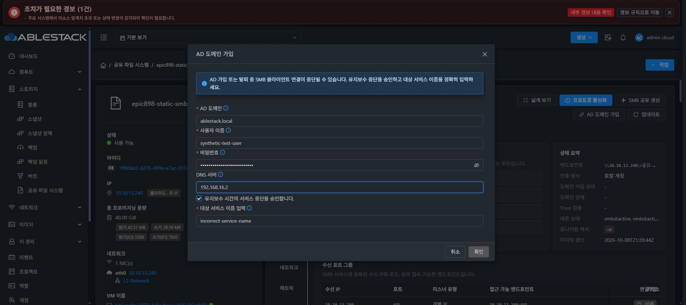
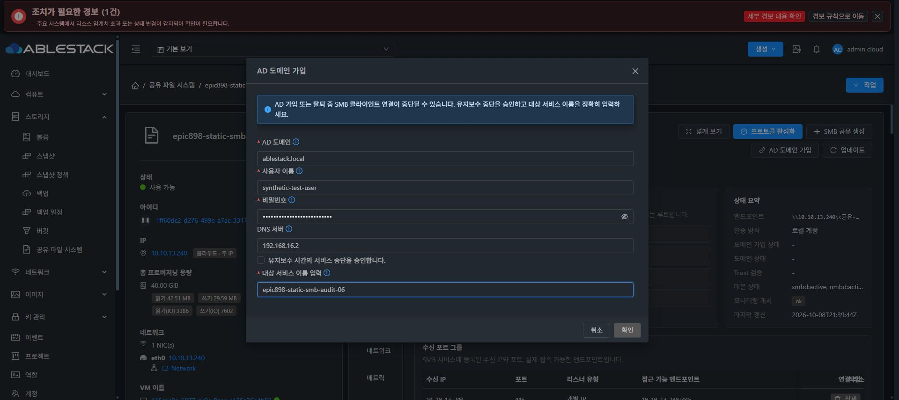

# Epic #898 AD 작업 승인 실제 UI 부정 검증

소스 8178fbc10c81288371f01d27b7619d7011d662d8의 UI는 104개 테스트 / 8 suites, lint 및 정상 production build 850개 파일을 통과했다. 13번에 static SHA 일치로 배포했다. index SHA-256 f851e2a0654f1601522cbd2dcfab8cd28daa575f185ecf3770a4f007b84697c0, 백업 /root/epic898-ui-backup-20261009-063644, config·WEB-INF 및 관리 PID 1189913 보존이다.

Chrome의 기존 VM50 SMB 탭에서 AD 가입 대화상자를 열었다. 합성 사용자·합성 암호·도메인·DNS 입력을 채운 뒤 중지 승인을 체크해도 확인 이름이 다르면 확인 버튼은 비활성이었다. 정확한 이름을 입력한 뒤 중지 승인을 해제해도 확인 버튼은 비활성이었다. 두 상태를 캡처하고 취소했다.

가입 요청·새 credential·AD 외부 효과는 0이다. 기존 로컬 SMB 인증 상태를 유지했다. 기존 관리 서버 ADE707에는 새 maintenance/fresh 계약이 아직 없으므로 미지원 API 제출 차단 및 실제 JOIN·fresh receipt·AD ACL 적용·LEAVE는 아직 검증하지 않았다. source unit의 성공을 클러스터 성공으로 표시하지 않는다. 원본 DATA/SID를 이 시험에서 변경하지 않았다.

두 컴포넌트의 style block 바이트는 동일하며 최종 UI 표준 #1275를 시작하지 않았다.

