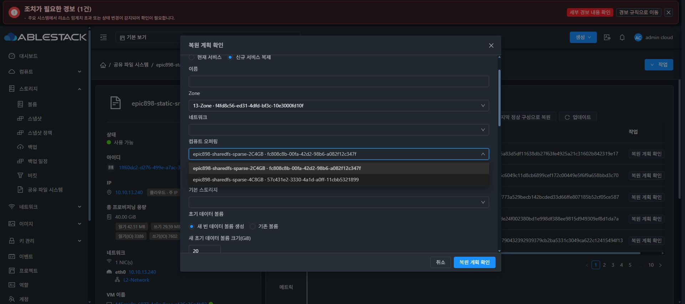

# Epic #898 신규 복제 ROOT 후보 실제 UI 검증

4df89b232e6e33f5536f83be405f04b978e16d07은 173개 테스트 / 12 suites·lint·정상 production build 850개 파일을 통과했다. 13번 static SHA 일치 적용, index fec6a6106cc327228f87580dd050a8b16f3a542a7fcabfe48f40c4fda8690b70, 백업 /root/epic898-ui-backup-20261009-080325, config·WEB-INF·관리 PID1189913 보존이다.

Chrome의 기존 VM50 LKG 계획 대화상자에서 신규 서비스 복제를 선택하고 실제 13-Zone을 지정했다. 컴퓨트 오퍼링 목록에는 SPARSE 2C4GB·4C8GB 두 개만 있었고 2C4GB가 기본 선택됐다. 기존 THIN 후보는 목록에 없었다. 복제 계획 요청이나 생성·적용을 제출하지 않고 취소했다. 기존 LKG 리비전48을 유지했다.

이 결과는 CREATE_NEW 옵션 조회·default·THIN 제외의 실제 UI 검증이다. 새 Cloud VM·ROOT/DATA 생성과 새 템플릿·신원 복원·외부 I/O 인수는 아직 남았다. AD 신규 복제의 explicit seedAbsent SYSTEM 템플릿 선택은 별도 후속 구현 중이다. 공통 scale·기존 THIN ROOT·레이아웃 변경 0, 최종 UI #1275 미착수다.

