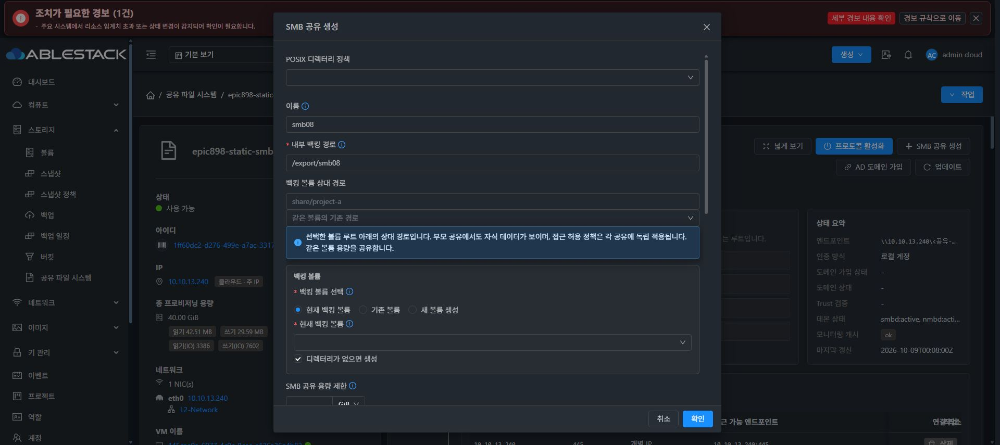

# Epic #898 공통 AD 승인 UI의 비 AD 흐름 회귀

4a2a27cfbf4c0dca5c83edbcd3fddf152325c924의 source6는 216개 테스트 / 14 suites·lint·정상 production build 850개 파일을 통과했다. 13번 static SHA 일치 적용, index 200ddc5f3243bdc4809496c8f49148e05174a5152fdc8b200a58345c96624590, 백업 /root/epic898-ui-backup-20261009-090700, config·WEB-INF·관리 PID1189913 보존이다.

Chrome의 기존 로컬 인증 VM50에서 SMB 공유 생성 입력을 열었다. 기존 폼·옵션이 표시되고 AD 승인 대화상자는 추가되지 않았다. 생성 확인을 누르지 않고 취소한 뒤 로컬 인증·smbd/nmbd active·두 엔드포인트를 확인했다.

이 결과는 비 AD 입력 열기·취소 회귀이며 실제 공유 생성·JOINED AD 승인·변경 성공은 수행하지 않았다. 현재 ADE707 관리 서버와 기존 로컬 게스트에는 새 JOINED target checkpoint 기능을 인수할 환경이 없다. 새 artifact와 AD fixture를 준비한 뒤 API/UI 실제 변경·승인 실패·scope 변경·접속을 검증한다. POSIX 실제 적용의 직접 POST 경로는 같은 consent 재사용 후속으로 별도 진행 중이다. 최종 UI #1275는 미착수다.

